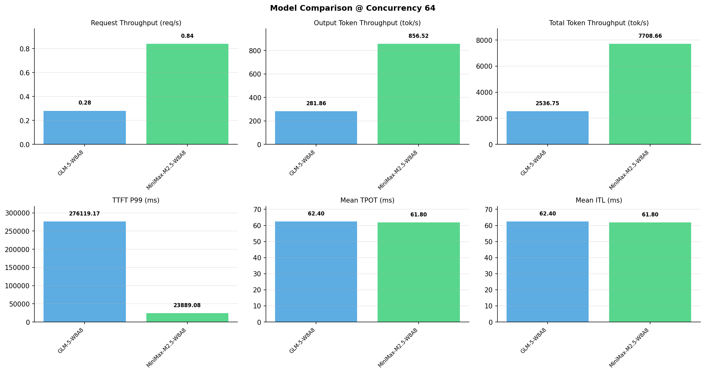

# 多模型性能对比报告

**测试日期：** 2026-05-14

**芯片平台：** inspur_metax_c550

**测试套件：** test_05

**Run ID：** 01, 01, 01

**并发级别：** 64并发

**测试配置：** 1000-i8192-o1024

---

## 🤖 芯片和模型配置信息

| 参数名称 | **MiniMax-M2.5-W8A8** | **GLM-5-W8A8** |
|----------|----------|----------|
| **max_position_embeddings** | 196608 | 202752 |
| **model_name** | MiniMax-M2.5-W8A8 | GLM-5-W8A8 |
| **model_size** | 215G | 712G |
| **python_version** | 3.10.10 | 3.10.10 |
| **quantization_config** | int8 | int8 |
| **sglang_version** | 0.5.9+maca3.5.3.204 | 0.5.9+maca3.5.3.204 |
| **temperature** | N/A | N/A |
| **top_k** | 40 | N/A |
| **top_p** | 0.95 | N/A |
| **transformers_version** | 4.57.6 | 5.1.0 |

---

## ⚙️ SGLang 启动配置信息

| 参数名称 | **MiniMax-M2.5-W8A8** | **GLM-5-W8A8** |
|----------|----------|----------|
| **Attention Backend** | flashinfer | flashinfer |
| **Chunked Prefill Size** | N/A | 8192 |
| **Context Length** | 196608 | 202752 |
| **Cuda Graph Max Bs** | N/A | 64 |
| **Disable Radix Cache** | True | True |
| **Dp Size** | N/A | 4 |
| **Max Queued Requests** | None | None |
| **Max Running Requests** | 64 | 64 |
| **Mem Fraction Static** | 0.9 | 0.8 |
| **Model Name** | MiniMax-M2.5-W8A8 | GLM-5-W8A8 |
| **Nnodes** | 1 | 2 |
| **Pp Size** | 1 | 1 |
| **Quantization** | w8a8_int8 | w8a8_int8 |
| **Reasoning Parser** | minimax-append-think | glm45 |
| **Tool Call Parser** | minimax-m2 | glm47 |
| **Tp Size** | 8 | 16 |

---

## 📊 模型列表

| 模型名称 | Run ID | 状态 |
|----------|--------|------|
| MiniMax-M2.5-W8A8 | 01 | [OK] |
| GLM-5-W8A8 | 01 | [OK] |

---

## 📊 测试概览

| 项目            | 配置                                     | 备注  |
|---------------|----------------------------------------|-----|
| **数据集**       | random                                 |     |
| **并发数**       | 1, 4, 8, 16, 32, 64, 128    |     |
| **总请求数**      | 1000                                    |     |
| **输入输出长度** | (128, 128), (512, 256), (1024, 512), (2048, 1024), (4096, 2048), (8192, 1024) |     |
| **测试套件**     | test_05                           |     |
| **被测芯片**      | inspur_metax_c550 |     |
| **SGLang版本**   | 0.5.9                           |     |

---

## 📈 服务基准结果对比

| 指标 | MiniMax-M2.5-W8A8 (基准) | GLM-5-W8A8 | 差异 | % |
|------|--------------- | --------- | ------- | -------|
| 成功请求数 | 1000 | 1000 | 0.00 | 0.0% |
| 测试持续时间 (s) | 1195.54 | 3632.99 | +2437.45 | +203.9% |
| 总输入 tokens | 8192000 | 8192000 | 0.00 | 0.0% |
| 总生成 tokens | 1024000 | 1024000 | 0.00 | 0.0% |
| **请求吞吐量 (req/s)** | 0.84 | 0.28 | -0.56 | -66.7% |
| **输出 token 吞吐量 (tok/s)** | 856.52 | 281.86 | -574.66 | -67.1% |
| **总 token 吞吐量 (tok/s)** | 7708.66 | 2536.75 | -5171.91 | -67.1% |

---

## ⏱️ 首 Token 延迟 (TTFT) 对比

| 指标 | MiniMax-M2.5-W8A8 (基准) | GLM-5-W8A8 | 差异 | % |
|------|--------------- | --------- | ------- | -------|
| 平均 TTFT (ms) | 11914.66 | 162179.11 | +150264.45 | +1261.2% |
| 中位 TTFT (ms) | 11789.45 | 176537.53 | +164748.08 | +1397.4% |
| P99 TTFT (ms) | 23889.08 | 276119.17 | +252230.09 | +1055.8% |

---

## ⚡ 每 Token 生成时间 (TPOT) 对比

| 指标 | MiniMax-M2.5-W8A8 (基准) | GLM-5-W8A8 | 差异 | % |
|------|--------------- | --------- | ------- | -------|
| 平均 TPOT (ms) | 61.80 | 62.40 | +0.60 | +1.0% |
| 中位 TPOT (ms) | 61.93 | 63.43 | +1.50 | +2.4% |
| P99 TPOT (ms) | 73.84 | 115.35 | +41.51 | +56.2% |

---

## 🔄 Token 间延迟 (ITL) 对比

| 指标 | MiniMax-M2.5-W8A8 (基准) | GLM-5-W8A8 | 差异 | % |
|------|--------------- | --------- | ------- | -------|
| 平均 ITL (ms) | 61.80 | 62.40 | +0.60 | +1.0% |
| 中位 ITL (ms) | 51.18 | 19.74 | -31.44 | -61.4% |
| P95 ITL (ms) | 52.67 | 39.93 | -12.74 | -24.2% |
| P99 ITL (ms) | 54.52 | 786.06 | +731.54 | +1341.8% |

---

## ⏱️ 端到端延迟 (E2E) 对比

| 指标 | MiniMax-M2.5-W8A8 (基准) | GLM-5-W8A8 | 差异 | % |
|------|--------------- | --------- | ------- | -------|
| 平均 E2E 延迟 (ms) | 75139.87 | 226015.89 | +150876.02 | +200.8% |
| 中位 E2E 延迟 (ms) | 75697.66 | 234151.92 | +158454.26 | +209.3% |
| P90 E2E 延迟 (ms) | 76936.16 | 316894.94 | +239958.78 | +311.9% |
| P99 E2E 延迟 (ms) | 77092.36 | 353109.31 | +276016.95 | +358.0% |

---

## 📊 模型性能对比

---

## 📝 分析小结

- **请求吞吐量**: MiniMax-M2.5-W8A8 最高，达 0.84 req/s
- **总token吞吐量**: MiniMax-M2.5-W8A8 最高，达 7709 tok/s
- **TTFT P99**: MiniMax-M2.5-W8A8 最优，为 23889.08ms
- **TPOT P99**: MiniMax-M2.5-W8A8 最优，为 73.84ms

---

*报告生成时间: 2026-05-14*

