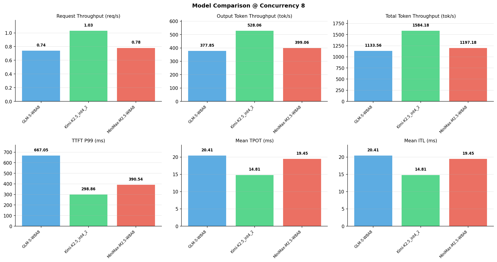

# 多模型性能对比报告

**测试日期：** 2026-05-14

**芯片平台：** inspur_metax_c550

**测试套件：** test_05

**Run ID：** 01, 01, 01

**并发级别：** 8并发

**测试配置：** 1000-i1024-o512

---

## 🤖 芯片和模型配置信息

| 参数名称 | **MiniMax-M2.5-W8A8** | **GLM-5-W8A8** | **Kimi-K2.5_int4_2** |
|----------|----------|----------|----------|
| **max_position_embeddings** | 196608 | 202752 | 262144 |
| **model_name** | MiniMax-M2.5-W8A8 | GLM-5-W8A8 | Kimi-K2.5_int4_2 |
| **model_size** | 215G | 712G | 496G |
| **python_version** | 3.10.10 | 3.10.10 | 3.10.10 |
| **quantization_config** | int8 | int8 | int4 |
| **sglang_version** | 0.5.9+maca3.5.3.204 | 0.5.9+maca3.5.3.204 | 0.5.9+maca3.5.3.204 |
| **temperature** | N/A | N/A | N/A |
| **top_k** | 40 | N/A | N/A |
| **top_p** | 0.95 | N/A | N/A |
| **transformers_version** | 4.57.6 | 5.1.0 | 4.56.2 |

---

## ⚙️ SGLang 启动配置信息

| 参数名称 | **MiniMax-M2.5-W8A8** | **GLM-5-W8A8** | **Kimi-K2.5_int4_2** |
|----------|----------|----------|----------|
| **Attention Backend** | flashinfer | flashinfer | flashinfer |
| **Chunked Prefill Size** | N/A | 8192 | 8192 |
| **Context Length** | 196608 | 202752 | 262144 |
| **Cuda Graph Max Bs** | N/A | 64 | 64 |
| **Disable Radix Cache** | True | True | True |
| **Dp Size** | N/A | 4 | N/A |
| **Max Queued Requests** | None | None | None |
| **Max Running Requests** | 64 | 64 | 64 |
| **Mem Fraction Static** | 0.9 | 0.8 | 0.8 |
| **Model Name** | MiniMax-M2.5-W8A8 | GLM-5-W8A8 | Kimi-K2.5_int4_2 |
| **Nnodes** | 1 | 2 | 2 |
| **Pp Size** | 1 | 1 | 1 |
| **Quantization** | w8a8_int8 | w8a8_int8 | w4a8_int8 |
| **Reasoning Parser** | minimax-append-think | glm45 | kimi_k2 |
| **Tool Call Parser** | minimax-m2 | glm47 | kimi_k2 |
| **Tp Size** | 8 | 16 | 16 |

---

## 📊 模型列表

| 模型名称 | Run ID | 状态 |
|----------|--------|------|
| MiniMax-M2.5-W8A8 | 01 | [OK] |
| GLM-5-W8A8 | 01 | [OK] |
| Kimi-K2.5_int4_2 | 01 | [OK] |

---

## 📊 测试概览

| 项目            | 配置                                     | 备注  |
|---------------|----------------------------------------|-----|
| **数据集**       | random                                 |     |
| **并发数**       | 1, 4, 8, 16, 32, 64, 128    |     |
| **总请求数**      | 1000                                    |     |
| **输入输出长度** | (128, 128), (512, 256), (1024, 512), (2048, 1024), (4096, 2048), (8192, 1024) |     |
| **测试套件**     | test_05                           |     |
| **被测芯片**      | inspur_metax_c550 |     |
| **SGLang版本**   | 0.5.9                           |     |

---

## 📈 服务基准结果对比

| 指标 | MiniMax-M2.5-W8A8 (基准) | GLM-5-W8A8 | 差异 | % | Kimi-K2.5_int4_2 | 差异 | % |
|------|--------------- | --------- | ------- | ------- | --------- | ------- | -------|
| 成功请求数 | 1000 | 1000 | 0.00 | 0.0% | 1000 | 0.00 | 0.0% |
| 测试持续时间 (s) | 1283.02 | 1355.02 | +72.00 | +5.6% | 969.59 | -313.43 | -24.4% |
| 总输入 tokens | 1024000 | 1024000 | 0.00 | 0.0% | 1024000 | 0.00 | 0.0% |
| 总生成 tokens | 512000 | 512000 | 0.00 | 0.0% | 512000 | 0.00 | 0.0% |
| **请求吞吐量 (req/s)** | 0.78 | 0.74 | -0.04 | -5.1% | 1.03 | +0.25 | +32.1% |
| **输出 token 吞吐量 (tok/s)** | 399.06 | 377.85 | -21.21 | -5.3% | 528.06 | +129.00 | +32.3% |
| **总 token 吞吐量 (tok/s)** | 1197.18 | 1133.56 | -63.62 | -5.3% | 1584.18 | +387.00 | +32.3% |

---

## ⏱️ 首 Token 延迟 (TTFT) 对比

| 指标 | MiniMax-M2.5-W8A8 (基准) | GLM-5-W8A8 | 差异 | % | Kimi-K2.5_int4_2 | 差异 | % |
|------|--------------- | --------- | ------- | ------- | --------- | ------- | -------|
| 平均 TTFT (ms) | 325.14 | 386.14 | +61.00 | +18.8% | 174.72 | -150.42 | -46.3% |
| 中位 TTFT (ms) | 336.67 | 360.93 | +24.26 | +7.2% | 165.92 | -170.75 | -50.7% |
| P99 TTFT (ms) | 390.54 | 667.05 | +276.51 | +70.8% | 298.86 | -91.68 | -23.5% |

---

## ⚡ 每 Token 生成时间 (TPOT) 对比

| 指标 | MiniMax-M2.5-W8A8 (基准) | GLM-5-W8A8 | 差异 | % | Kimi-K2.5_int4_2 | 差异 | % |
|------|--------------- | --------- | ------- | ------- | --------- | ------- | -------|
| 平均 TPOT (ms) | 19.45 | 20.41 | +0.96 | +4.9% | 14.81 | -4.64 | -23.9% |
| 中位 TPOT (ms) | 19.45 | 19.62 | +0.17 | +0.9% | 14.36 | -5.09 | -26.2% |
| P99 TPOT (ms) | 19.66 | 30.82 | +11.16 | +56.8% | 20.73 | +1.07 | +5.4% |

---

## 🔄 Token 间延迟 (ITL) 对比

| 指标 | MiniMax-M2.5-W8A8 (基准) | GLM-5-W8A8 | 差异 | % | Kimi-K2.5_int4_2 | 差异 | % |
|------|--------------- | --------- | ------- | ------- | --------- | ------- | -------|
| 平均 ITL (ms) | 19.45 | 20.41 | +0.96 | +4.9% | 14.81 | -4.64 | -23.9% |
| 中位 ITL (ms) | 19.40 | 15.37 | -4.03 | -20.8% | 10.93 | -8.47 | -43.7% |
| P95 ITL (ms) | 19.59 | 61.79 | +42.20 | +215.4% | 32.85 | +13.26 | +67.7% |
| P99 ITL (ms) | 27.69 | 92.35 | +64.66 | +233.5% | 56.85 | +29.16 | +105.3% |

---

## ⏱️ 端到端延迟 (E2E) 对比

| 指标 | MiniMax-M2.5-W8A8 (基准) | GLM-5-W8A8 | 差异 | % | Kimi-K2.5_int4_2 | 差异 | % |
|------|--------------- | --------- | ------- | ------- | --------- | ------- | -------|
| 平均 E2E 延迟 (ms) | 10262.02 | 10815.91 | +553.89 | +5.4% | 7744.09 | -2517.93 | -24.5% |
| 中位 E2E 延迟 (ms) | 10261.43 | 10412.03 | +150.60 | +1.5% | 7510.08 | -2751.35 | -26.8% |
| P90 E2E 延迟 (ms) | 10305.88 | 12503.78 | +2197.90 | +21.3% | 9059.83 | -1246.05 | -12.1% |
| P99 E2E 延迟 (ms) | 10339.61 | 16203.61 | +5864.00 | +56.7% | 10759.43 | +419.82 | +4.1% |

---

## 📊 模型性能对比

---

## 📝 分析小结

- **请求吞吐量**: Kimi-K2.5_int4_2 最高，达 1.03 req/s
- **总token吞吐量**: Kimi-K2.5_int4_2 最高，达 1584 tok/s
- **TTFT P99**: Kimi-K2.5_int4_2 最优，为 298.86ms
- **TPOT P99**: MiniMax-M2.5-W8A8 最优，为 19.66ms

---

*报告生成时间: 2026-05-14*

