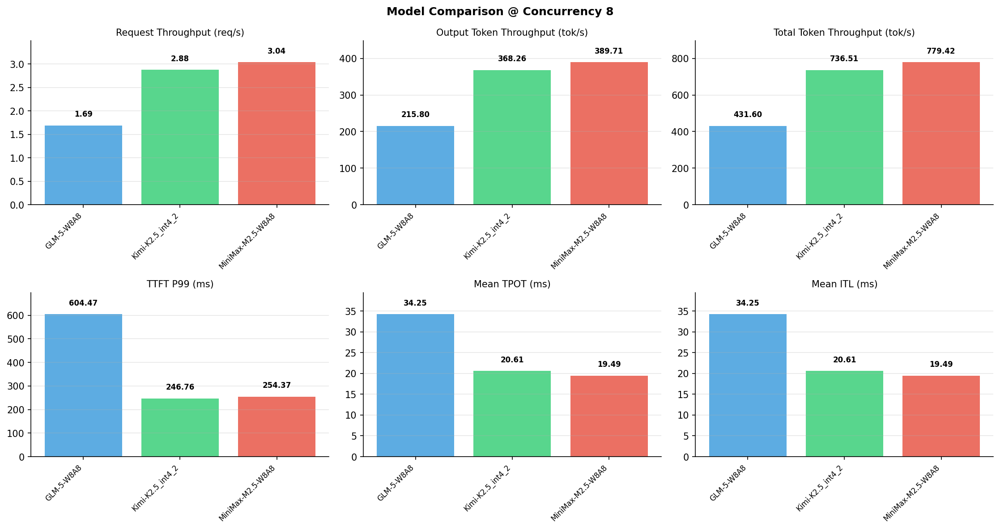

# 多模型性能对比报告

**测试日期：** 2026-05-14

**芯片平台：** inspur_metax_c550

**测试套件：** test_05

**Run ID：** 01, 01, 01

**并发级别：** 8并发

**测试配置：** 1000-i128-o128

---

## 🤖 芯片和模型配置信息

| 参数名称 | **MiniMax-M2.5-W8A8** | **GLM-5-W8A8** | **Kimi-K2.5_int4_2** |
|----------|----------|----------|----------|
| **max_position_embeddings** | 196608 | 202752 | 262144 |
| **model_name** | MiniMax-M2.5-W8A8 | GLM-5-W8A8 | Kimi-K2.5_int4_2 |
| **model_size** | 215G | 712G | 496G |
| **python_version** | 3.10.10 | 3.10.10 | 3.10.10 |
| **quantization_config** | int8 | int8 | int4 |
| **sglang_version** | 0.5.9+maca3.5.3.204 | 0.5.9+maca3.5.3.204 | 0.5.9+maca3.5.3.204 |
| **temperature** | N/A | N/A | N/A |
| **top_k** | 40 | N/A | N/A |
| **top_p** | 0.95 | N/A | N/A |
| **transformers_version** | 4.57.6 | 5.1.0 | 4.56.2 |

---

## ⚙️ SGLang 启动配置信息

| 参数名称 | **MiniMax-M2.5-W8A8** | **GLM-5-W8A8** | **Kimi-K2.5_int4_2** |
|----------|----------|----------|----------|
| **Attention Backend** | flashinfer | flashinfer | flashinfer |
| **Chunked Prefill Size** | N/A | 8192 | 8192 |
| **Context Length** | 196608 | 202752 | 262144 |
| **Cuda Graph Max Bs** | N/A | 64 | 64 |
| **Disable Radix Cache** | True | True | True |
| **Dp Size** | N/A | 4 | N/A |
| **Max Queued Requests** | None | None | None |
| **Max Running Requests** | 64 | 64 | 64 |
| **Mem Fraction Static** | 0.9 | 0.8 | 0.8 |
| **Model Name** | MiniMax-M2.5-W8A8 | GLM-5-W8A8 | Kimi-K2.5_int4_2 |
| **Nnodes** | 1 | 2 | 2 |
| **Pp Size** | 1 | 1 | 1 |
| **Quantization** | w8a8_int8 | w8a8_int8 | w4a8_int8 |
| **Reasoning Parser** | minimax-append-think | glm45 | kimi_k2 |
| **Tool Call Parser** | minimax-m2 | glm47 | kimi_k2 |
| **Tp Size** | 8 | 16 | 16 |

---

## 📊 模型列表

| 模型名称 | Run ID | 状态 |
|----------|--------|------|
| MiniMax-M2.5-W8A8 | 01 | [OK] |
| GLM-5-W8A8 | 01 | [OK] |
| Kimi-K2.5_int4_2 | 01 | [OK] |

---

## 📊 测试概览

| 项目            | 配置                                     | 备注  |
|---------------|----------------------------------------|-----|
| **数据集**       | random                                 |     |
| **并发数**       | 1, 4, 8, 16, 32, 64, 128    |     |
| **总请求数**      | 1000                                    |     |
| **输入输出长度** | (128, 128), (512, 256), (1024, 512), (2048, 1024), (4096, 2048), (8192, 1024) |     |
| **测试套件**     | test_05                           |     |
| **被测芯片**      | inspur_metax_c550 |     |
| **SGLang版本**   | 0.5.9                           |     |

---

## 📈 服务基准结果对比

| 指标 | MiniMax-M2.5-W8A8 (基准) | GLM-5-W8A8 | 差异 | % | Kimi-K2.5_int4_2 | 差异 | % |
|------|--------------- | --------- | ------- | ------- | --------- | ------- | -------|
| 成功请求数 | 1000 | 1000 | 0.00 | 0.0% | 1000 | 0.00 | 0.0% |
| 测试持续时间 (s) | 328.45 | 593.14 | +264.69 | +80.6% | 347.58 | +19.13 | +5.8% |
| 总输入 tokens | 128000 | 128000 | 0.00 | 0.0% | 128000 | 0.00 | 0.0% |
| 总生成 tokens | 128000 | 128000 | 0.00 | 0.0% | 128000 | 0.00 | 0.0% |
| **请求吞吐量 (req/s)** | 3.04 | 1.69 | -1.35 | -44.4% | 2.88 | -0.16 | -5.3% |
| **输出 token 吞吐量 (tok/s)** | 389.71 | 215.80 | -173.91 | -44.6% | 368.26 | -21.45 | -5.5% |
| **总 token 吞吐量 (tok/s)** | 779.42 | 431.60 | -347.82 | -44.6% | 736.51 | -42.91 | -5.5% |

---

## ⏱️ 首 Token 延迟 (TTFT) 对比

| 指标 | MiniMax-M2.5-W8A8 (基准) | GLM-5-W8A8 | 差异 | % | Kimi-K2.5_int4_2 | 差异 | % |
|------|--------------- | --------- | ------- | ------- | --------- | ------- | -------|
| 平均 TTFT (ms) | 150.13 | 388.66 | +238.53 | +158.9% | 159.14 | +9.01 | +6.0% |
| 中位 TTFT (ms) | 147.16 | 357.44 | +210.28 | +142.9% | 149.05 | +1.89 | +1.3% |
| P99 TTFT (ms) | 254.37 | 604.47 | +350.10 | +137.6% | 246.76 | -7.61 | -3.0% |

---

## ⚡ 每 Token 生成时间 (TPOT) 对比

| 指标 | MiniMax-M2.5-W8A8 (基准) | GLM-5-W8A8 | 差异 | % | Kimi-K2.5_int4_2 | 差异 | % |
|------|--------------- | --------- | ------- | ------- | --------- | ------- | -------|
| 平均 TPOT (ms) | 19.49 | 34.25 | +14.76 | +75.7% | 20.61 | +1.12 | +5.7% |
| 中位 TPOT (ms) | 19.37 | 33.44 | +14.07 | +72.6% | 20.42 | +1.05 | +5.4% |
| P99 TPOT (ms) | 20.46 | 52.50 | +32.04 | +156.6% | 29.59 | +9.13 | +44.6% |

---

## 🔄 Token 间延迟 (ITL) 对比

| 指标 | MiniMax-M2.5-W8A8 (基准) | GLM-5-W8A8 | 差异 | % | Kimi-K2.5_int4_2 | 差异 | % |
|------|--------------- | --------- | ------- | ------- | --------- | ------- | -------|
| 平均 ITL (ms) | 19.49 | 34.25 | +14.76 | +75.7% | 20.61 | +1.12 | +5.7% |
| 中位 ITL (ms) | 19.35 | 16.44 | -2.91 | -15.0% | 10.66 | -8.69 | -44.9% |
| P95 ITL (ms) | 19.55 | 117.93 | +98.38 | +503.2% | 51.43 | +31.88 | +163.1% |
| P99 ITL (ms) | 26.82 | 183.91 | +157.09 | +585.7% | 150.63 | +123.81 | +461.6% |

---

## ⏱️ 端到端延迟 (E2E) 对比

| 指标 | MiniMax-M2.5-W8A8 (基准) | GLM-5-W8A8 | 差异 | % | Kimi-K2.5_int4_2 | 差异 | % |
|------|--------------- | --------- | ------- | ------- | --------- | ------- | -------|
| 平均 E2E 延迟 (ms) | 2625.12 | 4738.52 | +2113.40 | +80.5% | 2776.69 | +151.57 | +5.8% |
| 中位 E2E 延迟 (ms) | 2606.27 | 4642.56 | +2036.29 | +78.1% | 2757.64 | +151.37 | +5.8% |
| P90 E2E 延迟 (ms) | 2734.20 | 6032.04 | +3297.84 | +120.6% | 3348.28 | +614.08 | +22.5% |
| P99 E2E 延迟 (ms) | 2756.25 | 7043.18 | +4286.93 | +155.5% | 3905.62 | +1149.37 | +41.7% |

---

## 📊 模型性能对比

---

## 📝 分析小结

- **请求吞吐量**: MiniMax-M2.5-W8A8 最高，达 3.04 req/s
- **总token吞吐量**: MiniMax-M2.5-W8A8 最高，达 779 tok/s
- **TTFT P99**: Kimi-K2.5_int4_2 最优，为 246.76ms
- **TPOT P99**: MiniMax-M2.5-W8A8 最优，为 20.46ms

---

*报告生成时间: 2026-05-14*

