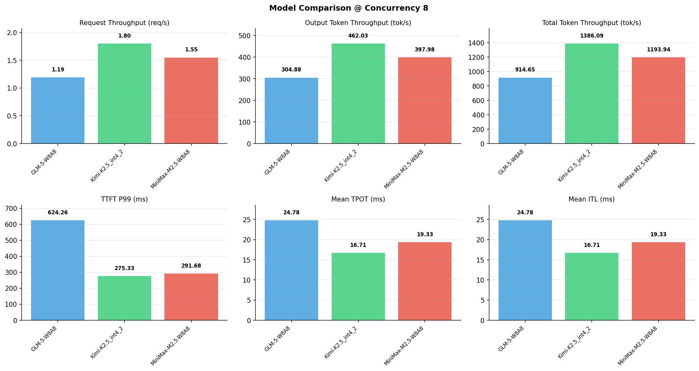

# 多模型性能对比报告

**测试日期：** 2026-05-14

**芯片平台：** inspur_metax_c550

**测试套件：** test_05

**Run ID：** 01, 01, 01

**并发级别：** 8并发

**测试配置：** 1000-i512-o256

---

## 🤖 芯片和模型配置信息

| 参数名称 | **MiniMax-M2.5-W8A8** | **GLM-5-W8A8** | **Kimi-K2.5_int4_2** |
|----------|----------|----------|----------|
| **max_position_embeddings** | 196608 | 202752 | 262144 |
| **model_name** | MiniMax-M2.5-W8A8 | GLM-5-W8A8 | Kimi-K2.5_int4_2 |
| **model_size** | 215G | 712G | 496G |
| **python_version** | 3.10.10 | 3.10.10 | 3.10.10 |
| **quantization_config** | int8 | int8 | int4 |
| **sglang_version** | 0.5.9+maca3.5.3.204 | 0.5.9+maca3.5.3.204 | 0.5.9+maca3.5.3.204 |
| **temperature** | N/A | N/A | N/A |
| **top_k** | 40 | N/A | N/A |
| **top_p** | 0.95 | N/A | N/A |
| **transformers_version** | 4.57.6 | 5.1.0 | 4.56.2 |

---

## ⚙️ SGLang 启动配置信息

| 参数名称 | **MiniMax-M2.5-W8A8** | **GLM-5-W8A8** | **Kimi-K2.5_int4_2** |
|----------|----------|----------|----------|
| **Attention Backend** | flashinfer | flashinfer | flashinfer |
| **Chunked Prefill Size** | N/A | 8192 | 8192 |
| **Context Length** | 196608 | 202752 | 262144 |
| **Cuda Graph Max Bs** | N/A | 64 | 64 |
| **Disable Radix Cache** | True | True | True |
| **Dp Size** | N/A | 4 | N/A |
| **Max Queued Requests** | None | None | None |
| **Max Running Requests** | 64 | 64 | 64 |
| **Mem Fraction Static** | 0.9 | 0.8 | 0.8 |
| **Model Name** | MiniMax-M2.5-W8A8 | GLM-5-W8A8 | Kimi-K2.5_int4_2 |
| **Nnodes** | 1 | 2 | 2 |
| **Pp Size** | 1 | 1 | 1 |
| **Quantization** | w8a8_int8 | w8a8_int8 | w4a8_int8 |
| **Reasoning Parser** | minimax-append-think | glm45 | kimi_k2 |
| **Tool Call Parser** | minimax-m2 | glm47 | kimi_k2 |
| **Tp Size** | 8 | 16 | 16 |

---

## 📊 模型列表

| 模型名称 | Run ID | 状态 |
|----------|--------|------|
| MiniMax-M2.5-W8A8 | 01 | [OK] |
| GLM-5-W8A8 | 01 | [OK] |
| Kimi-K2.5_int4_2 | 01 | [OK] |

---

## 📊 测试概览

| 项目            | 配置                                     | 备注  |
|---------------|----------------------------------------|-----|
| **数据集**       | random                                 |     |
| **并发数**       | 1, 4, 8, 16, 32, 64, 128    |     |
| **总请求数**      | 1000                                    |     |
| **输入输出长度** | (128, 128), (512, 256), (1024, 512), (2048, 1024), (4096, 2048), (8192, 1024) |     |
| **测试套件**     | test_05                           |     |
| **被测芯片**      | inspur_metax_c550 |     |
| **SGLang版本**   | 0.5.9                           |     |

---

## 📈 服务基准结果对比

| 指标 | MiniMax-M2.5-W8A8 (基准) | GLM-5-W8A8 | 差异 | % | Kimi-K2.5_int4_2 | 差异 | % |
|------|--------------- | --------- | ------- | ------- | --------- | ------- | -------|
| 成功请求数 | 1000 | 1000 | 0.00 | 0.0% | 1000 | 0.00 | 0.0% |
| 测试持续时间 (s) | 643.25 | 839.67 | +196.42 | +30.5% | 554.08 | -89.17 | -13.9% |
| 总输入 tokens | 512000 | 512000 | 0.00 | 0.0% | 512000 | 0.00 | 0.0% |
| 总生成 tokens | 256000 | 256000 | 0.00 | 0.0% | 256000 | 0.00 | 0.0% |
| **请求吞吐量 (req/s)** | 1.55 | 1.19 | -0.36 | -23.2% | 1.80 | +0.25 | +16.1% |
| **输出 token 吞吐量 (tok/s)** | 397.98 | 304.88 | -93.10 | -23.4% | 462.03 | +64.05 | +16.1% |
| **总 token 吞吐量 (tok/s)** | 1193.94 | 914.65 | -279.29 | -23.4% | 1386.09 | +192.15 | +16.1% |

---

## ⏱️ 首 Token 延迟 (TTFT) 对比

| 指标 | MiniMax-M2.5-W8A8 (基准) | GLM-5-W8A8 | 差异 | % | Kimi-K2.5_int4_2 | 差异 | % |
|------|--------------- | --------- | ------- | ------- | --------- | ------- | -------|
| 平均 TTFT (ms) | 215.00 | 387.75 | +172.75 | +80.3% | 163.27 | -51.73 | -24.1% |
| 中位 TTFT (ms) | 186.06 | 360.72 | +174.66 | +93.9% | 152.82 | -33.24 | -17.9% |
| P99 TTFT (ms) | 291.68 | 624.26 | +332.58 | +114.0% | 275.33 | -16.35 | -5.6% |

---

## ⚡ 每 Token 生成时间 (TPOT) 对比

| 指标 | MiniMax-M2.5-W8A8 (基准) | GLM-5-W8A8 | 差异 | % | Kimi-K2.5_int4_2 | 差异 | % |
|------|--------------- | --------- | ------- | ------- | --------- | ------- | -------|
| 平均 TPOT (ms) | 19.33 | 24.78 | +5.45 | +28.2% | 16.71 | -2.62 | -13.6% |
| 中位 TPOT (ms) | 19.33 | 23.43 | +4.10 | +21.2% | 16.21 | -3.12 | -16.1% |
| P99 TPOT (ms) | 19.51 | 37.94 | +18.43 | +94.5% | 22.71 | +3.20 | +16.4% |

---

## 🔄 Token 间延迟 (ITL) 对比

| 指标 | MiniMax-M2.5-W8A8 (基准) | GLM-5-W8A8 | 差异 | % | Kimi-K2.5_int4_2 | 差异 | % |
|------|--------------- | --------- | ------- | ------- | --------- | ------- | -------|
| 平均 ITL (ms) | 19.33 | 24.78 | +5.45 | +28.2% | 16.71 | -2.62 | -13.6% |
| 中位 ITL (ms) | 19.32 | 15.41 | -3.91 | -20.2% | 10.85 | -8.47 | -43.8% |
| P95 ITL (ms) | 19.52 | 90.23 | +70.71 | +362.2% | 51.12 | +31.60 | +161.9% |
| P99 ITL (ms) | 26.40 | 164.30 | +137.90 | +522.3% | 80.26 | +53.86 | +204.0% |

---

## ⏱️ 端到端延迟 (E2E) 对比

| 指标 | MiniMax-M2.5-W8A8 (基准) | GLM-5-W8A8 | 差异 | % | Kimi-K2.5_int4_2 | 差异 | % |
|------|--------------- | --------- | ------- | ------- | --------- | ------- | -------|
| 平均 E2E 延迟 (ms) | 5143.98 | 6705.38 | +1561.40 | +30.4% | 4423.68 | -720.30 | -14.0% |
| 中位 E2E 延迟 (ms) | 5119.13 | 6350.50 | +1231.37 | +24.1% | 4301.48 | -817.65 | -16.0% |
| P90 E2E 延迟 (ms) | 5228.44 | 8383.30 | +3154.86 | +60.3% | 5314.16 | +85.72 | +1.6% |
| P99 E2E 延迟 (ms) | 5252.21 | 10036.20 | +4783.99 | +91.1% | 6031.72 | +779.51 | +14.8% |

---

## 📊 模型性能对比

---

## 📝 分析小结

- **请求吞吐量**: Kimi-K2.5_int4_2 最高，达 1.80 req/s
- **总token吞吐量**: Kimi-K2.5_int4_2 最高，达 1386 tok/s
- **TTFT P99**: Kimi-K2.5_int4_2 最优，为 275.33ms
- **TPOT P99**: MiniMax-M2.5-W8A8 最优，为 19.51ms

---

*报告生成时间: 2026-05-14*

