# MiniMax-M2.5-W8A8模型在inspur_MetaX_C500上的多I/O测试报告

**测试日期：** 2026-04-27

---

## 测试场景
测试不同输入输出长度和并发级别下的性能表现，分析同一芯片同一模型在不同输入输出长度和并发级别下的性能指标变化趋势。

**主要采集指标**：

| 指标                  | 单位         | 含义                                 |
|---------------------|------------|------------------------------------|
| E2E Latency         | ms         | End-to-End Latency，端到端延迟         |
| TTFT                | ms         | Time To First Token，首 token 延迟     |
| TPOT                | ms/token   | Time Per Output Token，每 token 生成时间 |
| ITL                 | ms         | Inter-Token Latency，token间延迟       |
| Throughput          | tokens/s   | 系统总吞吐                              |
| QPS                 | requests/s | 请求吞吐                               |

---

## 📊 测试概览

| 项目            | 配置                                     | 备注  |
|---------------|----------------------------------------|-----|
| **数据集**       | random                                 |     |
| **并发数**       | 1, 4, 8, 16, 32, 64, 128    |     |
| **总请求数**      | 1000                                    |     |
| **输入输出长度** | (128, 128), (512, 256), (1024, 512), (2048, 1024), (4096, 2048), (8192, 1024) |     |
| **模型**        | MiniMax-M2.5-W8A8                           |     |
| **被测芯片**      | inspur_MetaX_C500 |     |
| **SGLang版本**   | 0.5.9                           |     |

---

## 🤖 芯片和模型配置信息

| 参数名称                    | inspur_MetaX_C500 |
|------------------------|-------------|
| **model_name** | MiniMax-M2.5-W8A8 |
| **quantization_config** | int8 |
| **model_size** | 215G |
| **max_position_embeddings** | 196608 |
| **temperature** | N/A |
| **top_k** | 40 |
| **top_p** | 0.95 |

---

## 🤖 SGLang启动配置信息

| 参数名称                   | inspur_MetaX_C500 |
|------------------------|-------------|
| **Model Name** | MiniMax-M2.5-W8A8 |
| **Attention Backend** | flashinfer |
| **Quantization** | w8a8_int8 |
| **TP Size** | 8 |
| **PP Size** | 1 |
| **Num Nodes** | 1 |
| **Data Type** | auto |
| **Context Length** | 196608 |
| **Max Running Requests** | 64 |

---

## 📋 各I/O测试汇总（随并发变化）

### input: 128, output: 128

| 并发数 | 请求吞吐量 (req/s) | 输出Token吞吐量 (tok/s) | 总Token吞吐量 (tok/s) | TTFT P99 (ms) | TPOT P99 (ms) | E2E延迟均值 (ms) |
| --------------- | --------------- | --------------- | --------------- | --------------- | --------------- | --------------- |
| 1 | 0.60 | 77.40 | 154.81 | 153.05 | 11.97 | 1653.19 |
| 4 | 1.90 | 242.97 | 485.94 | 155.80 | 15.55 | 2106.04 |
| 8 | 3.04 | 389.71 | 779.42 | 254.37 | 20.46 | 2625.12 |
| 16 | 5.32 | 680.39 | 1360.78 | 579.39 | 23.01 | 2985.68 |
| 32 | 8.73 | 1116.94 | 2233.88 | 575.15 | 27.81 | 3598.25 |
| 64 | 14.12 | 1807.14 | 3614.28 | 699.95 | 33.33 | 4426.21 |
| 128 | 14.73 | 1885.90 | 3771.79 | 4774.73 | 30.95 | 8236.08 |

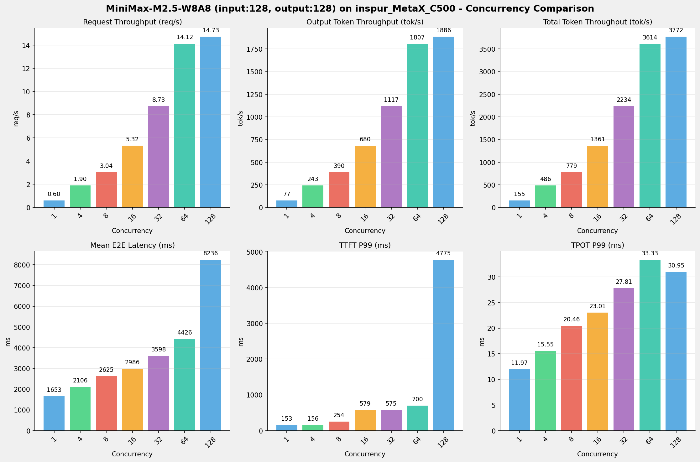

---

### input: 512, output: 256

| 并发数 | 请求吞吐量 (req/s) | 输出Token吞吐量 (tok/s) | 总Token吞吐量 (tok/s) | TTFT P99 (ms) | TPOT P99 (ms) | E2E延迟均值 (ms) |
| --------------- | --------------- | --------------- | --------------- | --------------- | --------------- | --------------- |
| 1 | 0.31 | 80.35 | 241.04 | 156.87 | 11.99 | 3185.64 |
| 4 | 0.96 | 246.10 | 738.30 | 249.24 | 16.06 | 4159.12 |
| 8 | 1.55 | 397.98 | 1193.94 | 291.68 | 19.51 | 5143.98 |
| 16 | 2.72 | 697.34 | 2092.01 | 417.62 | 22.05 | 5829.38 |
| 32 | 4.35 | 1112.46 | 3337.39 | 889.77 | 28.15 | 7234.85 |
| 64 | 6.82 | 1744.79 | 5234.37 | 1507.81 | 35.07 | 9185.69 |
| 128 | 6.86 | 1756.27 | 5268.82 | 10546.24 | 34.72 | 17724.38 |

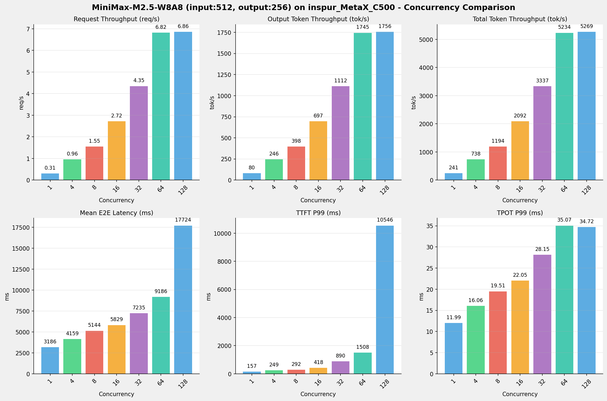

---

### input: 1024, output: 512

| 并发数 | 请求吞吐量 (req/s) | 输出Token吞吐量 (tok/s) | 总Token吞吐量 (tok/s) | TTFT P99 (ms) | TPOT P99 (ms) | E2E延迟均值 (ms) |
| --------------- | --------------- | --------------- | --------------- | --------------- | --------------- | --------------- |
| 1 | 0.16 | 81.65 | 244.96 | 158.39 | 12.03 | 6269.82 |
| 4 | 0.49 | 250.36 | 751.07 | 301.36 | 15.64 | 8179.01 |
| 8 | 0.78 | 399.06 | 1197.18 | 390.54 | 19.66 | 10262.02 |
| 16 | 1.34 | 685.28 | 2055.85 | 842.72 | 23.08 | 11867.82 |
| 32 | 2.14 | 1093.45 | 3280.35 | 1436.18 | 28.61 | 14729.27 |
| 64 | 3.30 | 1688.26 | 5064.77 | 2586.51 | 36.85 | 19004.47 |
| 128 | 3.31 | 1695.32 | 5085.96 | 21520.32 | 36.64 | 36737.88 |

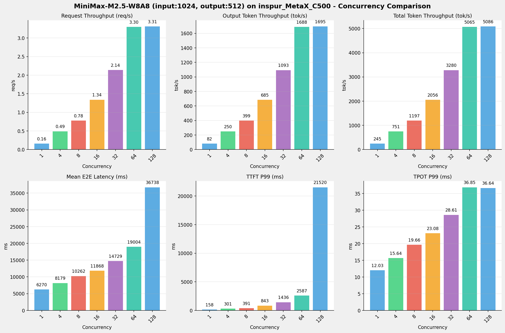

---

### input: 2048, output: 1024

| 并发数 | 请求吞吐量 (req/s) | 输出Token吞吐量 (tok/s) | 总Token吞吐量 (tok/s) | TTFT P99 (ms) | TPOT P99 (ms) | E2E延迟均值 (ms) |
| --------------- | --------------- | --------------- | --------------- | --------------- | --------------- | --------------- |
| 1 | 0.08 | 82.15 | 246.46 | 159.25 | 12.08 | 12463.90 |
| 4 | 0.24 | 250.25 | 750.74 | 427.62 | 15.83 | 16366.33 |
| 8 | 0.38 | 391.51 | 1174.52 | 738.03 | 20.36 | 20921.57 |
| 16 | 0.65 | 663.16 | 1989.48 | 1468.34 | 23.96 | 24534.78 |
| 32 | 1.02 | 1040.81 | 3122.42 | 2667.43 | 30.20 | 30975.32 |
| 64 | 1.52 | 1558.99 | 4676.97 | 5071.27 | 40.22 | 41194.32 |
| 128 | 1.52 | 1561.07 | 4683.20 | 46445.07 | 40.18 | 79891.22 |

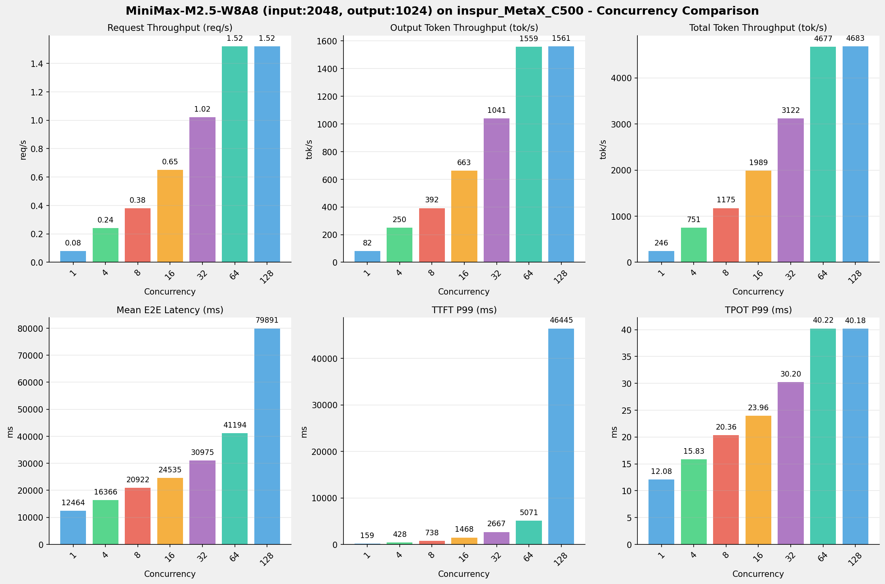

---

### input: 4096, output: 2048

| 并发数 | 请求吞吐量 (req/s) | 输出Token吞吐量 (tok/s) | 总Token吞吐量 (tok/s) | TTFT P99 (ms) | TPOT P99 (ms) | E2E延迟均值 (ms) |
| --------------- | --------------- | --------------- | --------------- | --------------- | --------------- | --------------- |
| 1 | 0.04 | 81.37 | 244.12 | 217.04 | 12.22 | 25167.30 |
| 4 | 0.12 | 243.35 | 730.04 | 750.50 | 16.48 | 33662.10 |
| 8 | 0.18 | 373.22 | 1119.65 | 1401.61 | 21.41 | 43896.57 |
| 16 | 0.30 | 622.42 | 1867.27 | 2726.73 | 25.58 | 52287.68 |
| 32 | 0.46 | 939.34 | 2818.03 | 5355.02 | 33.65 | 68699.13 |
| 64 | 0.66 | 1343.93 | 4031.78 | 10612.19 | 46.94 | 95651.49 |
| 128 | 0.66 | 1343.79 | 4031.36 | 107114.91 | 46.90 | 185915.84 |

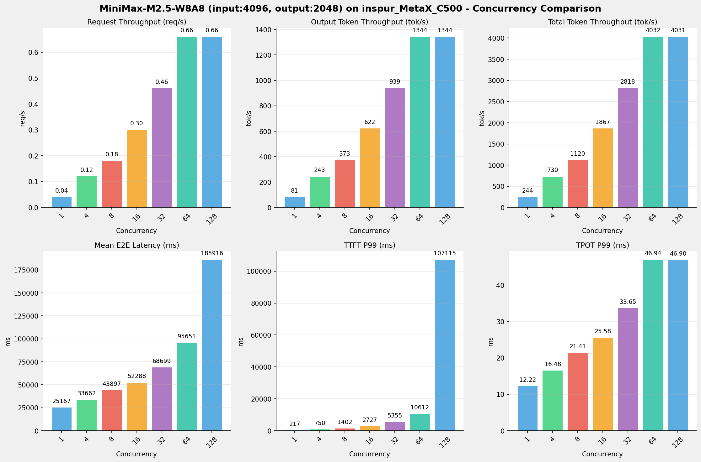

---

### input: 8192, output: 1024

| 并发数 | 请求吞吐量 (req/s) | 输出Token吞吐量 (tok/s) | 总Token吞吐量 (tok/s) | TTFT P99 (ms) | TPOT P99 (ms) | E2E延迟均值 (ms) |
| --------------- | --------------- | --------------- | --------------- | --------------- | --------------- | --------------- |
| 1 | 0.08 | 78.29 | 704.57 | 520.17 | 12.47 | 13079.88 |
| 4 | 0.21 | 219.44 | 1975.00 | 1674.84 | 18.01 | 18663.66 |
| 8 | 0.32 | 322.67 | 2904.05 | 3159.86 | 24.60 | 25384.99 |
| 16 | 0.48 | 494.64 | 4451.74 | 6149.73 | 32.34 | 32912.17 |
| 32 | 0.66 | 673.65 | 6062.88 | 12147.10 | 46.88 | 48015.24 |
| 64 | 0.84 | 856.52 | 7708.66 | 23889.08 | 73.84 | 75139.87 |
| 128 | 0.84 | 857.26 | 7715.33 | 99741.36 | 73.69 | 146090.88 |

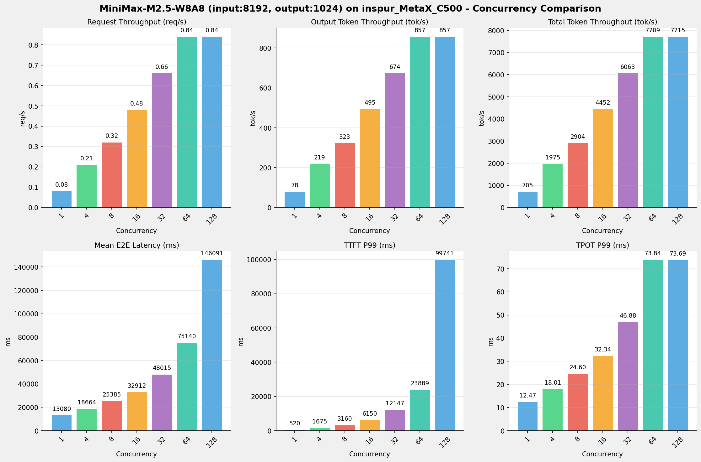

---

## 📊 I/O对比（固定并发数）

### 并发数 = 1

| 指标 | i128_o128 | i512_o256 | i1024_o512 | i2048_o1024 | i4096_o2048 | i8192_o1024 |
| --- | --- | --- | --- | --- | --- | --- |
| 请求吞吐量 (req/s) | 0.60 | 0.31 | 0.16 | 0.08 | 0.04 | 0.08 |
| 输出Token吞吐量 (tok/s) | 77.40 | 80.35 | 81.65 | 82.15 | 81.37 | 78.29 |
| 总Token吞吐量 (tok/s) | 154.81 | 241.04 | 244.96 | 246.46 | 244.12 | 704.57 |
| TTFT P99 (ms) | 153.05 | 156.87 | 158.39 | 159.25 | 217.04 | 520.17 |
| TPOT P99 (ms) | 11.97 | 11.99 | 12.03 | 12.08 | 12.22 | 12.47 |
| E2E延迟均值 (ms) | 1653.19 | 3185.64 | 6269.82 | 12463.90 | 25167.30 | 13079.88 |

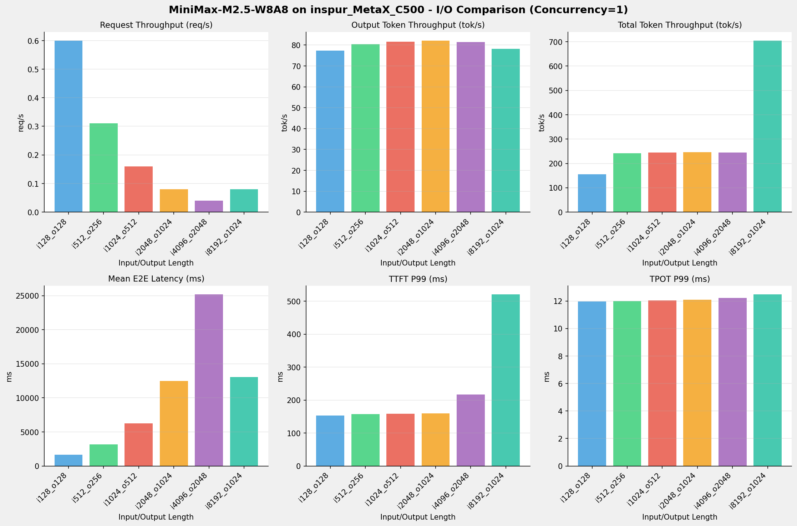

---

### 并发数 = 4

| 指标 | i128_o128 | i512_o256 | i1024_o512 | i2048_o1024 | i4096_o2048 | i8192_o1024 |
| --- | --- | --- | --- | --- | --- | --- |
| 请求吞吐量 (req/s) | 1.90 | 0.96 | 0.49 | 0.24 | 0.12 | 0.21 |
| 输出Token吞吐量 (tok/s) | 242.97 | 246.10 | 250.36 | 250.25 | 243.35 | 219.44 |
| 总Token吞吐量 (tok/s) | 485.94 | 738.30 | 751.07 | 750.74 | 730.04 | 1975.00 |
| TTFT P99 (ms) | 155.80 | 249.24 | 301.36 | 427.62 | 750.50 | 1674.84 |
| TPOT P99 (ms) | 15.55 | 16.06 | 15.64 | 15.83 | 16.48 | 18.01 |
| E2E延迟均值 (ms) | 2106.04 | 4159.12 | 8179.01 | 16366.33 | 33662.10 | 18663.66 |

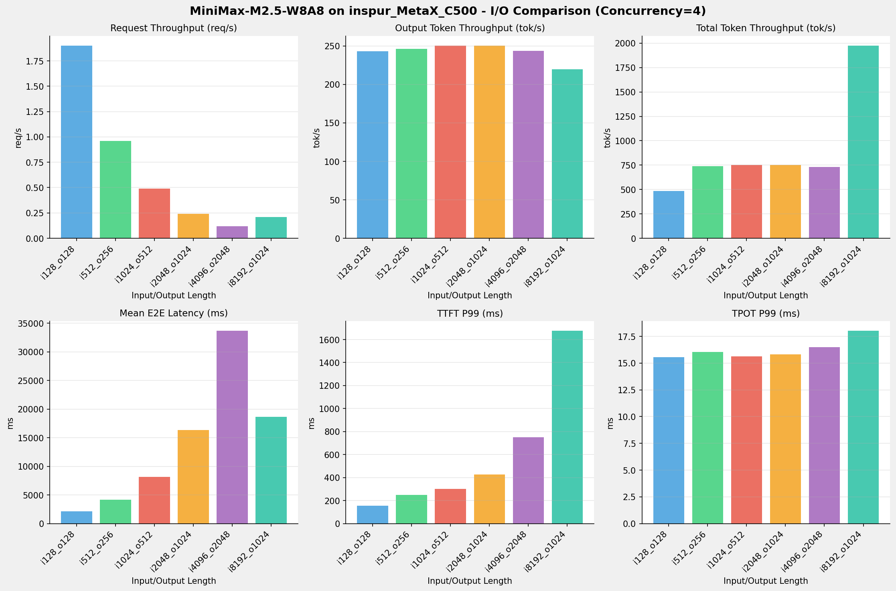

---

### 并发数 = 8

| 指标 | i128_o128 | i512_o256 | i1024_o512 | i2048_o1024 | i4096_o2048 | i8192_o1024 |
| --- | --- | --- | --- | --- | --- | --- |
| 请求吞吐量 (req/s) | 3.04 | 1.55 | 0.78 | 0.38 | 0.18 | 0.32 |
| 输出Token吞吐量 (tok/s) | 389.71 | 397.98 | 399.06 | 391.51 | 373.22 | 322.67 |
| 总Token吞吐量 (tok/s) | 779.42 | 1193.94 | 1197.18 | 1174.52 | 1119.65 | 2904.05 |
| TTFT P99 (ms) | 254.37 | 291.68 | 390.54 | 738.03 | 1401.61 | 3159.86 |
| TPOT P99 (ms) | 20.46 | 19.51 | 19.66 | 20.36 | 21.41 | 24.60 |
| E2E延迟均值 (ms) | 2625.12 | 5143.98 | 10262.02 | 20921.57 | 43896.57 | 25384.99 |

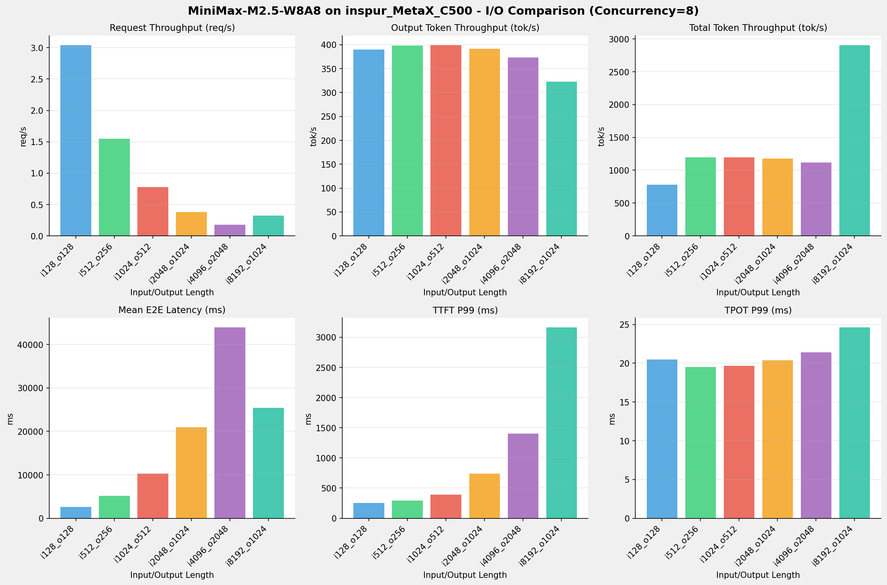

---

### 并发数 = 16

| 指标 | i128_o128 | i512_o256 | i1024_o512 | i2048_o1024 | i4096_o2048 | i8192_o1024 |
| --- | --- | --- | --- | --- | --- | --- |
| 请求吞吐量 (req/s) | 5.32 | 2.72 | 1.34 | 0.65 | 0.30 | 0.48 |
| 输出Token吞吐量 (tok/s) | 680.39 | 697.34 | 685.28 | 663.16 | 622.42 | 494.64 |
| 总Token吞吐量 (tok/s) | 1360.78 | 2092.01 | 2055.85 | 1989.48 | 1867.27 | 4451.74 |
| TTFT P99 (ms) | 579.39 | 417.62 | 842.72 | 1468.34 | 2726.73 | 6149.73 |
| TPOT P99 (ms) | 23.01 | 22.05 | 23.08 | 23.96 | 25.58 | 32.34 |
| E2E延迟均值 (ms) | 2985.68 | 5829.38 | 11867.82 | 24534.78 | 52287.68 | 32912.17 |

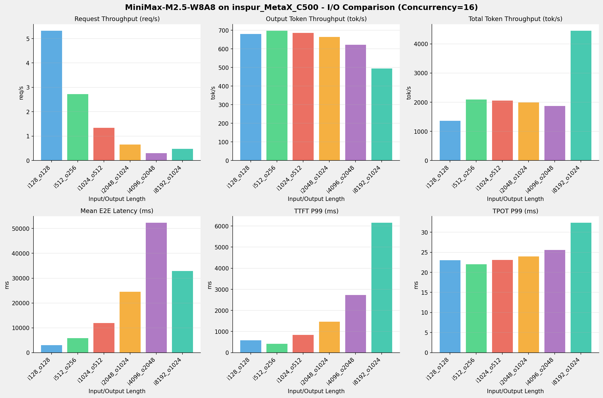

---

### 并发数 = 32

| 指标 | i128_o128 | i512_o256 | i1024_o512 | i2048_o1024 | i4096_o2048 | i8192_o1024 |
| --- | --- | --- | --- | --- | --- | --- |
| 请求吞吐量 (req/s) | 8.73 | 4.35 | 2.14 | 1.02 | 0.46 | 0.66 |
| 输出Token吞吐量 (tok/s) | 1116.94 | 1112.46 | 1093.45 | 1040.81 | 939.34 | 673.65 |
| 总Token吞吐量 (tok/s) | 2233.88 | 3337.39 | 3280.35 | 3122.42 | 2818.03 | 6062.88 |
| TTFT P99 (ms) | 575.15 | 889.77 | 1436.18 | 2667.43 | 5355.02 | 12147.10 |
| TPOT P99 (ms) | 27.81 | 28.15 | 28.61 | 30.20 | 33.65 | 46.88 |
| E2E延迟均值 (ms) | 3598.25 | 7234.85 | 14729.27 | 30975.32 | 68699.13 | 48015.24 |

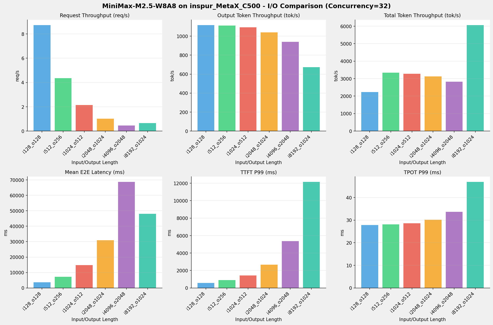

---

### 并发数 = 64

| 指标 | i128_o128 | i512_o256 | i1024_o512 | i2048_o1024 | i4096_o2048 | i8192_o1024 |
| --- | --- | --- | --- | --- | --- | --- |
| 请求吞吐量 (req/s) | 14.12 | 6.82 | 3.30 | 1.52 | 0.66 | 0.84 |
| 输出Token吞吐量 (tok/s) | 1807.14 | 1744.79 | 1688.26 | 1558.99 | 1343.93 | 856.52 |
| 总Token吞吐量 (tok/s) | 3614.28 | 5234.37 | 5064.77 | 4676.97 | 4031.78 | 7708.66 |
| TTFT P99 (ms) | 699.95 | 1507.81 | 2586.51 | 5071.27 | 10612.19 | 23889.08 |
| TPOT P99 (ms) | 33.33 | 35.07 | 36.85 | 40.22 | 46.94 | 73.84 |
| E2E延迟均值 (ms) | 4426.21 | 9185.69 | 19004.47 | 41194.32 | 95651.49 | 75139.87 |

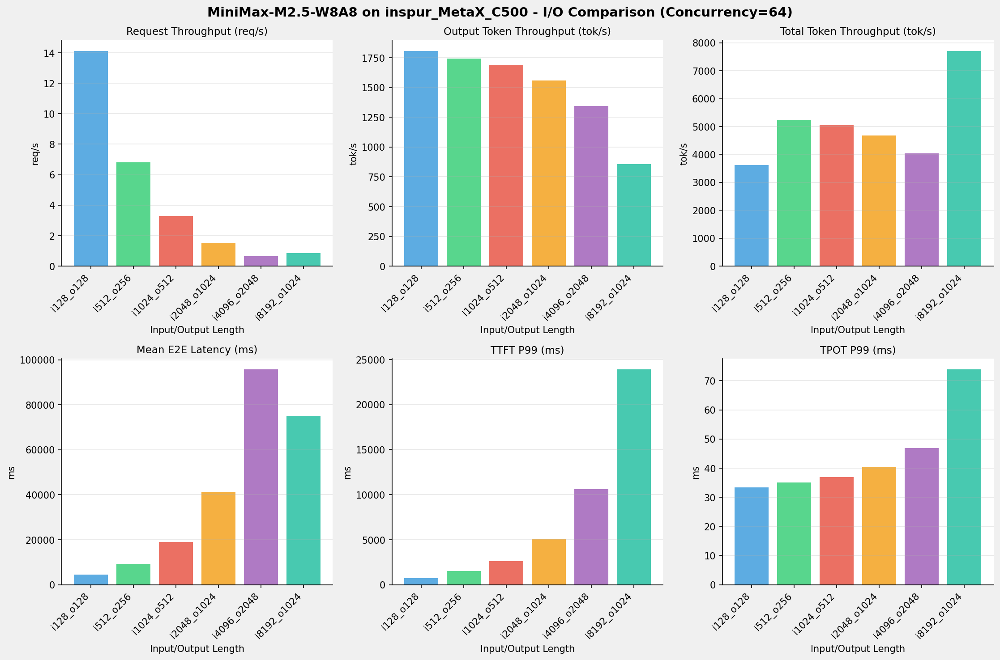

---

### 并发数 = 128

| 指标 | i128_o128 | i512_o256 | i1024_o512 | i2048_o1024 | i4096_o2048 | i8192_o1024 |
| --- | --- | --- | --- | --- | --- | --- |
| 请求吞吐量 (req/s) | 14.73 | 6.86 | 3.31 | 1.52 | 0.66 | 0.84 |
| 输出Token吞吐量 (tok/s) | 1885.90 | 1756.27 | 1695.32 | 1561.07 | 1343.79 | 857.26 |
| 总Token吞吐量 (tok/s) | 3771.79 | 5268.82 | 5085.96 | 4683.20 | 4031.36 | 7715.33 |
| TTFT P99 (ms) | 4774.73 | 10546.24 | 21520.32 | 46445.07 | 107114.91 | 99741.36 |
| TPOT P99 (ms) | 30.95 | 34.72 | 36.64 | 40.18 | 46.90 | 73.69 |
| E2E延迟均值 (ms) | 8236.08 | 17724.38 | 36737.88 | 79891.22 | 185915.84 | 146090.88 |

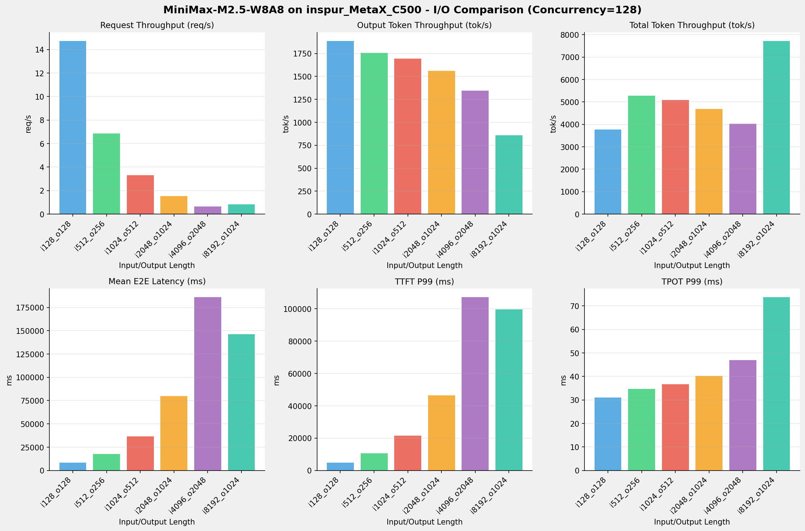

---

## 📝 详细性能数据

### input: 128, output: 128

#### 服务基准结果

| 指标 | 1 并发 | 4 并发 | 8 并发 | 16 并发 | 32 并发 | 64 并发 | 128 并发 |
| ----------- | ----------- | ----------- | ----------- | ----------- | ----------- | ----------- | ----------- |
| 成功请求数 | 1000 | 1000 | 1000 | 1000 | 1000 | 1000 | 1000 |
| 测试持续时间 (s) | 1653.66 | 526.81 | 328.45 | 188.13 | 114.60 | 70.83 | 67.87 |
| 总输入 tokens | 128000 | 128000 | 128000 | 128000 | 128000 | 128000 | 128000 |
| 总生成 tokens | 128000 | 128000 | 128000 | 128000 | 128000 | 128000 | 128000 |
| **请求吞吐量 (req/s)** | 0.60 | 1.90 | 3.04 | 5.32 | 8.73 | 14.12 | 14.73 |
| **输出 token 吞吐量 (tok/s)** | 77.40 | 242.97 | 389.71 | 680.39 | 1116.94 | 1807.14 | 1885.90 |
| 峰值输出 token 吞吐量 (tok/s) | 85.00 | 264.00 | 424.00 | 752.00 | 1280.00 | 2164.00 | 2112.00 |
| 总 token 吞吐量 (tok/s) | 154.81 | 485.94 | 779.42 | 1360.78 | 2233.88 | 3614.28 | 3771.79 |

#### TTFT

| 指标 | 1 并发 | 4 并发 | 8 并发 | 16 并发 | 32 并发 | 64 并发 | 128 并发 |
|----------- | ----------- | ----------- | ----------- | ----------- | ----------- | ----------- | -----------|
| 平均 TTFT (ms) | 139.21 | 142.27 | 150.13 | 196.13 | 291.81 | 422.90 | 4370.19 |
| P99 TTFT (ms) | 153.05 | 155.80 | 254.37 | 579.39 | 575.15 | 699.95 | 4774.73 |

#### TPOT

| 指标 | 1 并发 | 4 并发 | 8 并发 | 16 并发 | 32 并发 | 64 并发 | 128 并发 |
|----------- | ----------- | ----------- | ----------- | ----------- | ----------- | ----------- | -----------|
| 平均 TPOT (ms) | 11.92 | 15.46 | 19.49 | 21.96 | 26.03 | 31.52 | 30.44 |
| P99 TPOT (ms) | 11.97 | 15.55 | 20.46 | 23.01 | 27.81 | 33.33 | 30.95 |

#### ITL

| 指标 | 1 并发 | 4 并发 | 8 并发 | 16 并发 | 32 并发 | 64 并发 | 128 并发 |
|----------- | ----------- | ----------- | ----------- | ----------- | ----------- | ----------- | -----------|
| 平均 ITL (ms) | 11.92 | 15.46 | 19.49 | 21.97 | 26.04 | 31.52 | 30.44 |
| P99 ITL (ms) | 15.08 | 21.82 | 26.82 | 28.35 | 31.51 | 43.92 | 35.96 |

---

### input: 512, output: 256

#### 服务基准结果

| 指标 | 1 并发 | 4 并发 | 8 并发 | 16 并发 | 32 并发 | 64 并发 | 128 并发 |
| ----------- | ----------- | ----------- | ----------- | ----------- | ----------- | ----------- | ----------- |
| 成功请求数 | 1000 | 1000 | 1000 | 1000 | 1000 | 1000 | 1000 |
| 测试持续时间 (s) | 3186.16 | 1040.23 | 643.25 | 367.11 | 230.12 | 146.72 | 145.76 |
| 总输入 tokens | 512000 | 512000 | 512000 | 512000 | 512000 | 512000 | 512000 |
| 总生成 tokens | 256000 | 256000 | 256000 | 256000 | 256000 | 256000 | 256000 |
| **请求吞吐量 (req/s)** | 0.31 | 0.96 | 1.55 | 2.72 | 4.35 | 6.82 | 6.86 |
| **输出 token 吞吐量 (tok/s)** | 80.35 | 246.10 | 397.98 | 697.34 | 1112.46 | 1744.79 | 1756.27 |
| 峰值输出 token 吞吐量 (tok/s) | 85.00 | 264.00 | 424.00 | 768.00 | 1280.00 | 2112.00 | 2112.00 |
| 总 token 吞吐量 (tok/s) | 241.04 | 738.30 | 1193.94 | 2092.01 | 3337.39 | 5234.37 | 5268.82 |

#### TTFT

| 指标 | 1 并发 | 4 并发 | 8 并发 | 16 并发 | 32 并发 | 64 并发 | 128 并发 |
|----------- | ----------- | ----------- | ----------- | ----------- | ----------- | ----------- | -----------|
| 平均 TTFT (ms) | 141.95 | 152.81 | 215.00 | 324.41 | 575.74 | 938.33 | 9433.86 |
| P99 TTFT (ms) | 156.87 | 249.24 | 291.68 | 417.62 | 889.77 | 1507.81 | 10546.24 |

#### TPOT

| 指标 | 1 并发 | 4 并发 | 8 并发 | 16 并发 | 32 并发 | 64 并发 | 128 并发 |
|----------- | ----------- | ----------- | ----------- | ----------- | ----------- | ----------- | -----------|
| 平均 TPOT (ms) | 11.94 | 15.71 | 19.33 | 21.59 | 26.11 | 32.34 | 32.51 |
| P99 TPOT (ms) | 11.99 | 16.06 | 19.51 | 22.05 | 28.15 | 35.07 | 34.72 |

#### ITL

| 指标 | 1 并发 | 4 并发 | 8 并发 | 16 并发 | 32 并发 | 64 并发 | 128 并发 |
|----------- | ----------- | ----------- | ----------- | ----------- | ----------- | ----------- | -----------|
| 平均 ITL (ms) | 11.94 | 15.71 | 19.33 | 21.59 | 26.11 | 32.34 | 32.51 |
| P99 ITL (ms) | 15.35 | 23.55 | 26.40 | 28.20 | 31.62 | 36.08 | 36.14 |

---

### input: 1024, output: 512

#### 服务基准结果

| 指标 | 1 并发 | 4 并发 | 8 并发 | 16 并发 | 32 并发 | 64 并发 | 128 并发 |
| ----------- | ----------- | ----------- | ----------- | ----------- | ----------- | ----------- | ----------- |
| 成功请求数 | 1000 | 1000 | 1000 | 1000 | 1000 | 1000 | 1000 |
| 测试持续时间 (s) | 6270.34 | 2045.08 | 1283.02 | 747.14 | 468.24 | 303.27 | 302.01 |
| 总输入 tokens | 1024000 | 1024000 | 1024000 | 1024000 | 1024000 | 1024000 | 1024000 |
| 总生成 tokens | 512000 | 512000 | 512000 | 512000 | 512000 | 512000 | 512000 |
| **请求吞吐量 (req/s)** | 0.16 | 0.49 | 0.78 | 1.34 | 2.14 | 3.30 | 3.31 |
| **输出 token 吞吐量 (tok/s)** | 81.65 | 250.36 | 399.06 | 685.28 | 1093.45 | 1688.26 | 1695.32 |
| 峰值输出 token 吞吐量 (tok/s) | 85.00 | 264.00 | 424.00 | 752.00 | 1248.00 | 2048.00 | 2048.00 |
| 总 token 吞吐量 (tok/s) | 244.96 | 751.07 | 1197.18 | 2055.85 | 3280.35 | 5064.77 | 5085.96 |

#### TTFT

| 指标 | 1 并发 | 4 并发 | 8 并发 | 16 并发 | 32 并发 | 64 并发 | 128 并发 |
|----------- | ----------- | ----------- | ----------- | ----------- | ----------- | ----------- | -----------|
| 平均 TTFT (ms) | 143.03 | 241.51 | 325.14 | 523.71 | 907.93 | 1519.45 | 19250.58 |
| P99 TTFT (ms) | 158.39 | 301.36 | 390.54 | 842.72 | 1436.18 | 2586.51 | 21520.32 |

#### TPOT

| 指标 | 1 并发 | 4 并发 | 8 并发 | 16 并发 | 32 并发 | 64 并发 | 128 并发 |
|----------- | ----------- | ----------- | ----------- | ----------- | ----------- | ----------- | -----------|
| 平均 TPOT (ms) | 11.99 | 15.53 | 19.45 | 22.20 | 27.05 | 34.22 | 34.22 |
| P99 TPOT (ms) | 12.03 | 15.64 | 19.66 | 23.08 | 28.61 | 36.85 | 36.64 |

#### ITL

| 指标 | 1 并发 | 4 并发 | 8 并发 | 16 并发 | 32 并发 | 64 并发 | 128 并发 |
|----------- | ----------- | ----------- | ----------- | ----------- | ----------- | ----------- | -----------|
| 平均 ITL (ms) | 11.99 | 15.53 | 19.45 | 22.20 | 27.05 | 34.22 | 34.22 |
| P99 ITL (ms) | 17.67 | 21.83 | 27.69 | 29.02 | 32.11 | 37.13 | 37.19 |

---

### input: 2048, output: 1024

#### 服务基准结果

| 指标 | 1 并发 | 4 并发 | 8 并发 | 16 并发 | 32 并发 | 64 并发 | 128 并发 |
| ----------- | ----------- | ----------- | ----------- | ----------- | ----------- | ----------- | ----------- |
| 成功请求数 | 1000 | 1000 | 1000 | 1000 | 1000 | 1000 | 1000 |
| 测试持续时间 (s) | 12464.41 | 4091.94 | 2615.53 | 1544.12 | 983.85 | 656.84 | 655.96 |
| 总输入 tokens | 2048000 | 2048000 | 2048000 | 2048000 | 2048000 | 2048000 | 2048000 |
| 总生成 tokens | 1024000 | 1024000 | 1024000 | 1024000 | 1024000 | 1024000 | 1024000 |
| **请求吞吐量 (req/s)** | 0.08 | 0.24 | 0.38 | 0.65 | 1.02 | 1.52 | 1.52 |
| **输出 token 吞吐量 (tok/s)** | 82.15 | 250.25 | 391.51 | 663.16 | 1040.81 | 1558.99 | 1561.07 |
| 峰值输出 token 吞吐量 (tok/s) | 84.00 | 260.00 | 416.00 | 730.00 | 1216.00 | 1908.00 | 1856.00 |
| 总 token 吞吐量 (tok/s) | 246.46 | 750.74 | 1174.52 | 1989.48 | 3122.42 | 4676.97 | 4683.20 |

#### TTFT

| 指标 | 1 并发 | 4 并发 | 8 并发 | 16 并发 | 32 并发 | 64 并发 | 128 并发 |
|----------- | ----------- | ----------- | ----------- | ----------- | ----------- | ----------- | -----------|
| 平均 TTFT (ms) | 141.97 | 341.07 | 549.16 | 907.13 | 1538.65 | 2774.32 | 41436.86 |
| P99 TTFT (ms) | 159.25 | 427.62 | 738.03 | 1468.34 | 2667.43 | 5071.27 | 46445.07 |

#### TPOT

| 指标 | 1 并发 | 4 并发 | 8 并发 | 16 并发 | 32 并发 | 64 并发 | 128 并发 |
|----------- | ----------- | ----------- | ----------- | ----------- | ----------- | ----------- | -----------|
| 平均 TPOT (ms) | 12.04 | 15.66 | 19.91 | 23.10 | 28.77 | 37.56 | 37.59 |
| P99 TPOT (ms) | 12.08 | 15.83 | 20.36 | 23.96 | 30.20 | 40.22 | 40.18 |

#### ITL

| 指标 | 1 并发 | 4 并发 | 8 并发 | 16 并发 | 32 并发 | 64 并发 | 128 并发 |
|----------- | ----------- | ----------- | ----------- | ----------- | ----------- | ----------- | -----------|
| 平均 ITL (ms) | 12.04 | 15.66 | 19.91 | 23.10 | 28.77 | 37.56 | 37.59 |
| P99 ITL (ms) | 16.73 | 21.32 | 27.78 | 29.45 | 33.35 | 39.86 | 40.13 |

---

### input: 4096, output: 2048

#### 服务基准结果

| 指标 | 1 并发 | 4 并发 | 8 并发 | 16 并发 | 32 并发 | 64 并发 | 128 并发 |
| ----------- | ----------- | ----------- | ----------- | ----------- | ----------- | ----------- | ----------- |
| 成功请求数 | 1000 | 1000 | 1000 | 1000 | 1000 | 1000 | 1000 |
| 测试持续时间 (s) | 25167.85 | 8415.94 | 5487.44 | 3290.37 | 2180.24 | 1523.89 | 1524.05 |
| 总输入 tokens | 4096000 | 4096000 | 4096000 | 4096000 | 4096000 | 4096000 | 4096000 |
| 总生成 tokens | 2048000 | 2048000 | 2048000 | 2048000 | 2048000 | 2048000 | 2048000 |
| **请求吞吐量 (req/s)** | 0.04 | 0.12 | 0.18 | 0.30 | 0.46 | 0.66 | 0.66 |
| **输出 token 吞吐量 (tok/s)** | 81.37 | 243.35 | 373.22 | 622.42 | 939.34 | 1343.93 | 1343.79 |
| 峰值输出 token 吞吐量 (tok/s) | 83.00 | 256.00 | 400.00 | 688.00 | 1088.00 | 1664.00 | 1664.00 |
| 总 token 吞吐量 (tok/s) | 244.12 | 730.04 | 1119.65 | 1867.27 | 2818.03 | 4031.78 | 4031.36 |

#### TTFT

| 指标 | 1 并发 | 4 并发 | 8 并发 | 16 并发 | 32 并发 | 64 并发 | 128 并发 |
|----------- | ----------- | ----------- | ----------- | ----------- | ----------- | ----------- | -----------|
| 平均 TTFT (ms) | 197.31 | 573.04 | 931.87 | 1594.85 | 2902.41 | 5434.22 | 95692.10 |
| P99 TTFT (ms) | 217.04 | 750.50 | 1401.61 | 2726.73 | 5355.02 | 10612.19 | 107114.91 |

#### TPOT

| 指标 | 1 并发 | 4 并发 | 8 并发 | 16 并发 | 32 并发 | 64 并发 | 128 并发 |
|----------- | ----------- | ----------- | ----------- | ----------- | ----------- | ----------- | -----------|
| 平均 TPOT (ms) | 12.20 | 16.16 | 20.99 | 24.76 | 32.14 | 44.07 | 44.08 |
| P99 TPOT (ms) | 12.22 | 16.48 | 21.41 | 25.58 | 33.65 | 46.94 | 46.90 |

#### ITL

| 指标 | 1 并发 | 4 并发 | 8 并发 | 16 并发 | 32 并发 | 64 并发 | 128 并发 |
|----------- | ----------- | ----------- | ----------- | ----------- | ----------- | ----------- | -----------|
| 平均 ITL (ms) | 12.20 | 16.16 | 20.99 | 24.76 | 32.14 | 44.07 | 44.08 |
| P99 ITL (ms) | 16.26 | 21.81 | 28.13 | 30.11 | 35.66 | 46.28 | 46.39 |

---

### input: 8192, output: 1024

#### 服务基准结果

| 指标 | 1 并发 | 4 并发 | 8 并发 | 16 并发 | 32 并发 | 64 并发 | 128 并发 |
| ----------- | ----------- | ----------- | ----------- | ----------- | ----------- | ----------- | ----------- |
| 成功请求数 | 1000 | 1000 | 1000 | 1000 | 1000 | 1000 | 1000 |
| 测试持续时间 (s) | 13080.41 | 4666.34 | 3173.50 | 2070.20 | 1520.07 | 1195.54 | 1194.51 |
| 总输入 tokens | 8192000 | 8192000 | 8192000 | 8192000 | 8192000 | 8192000 | 8192000 |
| 总生成 tokens | 1024000 | 1024000 | 1024000 | 1024000 | 1024000 | 1024000 | 1024000 |
| **请求吞吐量 (req/s)** | 0.08 | 0.21 | 0.32 | 0.48 | 0.66 | 0.84 | 0.84 |
| **输出 token 吞吐量 (tok/s)** | 78.29 | 219.44 | 322.67 | 494.64 | 673.65 | 856.52 | 857.26 |
| 峰值输出 token 吞吐量 (tok/s) | 82.00 | 244.00 | 376.00 | 624.00 | 928.00 | 1280.00 | 1344.00 |
| 总 token 吞吐量 (tok/s) | 704.57 | 1975.00 | 2904.05 | 4451.74 | 6062.88 | 7708.66 | 7715.33 |

#### TTFT

| 指标 | 1 并发 | 4 并发 | 8 并发 | 16 并发 | 32 并发 | 64 并发 | 128 并发 |
|----------- | ----------- | ----------- | ----------- | ----------- | ----------- | ----------- | -----------|
| 平均 TTFT (ms) | 373.11 | 1002.75 | 1745.96 | 3201.04 | 6122.72 | 11914.66 | 82898.14 |
| P99 TTFT (ms) | 520.17 | 1674.84 | 3159.86 | 6149.73 | 12147.10 | 23889.08 | 99741.36 |

#### TPOT

| 指标 | 1 并发 | 4 并发 | 8 并发 | 16 并发 | 32 并发 | 64 并发 | 128 并发 |
|----------- | ----------- | ----------- | ----------- | ----------- | ----------- | ----------- | -----------|
| 平均 TPOT (ms) | 12.42 | 17.26 | 23.11 | 29.04 | 40.95 | 61.80 | 61.77 |
| P99 TPOT (ms) | 12.47 | 18.01 | 24.60 | 32.34 | 46.88 | 73.84 | 73.69 |

#### ITL

| 指标 | 1 并发 | 4 并发 | 8 并发 | 16 并发 | 32 并发 | 64 并发 | 128 并发 |
|----------- | ----------- | ----------- | ----------- | ----------- | ----------- | ----------- | -----------|
| 平均 ITL (ms) | 12.42 | 17.26 | 23.11 | 29.04 | 40.95 | 61.80 | 61.77 |
| P99 ITL (ms) | 17.77 | 23.89 | 27.16 | 31.66 | 39.63 | 54.52 | 54.66 |

---

*报告生成时间: 2026-04-27*

