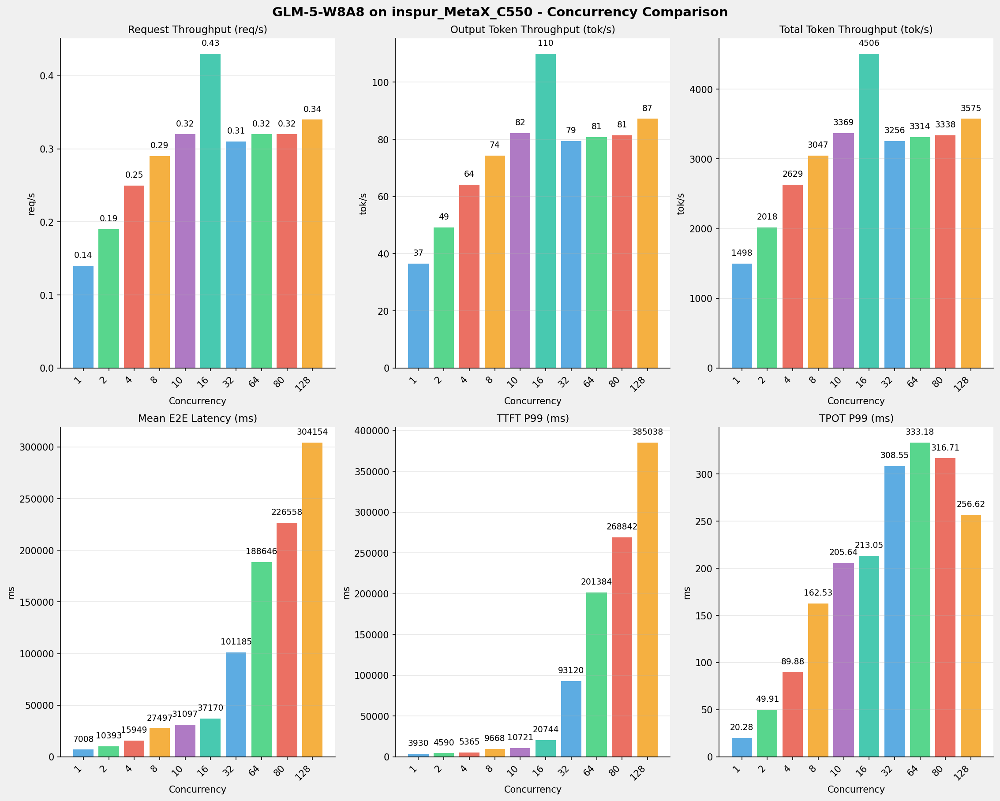
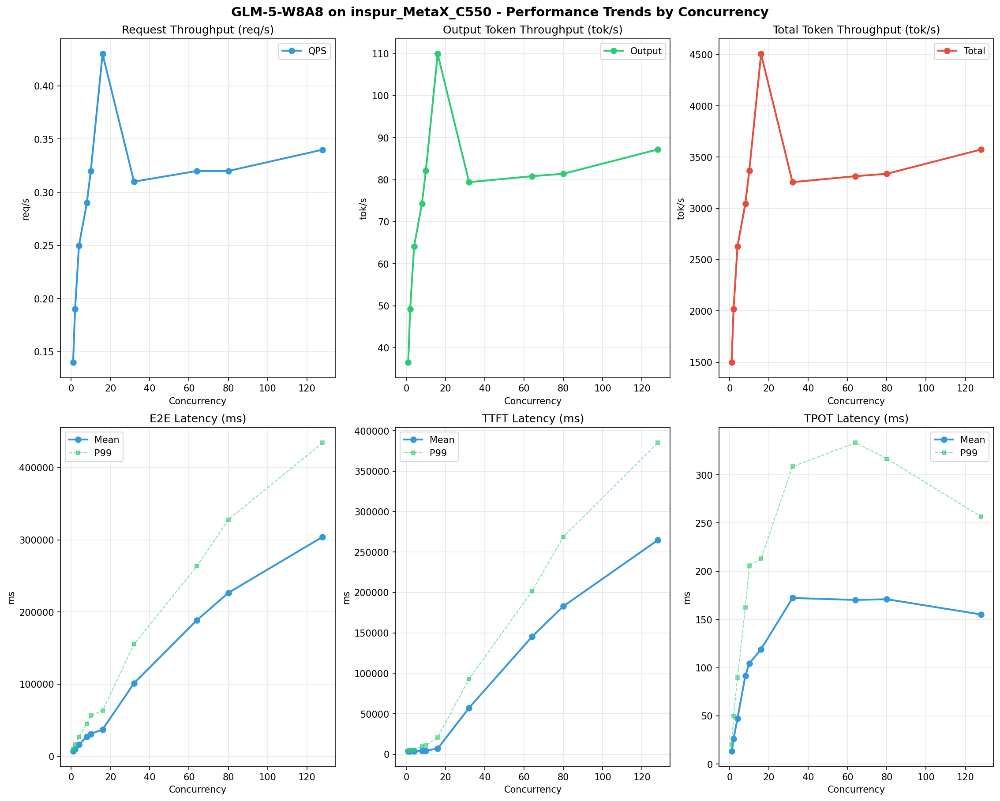

# GLM-5-W8A8模型在inspur_MetaX_C550上的Benchmark基准测试报告

**测试日期：** 2026-05-13

---

## 测试场景
使用sglang bench serve基准测试工具对不同并发数，请求上下文长度下的性能变化趋势。

**主要采集指标**：

| 指标                  | 单位         | 含义                                 |
|---------------------|------------|------------------------------------|
| E2E Latency         | ms         | End-to-End Latency，端到端延迟         |
| TTFT                | ms         | Time To First Token，首 token 延迟     |
| TPOT                | ms/token   | Time Per Output Token，每 token 生成时间 |
| ITL                 | ms         | Inter-Token Latency，token间延迟       |
| Throughput          | tokens/s   | 系统总吞吐                              |
| QPS                 | requests/s | 请求吞吐                               |

## 🤖 芯片和模型配置信息

| 参数名称                    | inspur_MetaX_C550 |
|------------------------|-------------|
| **model_name** | GLM-5-W8A8 |
| **quantization_config** | int8 |
| **model_size** | 712G |
| **max_position_embeddings** | 202752 |
| **temperature** | N/A |
| **top_k** | N/A |
| **top_p** | N/A |
| **transformers_version** | 5.1.0 |
| **sglang_version** | 0.5.9+maca3.5.3.204 |
| **python_version** | 3.10.10 |

## 🤖 SGLang启动配置信息

| 参数名称                   | inspur_MetaX_C550 |
|------------------------|-------------|
| **Model Name** | GLM-5-W8A8 |
| **Attention Backend** | flashinfer |
| **Quantization** | w8a8_int8 |
| **Tp Size** | 16 |
| **Dp Size** | 4 |
| **Pp Size** | 1 |
| **Nnodes** | 2 |
| **Context Length** | 202752 |
| **Cuda Graph Max Bs** | 64 |
| **Max Running Requests** | 64 |
| **Max Queued Requests** | None |
| **Chunked Prefill Size** | 8192 |
| **Disable Radix Cache** | True |
| **Tool Call Parser** | glm47 |
| **Reasoning Parser** | glm45 |
| **Mem Fraction Static** | 0.8 |

- **inspur_MetaX_C550**: 浪潮MetaX_C550 SGLang启动配置

## 📊 测试概览

| 项目            | 配置                                     | 备注  |
|---------------|----------------------------------------|-----|
| **数据集**       | random                                 |     |
| **并发数**       | 1, 2, 4, 8, 10, 16, 32, 64, 80, 128    |     |
| **总请求数**      | 320                                    |     |
| **请求输入上下文长度** | 10240（10k）                             |     |
| **请求输出上下文长度** | 256（0.25k）                             |     |
| **模型**        | GLM-5-W8A8                           |     |
| **被测芯片**      | inspur_MetaX_C550 |     |
| **SGLang版本**   | 0.5.9                           |     |

---

## 📋 测试结果汇总

| 并发数 | 请求吞吐量 (req/s) | 输出Token吞吐量 (tok/s) | 总Token吞吐量 (tok/s) | TTFT P99 (ms) | TPOT P99 (ms) | E2E延迟均值 (ms) |
| ----------- | ----------- | ----------- | ----------- | ----------- | ----------- | ----------- |
| 1 | 0.14 | 36.52 | 1497.52 | 3929.91 | 20.28 | 7008.40 |
| 2 | 0.19 | 49.22 | 2018.03 | 4589.56 | 49.91 | 10393.40 |
| 4 | 0.25 | 64.11 | 2628.53 | 5364.65 | 89.88 | 15948.98 |
| 8 | 0.29 | 74.32 | 3047.29 | 9668.44 | 162.53 | 27497.14 |
| 10 | 0.32 | 82.17 | 3369.03 | 10721.27 | 205.64 | 31097.31 |
| 16 | 0.43 | 109.90 | 4506.02 | 20743.80 | 213.05 | 37169.95 |
| 32 | 0.31 | 79.41 | 3255.88 | 93120.34 | 308.55 | 101185.36 |
| 64 | 0.32 | 80.83 | 3314.18 | 201384.39 | 333.18 | 188645.87 |
| 80 | 0.32 | 81.40 | 3337.56 | 268841.72 | 316.71 | 226558.37 |
| 128 | 0.34 | 87.19 | 3574.74 | 385037.85 | 256.62 | 304153.90 |

## 📊 各并发级别性能柱状图

## 📈 性能趋势分析

---

### 🎯 服务基准结果详情

| 指标 | 1 并发 | 2 并发 | 4 并发 | 8 并发 | 10 并发 | 16 并发 | 32 并发 | 64 并发 | 80 并发 | 128 并发 |
|------|----------- | ----------- | ----------- | ----------- | ----------- | ----------- | ----------- | ----------- | ----------- | -----------|
| 成功请求数 | 320 | 320 | 320 | 320 | 320 | 320 | 320 | 320 | 320 | 320 |
| 测试持续时间 (s) | 2242.86 | 1664.36 | 1277.79 | 1102.20 | 996.94 | 745.38 | 1031.58 | 1013.44 | 1006.34 | 939.57 |
| 总输入 tokens | 3276800 | 3276800 | 3276800 | 3276800 | 3276800 | 3276800 | 3276800 | 3276800 | 3276800 | 3276800 |
| 总生成 tokens | 81920 | 81920 | 81920 | 81920 | 81920 | 81920 | 81920 | 81920 | 81920 | 81920 |
| **请求吞吐量 (req/s)** | 0.14 | 0.19 | 0.25 | 0.29 | 0.32 | 0.43 | 0.31 | 0.32 | 0.32 | 0.34 |
| **输出 token 吞吐量 (tok/s)** | 36.52 | 49.22 | 64.11 | 74.32 | 82.17 | 109.90 | 79.41 | 80.83 | 81.40 | 87.19 |
| 峰值输出 token 吞吐量 (tok/s) | 79.00 | 154.00 | 304.00 | 512.00 | 579.00 | 856.00 | 858.00 | 858.00 | 857.00 | 858.00 |
| 峰值并发请求数 | 2 | 4 | 7 | 14 | 19 | 27 | 44 | 76 | 92 | 138 |
| **总 token 吞吐量 (tok/s)** | 1497.52 | 2018.03 | 2628.53 | 3047.29 | 3369.03 | 4506.02 | 3255.88 | 3314.18 | 3337.56 | 3574.74 |

### ⏱️ 端到端延迟 (E2E Latency)

| 指标 | 1 并发 | 2 并发 | 4 并发 | 8 并发 | 10 并发 | 16 并发 | 32 并发 | 64 并发 | 80 并发 | 128 并发 |
|------|----------- | ----------- | ----------- | ----------- | ----------- | ----------- | ----------- | ----------- | ----------- | -----------|
| 平均 E2E 延迟 (ms) | 7008.40 | 10393.40 | 15948.98 | 27497.14 | 31097.31 | 37169.95 | 101185.36 | 188645.87 | 226558.37 | 304153.90 |
| 中位 E2E 延迟 (ms) | 6926.36 | 10536.89 | 15193.08 | 27210.99 | 31105.24 | 36593.75 | 106428.80 | 207505.30 | 243196.58 | 367519.69 |
| P90 E2E 延迟 (ms) | 7072.51 | 10801.95 | 17969.51 | 30236.75 | 36980.31 | 45041.12 | 130915.84 | 237037.20 | 302403.79 | 415240.42 |
| P99 E2E 延迟 (ms) | 9562.98 | 16322.43 | 26868.07 | 45219.70 | 56469.11 | 63320.77 | 155388.38 | 263429.41 | 328009.41 | 434512.31 |

### ⏱️ 首Token延迟 (TTFT)

| 指标 | 1 并发 | 2 并发 | 4 并发 | 8 并发 | 10 并发 | 16 并发 | 32 并发 | 64 并发 | 80 并发 | 128 并发 |
|------|----------- | ----------- | ----------- | ----------- | ----------- | ----------- | ----------- | ----------- | ----------- | -----------|
| 平均 TTFT (ms) | 3606.89 | 3679.49 | 3860.75 | 4101.49 | 4476.11 | 6795.86 | 57259.92 | 145239.71 | 182957.70 | 264586.02 |
| 中位 TTFT (ms) | 3602.74 | 3616.86 | 3630.53 | 3651.05 | 4096.36 | 4863.36 | 59284.08 | 161034.99 | 198816.67 | 328292.33 |
| P99 TTFT (ms) | 3929.91 | 4589.56 | 5364.65 | 9668.44 | 10721.27 | 20743.80 | 93120.34 | 201384.39 | 268841.72 | 385037.85 |

### ⚡ 每Token生成时间 (TPOT)

| 指标 | 1 并发 | 2 并发 | 4 并发 | 8 并发 | 10 并发 | 16 并发 | 32 并发 | 64 并发 | 80 并发 | 128 并发 |
|------|----------- | ----------- | ----------- | ----------- | ----------- | ----------- | ----------- | ----------- | ----------- | -----------|
| 平均 TPOT (ms) | 13.34 | 26.33 | 47.40 | 91.75 | 104.40 | 119.11 | 172.26 | 170.22 | 170.98 | 155.17 |
| 中位 TPOT (ms) | 13.03 | 27.18 | 45.10 | 92.20 | 105.28 | 120.53 | 186.66 | 177.38 | 169.97 | 157.99 |
| P99 TPOT (ms) | 20.28 | 49.91 | 89.88 | 162.53 | 205.64 | 213.05 | 308.55 | 333.18 | 316.71 | 256.62 |

### 🔄 Token间延迟 (ITL)

| 指标 | 1 并发 | 2 并发 | 4 并发 | 8 并发 | 10 并发 | 16 并发 | 32 并发 | 64 并发 | 80 并发 | 128 并发 |
|------|----------- | ----------- | ----------- | ----------- | ----------- | ----------- | ----------- | ----------- | ----------- | -----------|
| 平均 ITL (ms) | 13.34 | 26.33 | 47.41 | 91.75 | 104.40 | 119.12 | 172.27 | 170.23 | 170.99 | 155.18 |
| 中位 ITL (ms) | 12.93 | 13.16 | 13.37 | 15.98 | 17.64 | 18.91 | 18.94 | 18.96 | 18.95 | 18.94 |
| P95 ITL (ms) | 13.33 | 17.19 | 19.34 | 906.35 | 911.33 | 1035.01 | 920.94 | 919.57 | 920.39 | 926.95 |
| P99 ITL (ms) | 25.50 | 896.21 | 910.14 | 1148.91 | 1156.99 | 1331.45 | 2633.70 | 2103.50 | 1915.10 | 2106.33 |

---

## 📝 分析总结

### 1. 吞吐量性能分析

**请求吞吐量 (QPS)**: 随着并发级别增加，QPS持续上升。
低并发(1,2,4)平均 QPS: 0.19 req/s；
中并发(8,10,16,32)平均 QPS: 0.34 req/s；
高并发(64,80,128)平均 QPS: 0.33 req/s；
最高 QPS 出现在 16 并发，达到 0.43 req/s。

**Token总吞吐量**: 最高达到 4506 tok/s (16 并发)。

### 2. 端到端延迟 (E2E Latency) 分析

E2E延迟随并发增加显著上升。
低并发平均 P99 E2E: 17584ms；
高并发平均 P99 E2E: 341984ms；
最高 P99 E2E 出现在 128 并发，达到 434512ms。

### 3. 首Token延迟 (TTFT) 分析

TTFT随并发增加显著上升。
低并发平均 P99 TTFT: 4628ms；
高并发平均 P99 TTFT: 285088ms；
最高 P99 TTFT 出现在 128 并发，达到 385038ms。

### 4. Token生成时间 (TPOT) 分析

TPOT随并发增加也呈上升趋势。
低并发平均 P99 TPOT: 53.36ms；
高并发平均 P99 TPOT: 302.17ms；
最高 P99 TPOT 出现在 64 并发，达到 333.18ms。

### 5. Token间延迟 (ITL) 分析

ITL随并发增加呈上升趋势。
低并发平均 P99 ITL: 610.62ms；
高并发平均 P99 ITL: 2041.64ms；
最高 P99 ITL 出现在 32 并发，达到 2633.70ms。

### 6. 综合评估

**吞吐量增长**: 从最低并发到最高并发，QPS增长了 142.9%。
**E2E延迟恶化**: 高并发相比低并发，E2E P99增加了 2371.0%。
**TTFT延迟恶化**: 高并发相比低并发，TTFT P99增加了 8219.7%。
**TPOT延迟恶化**: 高并发相比低并发，TPOT P99增加了 524.4%。

---

*报告生成时间: 2026-05-13*

