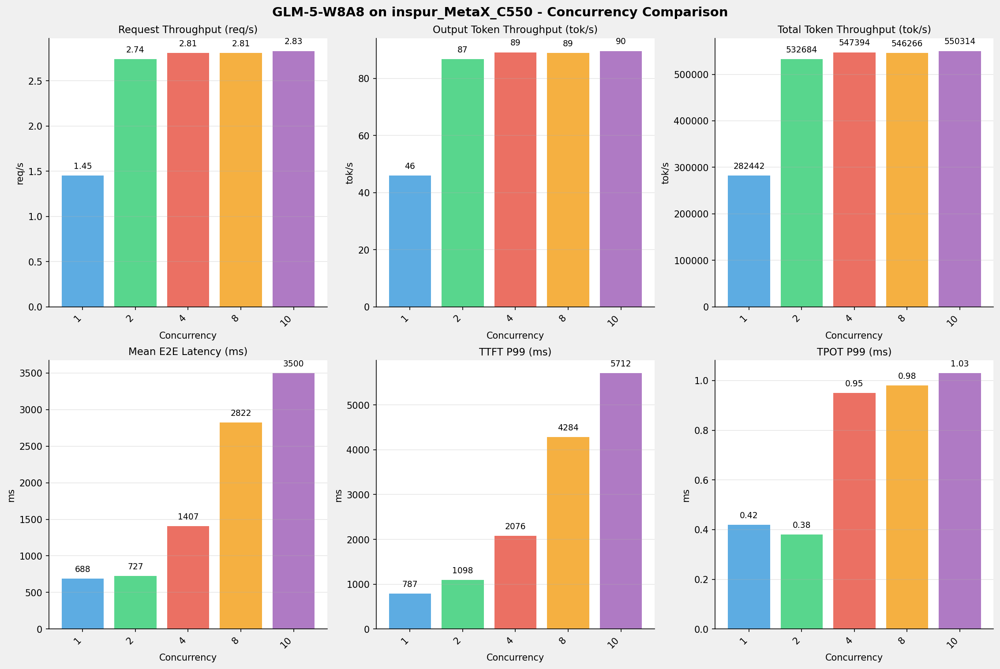
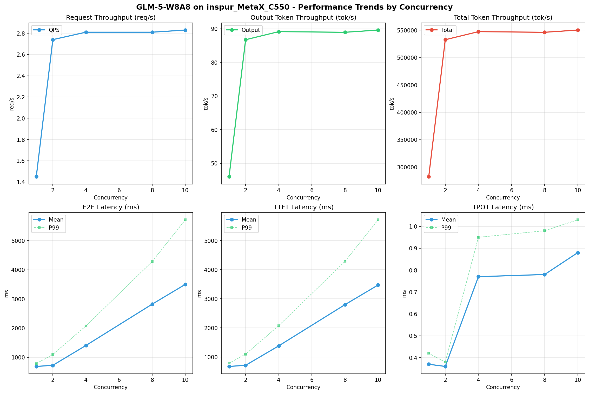

# GLM-5-W8A8模型在inspur_MetaX_C550上的Benchmark基准测试报告

**测试日期：** 2026-05-13

---

## 测试场景
使用sglang bench serve基准测试工具对不同并发数，请求上下文长度下的性能变化趋势。

**主要采集指标**：

| 指标                  | 单位         | 含义                                 |
|---------------------|------------|------------------------------------|
| E2E Latency         | ms         | End-to-End Latency，端到端延迟         |
| TTFT                | ms         | Time To First Token，首 token 延迟     |
| TPOT                | ms/token   | Time Per Output Token，每 token 生成时间 |
| ITL                 | ms         | Inter-Token Latency，token间延迟       |
| Throughput          | tokens/s   | 系统总吞吐                              |
| QPS                 | requests/s | 请求吞吐                               |

## 🤖 芯片和模型配置信息

| 参数名称                    | inspur_MetaX_C550 |
|------------------------|-------------|
| **model_name** | GLM-5-W8A8 |
| **quantization_config** | int8 |
| **model_size** | 712G |
| **max_position_embeddings** | 202752 |
| **temperature** | N/A |
| **top_k** | N/A |
| **top_p** | N/A |
| **transformers_version** | 5.1.0 |
| **sglang_version** | 0.5.9+maca3.5.3.204 |
| **python_version** | 3.10.10 |

## 🤖 SGLang启动配置信息

| 参数名称                   | inspur_MetaX_C550 |
|------------------------|-------------|
| **Model Name** | GLM-5-W8A8 |
| **Attention Backend** | flashinfer |
| **Quantization** | w8a8_int8 |
| **Tp Size** | 16 |
| **Dp Size** | 4 |
| **Pp Size** | 1 |
| **Nnodes** | 2 |
| **Context Length** | 202752 |
| **Cuda Graph Max Bs** | 64 |
| **Max Running Requests** | 64 |
| **Max Queued Requests** | None |
| **Chunked Prefill Size** | 8192 |
| **Disable Radix Cache** | True |
| **Tool Call Parser** | glm47 |
| **Reasoning Parser** | glm45 |
| **Mem Fraction Static** | 0.8 |

- **inspur_MetaX_C550**: 浪潮MetaX_C550 SGLang启动配置

## 📊 测试概览

| 项目            | 配置                                     | 备注  |
|---------------|----------------------------------------|-----|
| **数据集**       | random                                 |     |
| **并发数**       | 1, 2, 4, 8, 10    |     |
| **总请求数**      | 100                                    |     |
| **请求输入上下文长度** | 194560（190k）                             |     |
| **请求输出上下文长度** | 1024（1k）                             |     |
| **模型**        | GLM-5-W8A8                           |     |
| **被测芯片**      | inspur_MetaX_C550 |     |
| **SGLang版本**   | 0.5.9                           |     |

---

## 📋 测试结果汇总

| 并发数 | 请求吞吐量 (req/s) | 输出Token吞吐量 (tok/s) | 总Token吞吐量 (tok/s) | TTFT P99 (ms) | TPOT P99 (ms) | E2E延迟均值 (ms) |
| ----------- | ----------- | ----------- | ----------- | ----------- | ----------- | ----------- |
| 1 | 1.45 | 46.00 | 282442.27 | 787.19 | 0.42 | 688.40 |
| 2 | 2.74 | 86.75 | 532683.60 | 1097.86 | 0.38 | 726.67 |
| 4 | 2.81 | 89.15 | 547393.69 | 2076.30 | 0.95 | 1406.97 |
| 8 | 2.81 | 88.96 | 546265.77 | 4283.84 | 0.98 | 2821.97 |
| 10 | 2.83 | 89.62 | 550313.50 | 5711.66 | 1.03 | 3499.53 |

## 📊 各并发级别性能柱状图

## 📈 性能趋势分析

---

### 🎯 服务基准结果详情

| 指标 | 1 并发 | 2 并发 | 4 并发 | 8 并发 | 10 并发 |
|------|----------- | ----------- | ----------- | ----------- | -----------|
| 成功请求数 | 100 | 100 | 100 | 100 | 100 |
| 测试持续时间 (s) | 68.90 | 36.53 | 35.55 | 35.62 | 35.36 |
| 总输入 tokens | 19456000 | 19456000 | 19456000 | 19456000 | 19456000 |
| 总生成 tokens | 3169 | 3169 | 3169 | 3169 | 3169 |
| **请求吞吐量 (req/s)** | 1.45 | 2.74 | 2.81 | 2.81 | 2.83 |
| **输出 token 吞吐量 (tok/s)** | 46.00 | 86.75 | 89.15 | 88.96 | 89.62 |
| 峰值输出 token 吞吐量 (tok/s) | 3.00 | 4.00 | 4.00 | 7.00 | 9.00 |
| 峰值并发请求数 | 3 | 6 | 8 | 12 | 14 |
| **总 token 吞吐量 (tok/s)** | 282442.27 | 532683.60 | 547393.69 | 546265.77 | 550313.50 |

### ⏱️ 端到端延迟 (E2E Latency)

| 指标 | 1 并发 | 2 并发 | 4 并发 | 8 并发 | 10 并发 |
|------|----------- | ----------- | ----------- | ----------- | -----------|
| 平均 E2E 延迟 (ms) | 688.40 | 726.67 | 1406.97 | 2821.97 | 3499.53 |
| 中位 E2E 延迟 (ms) | 697.19 | 719.91 | 1406.93 | 2848.50 | 3492.02 |
| P90 E2E 延迟 (ms) | 753.32 | 802.03 | 1733.43 | 3177.04 | 4114.64 |
| P99 E2E 延迟 (ms) | 787.19 | 1097.87 | 2076.31 | 4283.85 | 5711.68 |

### ⏱️ 首Token延迟 (TTFT)

| 指标 | 1 并发 | 2 并发 | 4 并发 | 8 并发 | 10 并发 |
|------|----------- | ----------- | ----------- | ----------- | -----------|
| 平均 TTFT (ms) | 677.01 | 715.72 | 1383.44 | 2798.16 | 3472.63 |
| 中位 TTFT (ms) | 697.18 | 719.90 | 1406.92 | 2848.49 | 3492.02 |
| P99 TTFT (ms) | 787.19 | 1097.86 | 2076.30 | 4283.84 | 5711.66 |

### ⚡ 每Token生成时间 (TPOT)

| 指标 | 1 并发 | 2 并发 | 4 并发 | 8 并发 | 10 并发 |
|------|----------- | ----------- | ----------- | ----------- | -----------|
| 平均 TPOT (ms) | 0.37 | 0.36 | 0.77 | 0.78 | 0.88 |
| 中位 TPOT (ms) | 0.37 | 0.37 | 0.68 | 0.67 | 0.94 |
| P99 TPOT (ms) | 0.42 | 0.38 | 0.95 | 0.98 | 1.03 |

### 🔄 Token间延迟 (ITL)

| 指标 | 1 并发 | 2 并发 | 4 并发 | 8 并发 | 10 并发 |
|------|----------- | ----------- | ----------- | ----------- | -----------|
| 平均 ITL (ms) | 0.00 | 0.00 | 0.00 | 0.00 | 0.00 |
| 中位 ITL (ms) | 0.00 | 0.00 | 0.00 | 0.00 | 0.00 |
| P95 ITL (ms) | 0.00 | 0.00 | 0.00 | 0.00 | 0.00 |
| P99 ITL (ms) | 0.00 | 0.00 | 0.00 | 0.00 | 0.00 |

---

## 📝 分析总结

### 1. 吞吐量性能分析

**请求吞吐量 (QPS)**: 随着并发级别增加，QPS持续上升。
低并发(1,2,4)平均 QPS: 2.33 req/s；
中并发(8,10)平均 QPS: 2.82 req/s；
最高 QPS 出现在 10 并发，达到 2.83 req/s。

**Token总吞吐量**: 最高达到 550314 tok/s (10 并发)。

### 2. 端到端延迟 (E2E Latency) 分析

E2E延迟随并发增加显著上升。
低并发平均 P99 E2E: 1320ms；
最高 P99 E2E 出现在 10 并发，达到 5712ms。

### 3. 首Token延迟 (TTFT) 分析

TTFT随并发增加显著上升。
低并发平均 P99 TTFT: 1320ms；
最高 P99 TTFT 出现在 10 并发，达到 5712ms。

### 4. Token生成时间 (TPOT) 分析

TPOT随并发增加也呈上升趋势。
低并发平均 P99 TPOT: 0.58ms；
最高 P99 TPOT 出现在 10 并发，达到 1.03ms。

### 5. Token间延迟 (ITL) 分析

ITL随并发增加呈上升趋势。
低并发平均 P99 ITL: 0.00ms；
最高 P99 ITL 出现在 None 并发，达到 0.00ms。

### 6. 综合评估

**吞吐量增长**: 从最低并发到最高并发，QPS增长了 95.2%。
**E2E延迟恶化**: 高并发相比低并发，E2E P99增加了 332.6%。
**TTFT延迟恶化**: 高并发相比低并发，TTFT P99增加了 332.6%。
**TPOT延迟恶化**: 高并发相比低并发，TPOT P99增加了 76.6%。

---

*报告生成时间: 2026-05-13*

