# GLM-5-W8A8模型在inspur_MetaX_C550上的多I/O测试报告

**测试日期：** 2026-05-13

---

## 测试场景
测试不同输入输出长度和并发级别下的性能表现，分析同一芯片同一模型在不同输入输出长度和并发级别下的性能指标变化趋势。

**主要采集指标**：

| 指标                  | 单位         | 含义                                 |
|---------------------|------------|------------------------------------|
| E2E Latency         | ms         | End-to-End Latency，端到端延迟         |
| TTFT                | ms         | Time To First Token，首 token 延迟     |
| TPOT                | ms/token   | Time Per Output Token，每 token 生成时间 |
| ITL                 | ms         | Inter-Token Latency，token间延迟       |
| Throughput          | tokens/s   | 系统总吞吐                              |
| QPS                 | requests/s | 请求吞吐                               |

## 🤖 芯片和模型配置信息

| 参数名称                    | inspur_MetaX_C550 |
|------------------------|-------------|
| **model_name** | GLM-5-W8A8 |
| **quantization_config** | int8 |
| **model_size** | 712G |
| **max_position_embeddings** | 202752 |
| **temperature** | N/A |
| **top_k** | N/A |
| **top_p** | N/A |
| **transformers_version** | 5.1.0 |
| **sglang_version** | 0.5.9+maca3.5.3.204 |
| **python_version** | 3.10.10 |

## 🤖 SGLang启动配置信息

| 参数名称                   | inspur_MetaX_C550 |
|------------------------|-------------|
| **Model Name** | GLM-5-W8A8 |
| **Attention Backend** | flashinfer |
| **Quantization** | w8a8_int8 |
| **Tp Size** | 16 |
| **Dp Size** | 4 |
| **Pp Size** | 1 |
| **Nnodes** | 2 |
| **Context Length** | 202752 |
| **Cuda Graph Max Bs** | 64 |
| **Max Running Requests** | 64 |
| **Max Queued Requests** | None |
| **Chunked Prefill Size** | 8192 |
| **Disable Radix Cache** | True |
| **Tool Call Parser** | glm47 |
| **Reasoning Parser** | glm45 |
| **Mem Fraction Static** | 0.8 |

- **inspur_MetaX_C550**: 浪潮MetaX_C550 SGLang启动配置

## 📊 测试概览

| 项目            | 配置                                     | 备注  |
|---------------|----------------------------------------|-----|
| **数据集**       | random                                 |     |
| **并发数**       | 1, 4, 8, 16, 32, 64, 128    |     |
| **总请求数**      | 1000                                    |     |
| **输入输出长度** | (128, 128), (512, 256), (1024, 512), (2048, 1024), (4096, 2048), (8192, 1024) |     |
| **模型**        | GLM-5-W8A8                           |     |
| **被测芯片**      | inspur_MetaX_C550 |     |
| **SGLang版本**   | 0.5.9                           |     |

---

## 📋 各I/O测试汇总（固定上下文长度，随并发变化）

### input: 128, output: 128

| 并发数 | 请求吞吐量 (req/s) | 输出Token吞吐量 (tok/s) | 总Token吞吐量 (tok/s) | TTFT P99 (ms) | TPOT P99 (ms) | E2E延迟均值 (ms) |
| --------------- | --------------- | --------------- | --------------- | --------------- | --------------- | --------------- |
| 1 | 0.43 | 55.55 | 111.10 | 364.84 | 22.97 | 2303.79 |
| 4 | 1.22 | 155.68 | 311.35 | 593.86 | 35.14 | 3284.59 |
| 8 | 1.69 | 215.80 | 431.60 | 604.47 | 52.50 | 4738.52 |
| 16 | 2.32 | 297.01 | 594.03 | 607.85 | 77.50 | 6867.78 |
| 32 | 3.17 | 406.17 | 812.34 | 664.24 | 114.84 | 10030.79 |
| 64 | 4.16 | 533.08 | 1066.15 | 3465.57 | 175.69 | 15224.52 |
| 128 | 4.78 | 611.98 | 1223.96 | 17851.20 | 157.60 | 25802.83 |

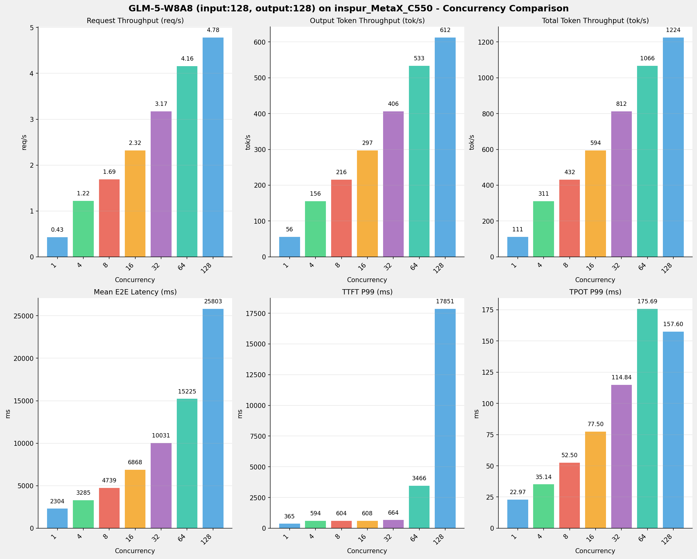

---

### input: 512, output: 256

| 并发数 | 请求吞吐量 (req/s) | 输出Token吞吐量 (tok/s) | 总Token吞吐量 (tok/s) | TTFT P99 (ms) | TPOT P99 (ms) | E2E延迟均值 (ms) |
| --------------- | --------------- | --------------- | --------------- | --------------- | --------------- | --------------- |
| 1 | 0.26 | 66.38 | 199.14 | 367.82 | 21.32 | 3856.13 |
| 4 | 0.81 | 207.27 | 621.82 | 596.99 | 28.99 | 4935.95 |
| 8 | 1.19 | 304.88 | 914.65 | 624.26 | 37.94 | 6705.38 |
| 16 | 1.70 | 434.85 | 1304.55 | 662.07 | 55.71 | 9392.49 |
| 32 | 2.39 | 611.12 | 1833.37 | 1371.85 | 79.40 | 13321.30 |
| 64 | 3.27 | 836.53 | 2509.59 | 4391.67 | 116.28 | 19333.53 |
| 128 | 3.35 | 857.71 | 2573.12 | 26855.53 | 113.49 | 36641.89 |

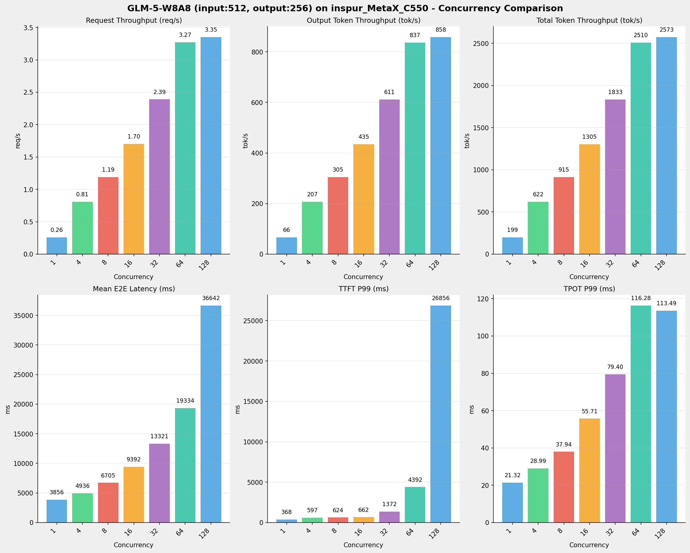

---

### input: 1024, output: 512

| 并发数 | 请求吞吐量 (req/s) | 输出Token吞吐量 (tok/s) | 总Token吞吐量 (tok/s) | TTFT P99 (ms) | TPOT P99 (ms) | E2E延迟均值 (ms) |
| --------------- | --------------- | --------------- | --------------- | --------------- | --------------- | --------------- |
| 1 | 0.14 | 72.15 | 216.44 | 599.30 | 19.57 | 7096.32 |
| 4 | 0.48 | 246.53 | 739.58 | 649.84 | 24.15 | 8295.56 |
| 8 | 0.74 | 377.85 | 1133.56 | 667.05 | 30.82 | 10815.91 |
| 16 | 1.10 | 564.61 | 1693.82 | 1086.67 | 42.55 | 14446.57 |
| 32 | 1.62 | 829.93 | 2489.79 | 2456.56 | 54.04 | 19590.23 |
| 64 | 2.31 | 1182.13 | 3546.40 | 5837.82 | 79.17 | 27167.83 |
| 128 | 2.21 | 1129.38 | 3388.15 | 38714.32 | 85.79 | 55275.26 |

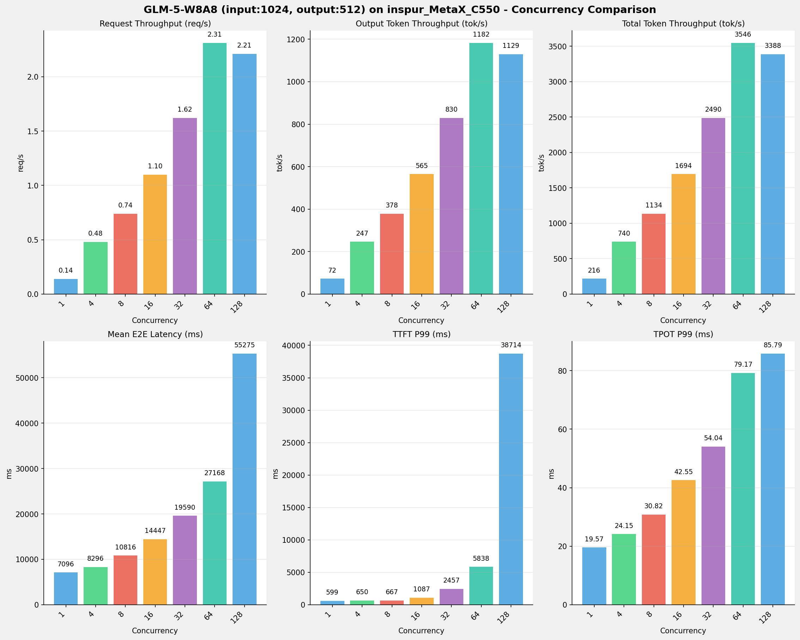

---

### input: 2048, output: 1024

| 并发数 | 请求吞吐量 (req/s) | 输出Token吞吐量 (tok/s) | 总Token吞吐量 (tok/s) | TTFT P99 (ms) | TPOT P99 (ms) | E2E延迟均值 (ms) |
| --------------- | --------------- | --------------- | --------------- | --------------- | --------------- | --------------- |
| 1 | 0.07 | 72.77 | 218.31 | 903.22 | 19.35 | 14071.42 |
| 4 | 0.24 | 250.85 | 752.54 | 949.47 | 23.47 | 16317.46 |
| 8 | 0.38 | 384.79 | 1154.37 | 1069.07 | 31.63 | 21235.31 |
| 16 | 0.57 | 583.11 | 1749.33 | 1833.58 | 38.57 | 27886.82 |
| 32 | 0.83 | 845.71 | 2537.12 | 4848.58 | 54.10 | 38232.31 |
| 64 | 1.13 | 1154.46 | 3463.39 | 25978.52 | 77.16 | 55429.21 |
| 128 | 1.04 | 1061.58 | 3184.75 | 85028.34 | 111.50 | 118379.85 |

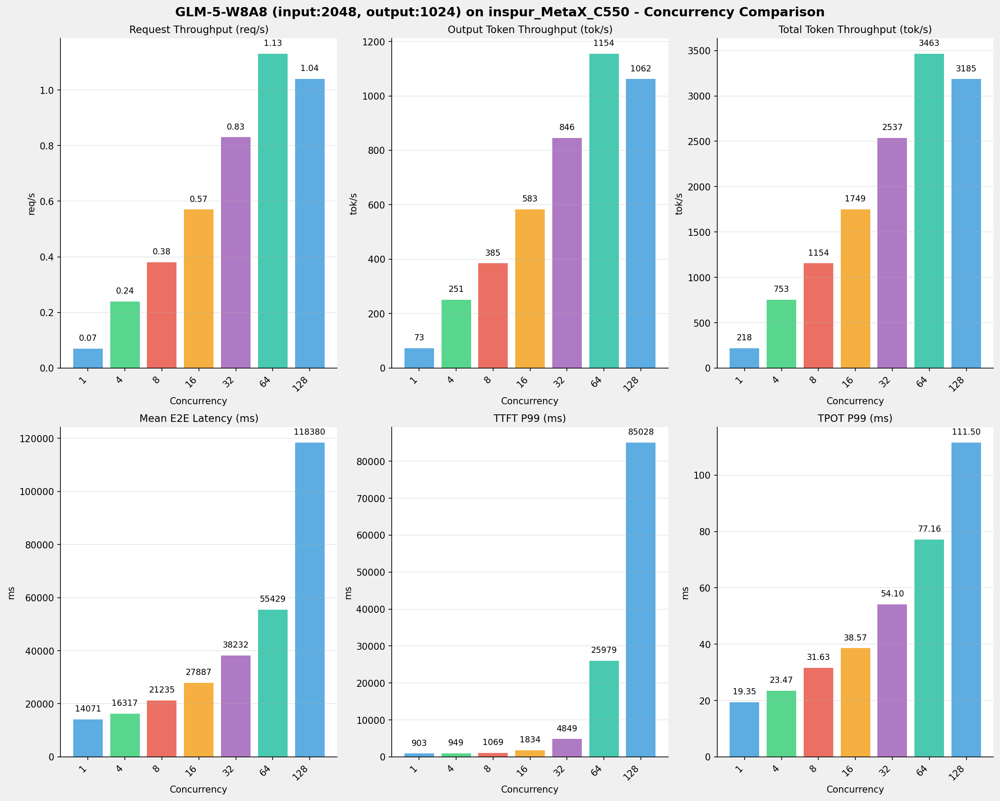

---

### input: 4096, output: 2048

| 并发数 | 请求吞吐量 (req/s) | 输出Token吞吐量 (tok/s) | 总Token吞吐量 (tok/s) | TTFT P99 (ms) | TPOT P99 (ms) | E2E延迟均值 (ms) |
| --------------- | --------------- | --------------- | --------------- | --------------- | --------------- | --------------- |
| 1 | 0.04 | 72.77 | 218.31 | 1488.63 | 18.84 | 28142.54 |
| 4 | 0.12 | 249.83 | 749.49 | 1550.11 | 22.67 | 32747.40 |
| 8 | 0.19 | 383.99 | 1151.96 | 1639.84 | 29.57 | 42535.99 |
| 16 | 0.28 | 576.48 | 1729.45 | 3641.71 | 41.10 | 56357.52 |
| 32 | 0.41 | 849.16 | 2547.49 | 48832.66 | 48.77 | 76211.87 |
| 64 | 0.37 | 766.95 | 2300.84 | 145146.11 | 76.65 | 166205.09 |
| 128 | 0.37 | 767.49 | 2302.47 | 309832.27 | 150.41 | 321961.50 |

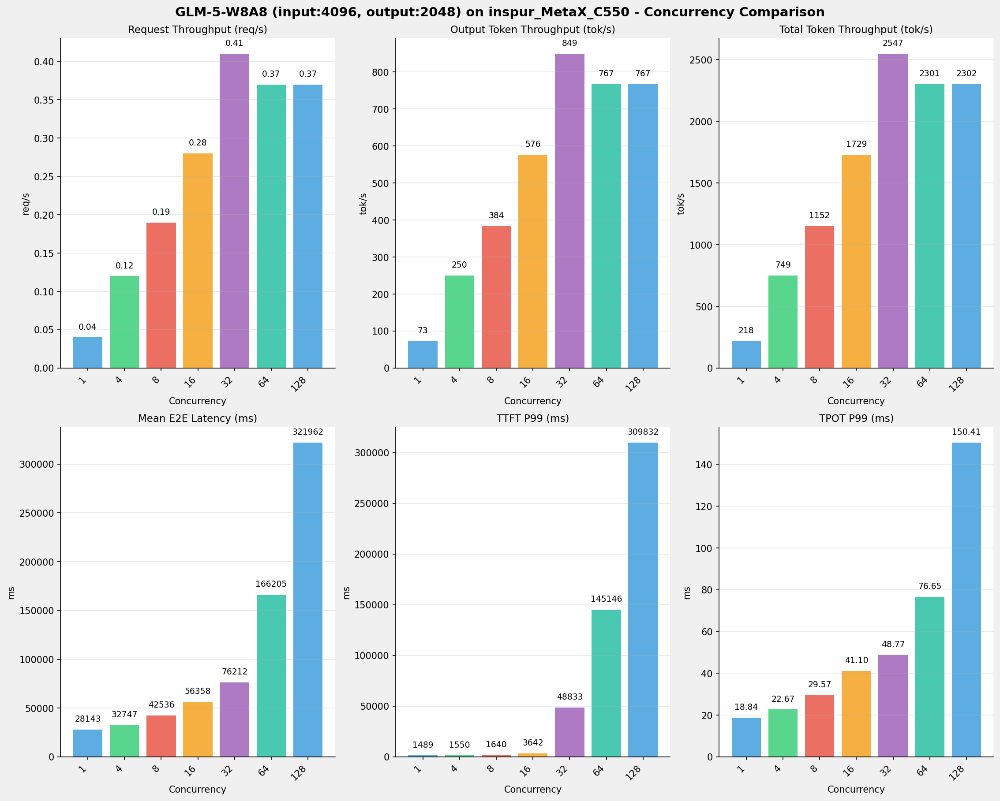

---

### input: 8192, output: 1024

| 并发数 | 请求吞吐量 (req/s) | 输出Token吞吐量 (tok/s) | 总Token吞吐量 (tok/s) | TTFT P99 (ms) | TPOT P99 (ms) | E2E延迟均值 (ms) |
| --------------- | --------------- | --------------- | --------------- | --------------- | --------------- | --------------- |
| 1 | 0.06 | 62.79 | 565.11 | 3005.83 | 19.60 | 16307.94 |
| 4 | 0.16 | 165.17 | 1486.56 | 3538.13 | 31.87 | 24709.21 |
| 8 | 0.21 | 218.45 | 1966.08 | 4137.29 | 52.23 | 37411.73 |
| 16 | 0.28 | 283.53 | 2551.75 | 9793.00 | 85.77 | 57519.49 |
| 32 | 0.30 | 304.40 | 2739.64 | 156013.57 | 92.23 | 105405.58 |
| 64 | 0.28 | 281.86 | 2536.75 | 276119.17 | 115.35 | 226015.89 |
| 128 | 0.26 | 266.56 | 2399.02 | 555809.23 | 448.50 | 461077.93 |

---

## 📊 I/O对比（固定并发数，随上下文长度变化）

### 并发数 = 1

| 指标 | i128_o128 | i512_o256 | i1024_o512 | i2048_o1024 | i4096_o2048 | i8192_o1024 |
| --- | --- | --- | --- | --- | --- | --- |
| 请求吞吐量 (req/s) | 0.43 | 0.26 | 0.14 | 0.07 | 0.04 | 0.06 |
| 输出Token吞吐量 (tok/s) | 55.55 | 66.38 | 72.15 | 72.77 | 72.77 | 62.79 |
| 总Token吞吐量 (tok/s) | 111.10 | 199.14 | 216.44 | 218.31 | 218.31 | 565.11 |
| TTFT P99 (ms) | 364.84 | 367.82 | 599.30 | 903.22 | 1488.63 | 3005.83 |
| TPOT P99 (ms) | 22.97 | 21.32 | 19.57 | 19.35 | 18.84 | 19.60 |
| E2E延迟均值 (ms) | 2303.79 | 3856.13 | 7096.32 | 14071.42 | 28142.54 | 16307.94 |

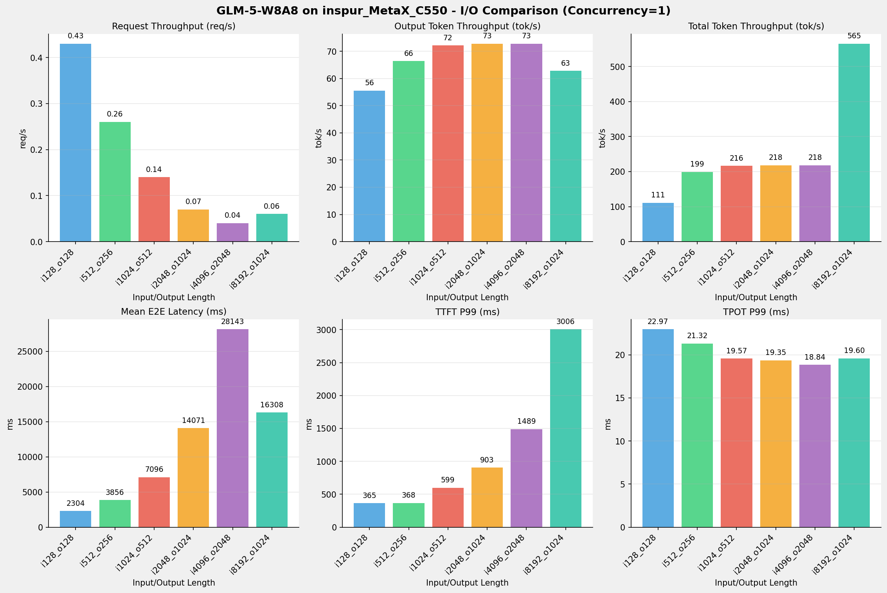

---

### 并发数 = 4

| 指标 | i128_o128 | i512_o256 | i1024_o512 | i2048_o1024 | i4096_o2048 | i8192_o1024 |
| --- | --- | --- | --- | --- | --- | --- |
| 请求吞吐量 (req/s) | 1.22 | 0.81 | 0.48 | 0.24 | 0.12 | 0.16 |
| 输出Token吞吐量 (tok/s) | 155.68 | 207.27 | 246.53 | 250.85 | 249.83 | 165.17 |
| 总Token吞吐量 (tok/s) | 311.35 | 621.82 | 739.58 | 752.54 | 749.49 | 1486.56 |
| TTFT P99 (ms) | 593.86 | 596.99 | 649.84 | 949.47 | 1550.11 | 3538.13 |
| TPOT P99 (ms) | 35.14 | 28.99 | 24.15 | 23.47 | 22.67 | 31.87 |
| E2E延迟均值 (ms) | 3284.59 | 4935.95 | 8295.56 | 16317.46 | 32747.40 | 24709.21 |

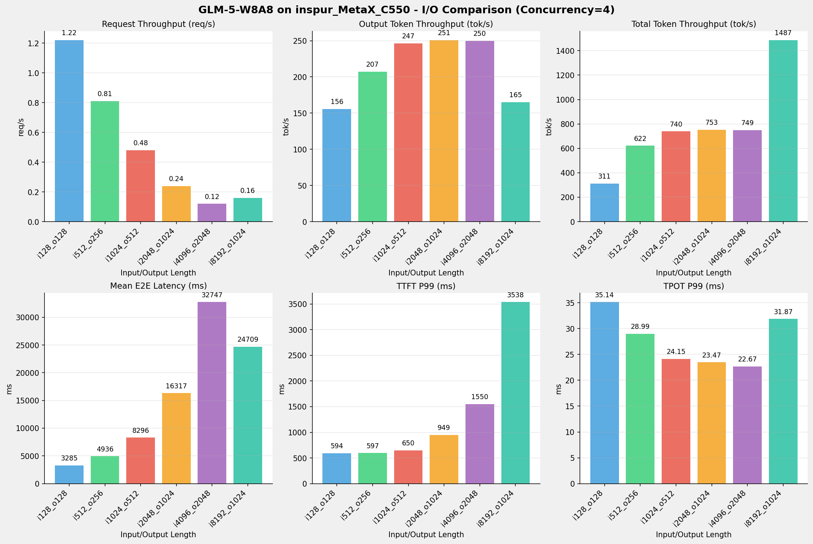

---

### 并发数 = 8

| 指标 | i128_o128 | i512_o256 | i1024_o512 | i2048_o1024 | i4096_o2048 | i8192_o1024 |
| --- | --- | --- | --- | --- | --- | --- |
| 请求吞吐量 (req/s) | 1.69 | 1.19 | 0.74 | 0.38 | 0.19 | 0.21 |
| 输出Token吞吐量 (tok/s) | 215.80 | 304.88 | 377.85 | 384.79 | 383.99 | 218.45 |
| 总Token吞吐量 (tok/s) | 431.60 | 914.65 | 1133.56 | 1154.37 | 1151.96 | 1966.08 |
| TTFT P99 (ms) | 604.47 | 624.26 | 667.05 | 1069.07 | 1639.84 | 4137.29 |
| TPOT P99 (ms) | 52.50 | 37.94 | 30.82 | 31.63 | 29.57 | 52.23 |
| E2E延迟均值 (ms) | 4738.52 | 6705.38 | 10815.91 | 21235.31 | 42535.99 | 37411.73 |

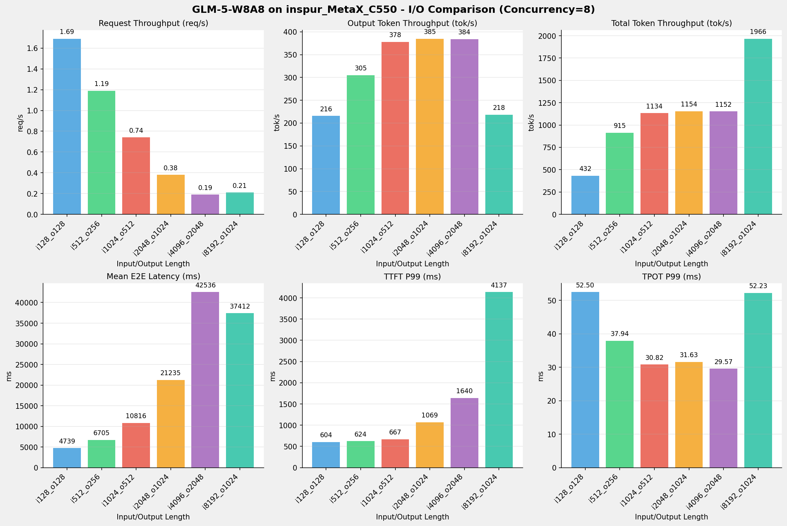

---

### 并发数 = 16

| 指标 | i128_o128 | i512_o256 | i1024_o512 | i2048_o1024 | i4096_o2048 | i8192_o1024 |
| --- | --- | --- | --- | --- | --- | --- |
| 请求吞吐量 (req/s) | 2.32 | 1.70 | 1.10 | 0.57 | 0.28 | 0.28 |
| 输出Token吞吐量 (tok/s) | 297.01 | 434.85 | 564.61 | 583.11 | 576.48 | 283.53 |
| 总Token吞吐量 (tok/s) | 594.03 | 1304.55 | 1693.82 | 1749.33 | 1729.45 | 2551.75 |
| TTFT P99 (ms) | 607.85 | 662.07 | 1086.67 | 1833.58 | 3641.71 | 9793.00 |
| TPOT P99 (ms) | 77.50 | 55.71 | 42.55 | 38.57 | 41.10 | 85.77 |
| E2E延迟均值 (ms) | 6867.78 | 9392.49 | 14446.57 | 27886.82 | 56357.52 | 57519.49 |

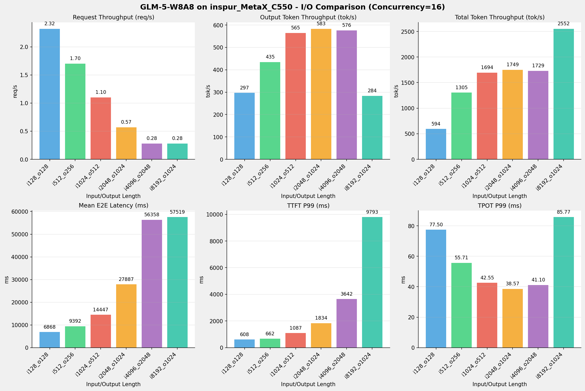

---

### 并发数 = 32

| 指标 | i128_o128 | i512_o256 | i1024_o512 | i2048_o1024 | i4096_o2048 | i8192_o1024 |
| --- | --- | --- | --- | --- | --- | --- |
| 请求吞吐量 (req/s) | 3.17 | 2.39 | 1.62 | 0.83 | 0.41 | 0.30 |
| 输出Token吞吐量 (tok/s) | 406.17 | 611.12 | 829.93 | 845.71 | 849.16 | 304.40 |
| 总Token吞吐量 (tok/s) | 812.34 | 1833.37 | 2489.79 | 2537.12 | 2547.49 | 2739.64 |
| TTFT P99 (ms) | 664.24 | 1371.85 | 2456.56 | 4848.58 | 48832.66 | 156013.57 |
| TPOT P99 (ms) | 114.84 | 79.40 | 54.04 | 54.10 | 48.77 | 92.23 |
| E2E延迟均值 (ms) | 10030.79 | 13321.30 | 19590.23 | 38232.31 | 76211.87 | 105405.58 |

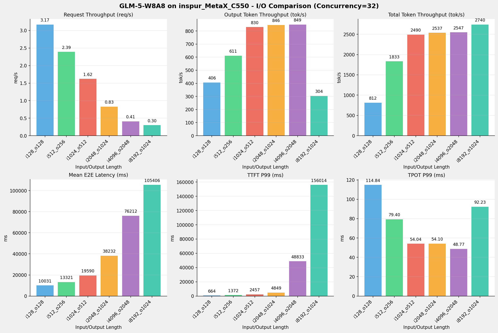

---

### 并发数 = 64

| 指标 | i128_o128 | i512_o256 | i1024_o512 | i2048_o1024 | i4096_o2048 | i8192_o1024 |
| --- | --- | --- | --- | --- | --- | --- |
| 请求吞吐量 (req/s) | 4.16 | 3.27 | 2.31 | 1.13 | 0.37 | 0.28 |
| 输出Token吞吐量 (tok/s) | 533.08 | 836.53 | 1182.13 | 1154.46 | 766.95 | 281.86 |
| 总Token吞吐量 (tok/s) | 1066.15 | 2509.59 | 3546.40 | 3463.39 | 2300.84 | 2536.75 |
| TTFT P99 (ms) | 3465.57 | 4391.67 | 5837.82 | 25978.52 | 145146.11 | 276119.17 |
| TPOT P99 (ms) | 175.69 | 116.28 | 79.17 | 77.16 | 76.65 | 115.35 |
| E2E延迟均值 (ms) | 15224.52 | 19333.53 | 27167.83 | 55429.21 | 166205.09 | 226015.89 |

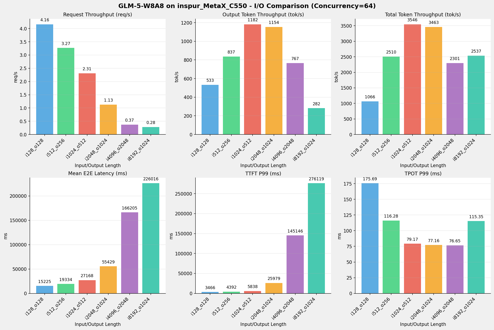

---

### 并发数 = 128

| 指标 | i128_o128 | i512_o256 | i1024_o512 | i2048_o1024 | i4096_o2048 | i8192_o1024 |
| --- | --- | --- | --- | --- | --- | --- |
| 请求吞吐量 (req/s) | 4.78 | 3.35 | 2.21 | 1.04 | 0.37 | 0.26 |
| 输出Token吞吐量 (tok/s) | 611.98 | 857.71 | 1129.38 | 1061.58 | 767.49 | 266.56 |
| 总Token吞吐量 (tok/s) | 1223.96 | 2573.12 | 3388.15 | 3184.75 | 2302.47 | 2399.02 |
| TTFT P99 (ms) | 17851.20 | 26855.53 | 38714.32 | 85028.34 | 309832.27 | 555809.23 |
| TPOT P99 (ms) | 157.60 | 113.49 | 85.79 | 111.50 | 150.41 | 448.50 |
| E2E延迟均值 (ms) | 25802.83 | 36641.89 | 55275.26 | 118379.85 | 321961.50 | 461077.93 |

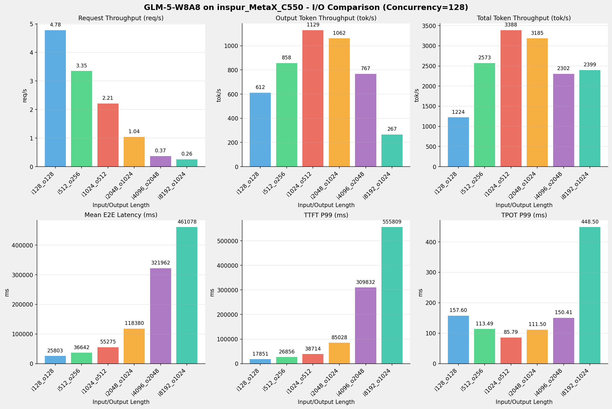

---

## 📝 详细性能数据

### input: 128, output: 128

#### 服务基准结果

| 指标 | 1 并发 | 4 并发 | 8 并发 | 16 并发 | 32 并发 | 64 并发 | 128 并发 |
| ----------- | ----------- | ----------- | ----------- | ----------- | ----------- | ----------- | ----------- |
| 成功请求数 | 1000 | 1000 | 1000 | 1000 | 1000 | 1000 | 1000 |
| 测试持续时间 (s) | 2304.21 | 822.21 | 593.14 | 430.96 | 315.14 | 240.12 | 209.16 |
| 总输入 tokens | 128000 | 128000 | 128000 | 128000 | 128000 | 128000 | 128000 |
| 总生成 tokens | 128000 | 128000 | 128000 | 128000 | 128000 | 128000 | 128000 |
| **请求吞吐量 (req/s)** | 0.43 | 1.22 | 1.69 | 2.32 | 3.17 | 4.16 | 4.78 |
| **输出 token 吞吐量 (tok/s)** | 55.55 | 155.68 | 215.80 | 297.01 | 406.17 | 533.08 | 611.98 |
| 峰值输出 token 吞吐量 (tok/s) | 83.00 | 295.00 | 459.00 | 691.00 | 1242.00 | 2059.00 | 2086.00 |
| 总 token 吞吐量 (tok/s) | 111.10 | 311.35 | 431.60 | 594.03 | 812.34 | 1066.15 | 1223.96 |

#### TTFT

| 指标 | 1 并发 | 4 并发 | 8 并发 | 16 并发 | 32 并发 | 64 并发 | 128 并发 |
|----------- | ----------- | ----------- | ----------- | ----------- | ----------- | ----------- | -----------|
| 平均 TTFT (ms) | 299.72 | 362.92 | 388.66 | 420.48 | 454.58 | 1031.93 | 13230.03 |
| P99 TTFT (ms) | 364.84 | 593.86 | 604.47 | 607.85 | 664.24 | 3465.57 | 17851.20 |

#### TPOT

| 指标 | 1 并发 | 4 并发 | 8 并发 | 16 并发 | 32 并发 | 64 并发 | 128 并发 |
|----------- | ----------- | ----------- | ----------- | ----------- | ----------- | ----------- | -----------|
| 平均 TPOT (ms) | 15.78 | 23.01 | 34.25 | 50.77 | 75.40 | 111.75 | 99.00 |
| P99 TPOT (ms) | 22.97 | 35.14 | 52.50 | 77.50 | 114.84 | 175.69 | 157.60 |

#### ITL

| 指标 | 1 并发 | 4 并发 | 8 并发 | 16 并发 | 32 并发 | 64 并发 | 128 并发 |
|----------- | ----------- | ----------- | ----------- | ----------- | ----------- | ----------- | -----------|
| 平均 ITL (ms) | 15.78 | 23.01 | 34.25 | 50.77 | 75.41 | 111.76 | 99.00 |
| P99 ITL (ms) | 49.68 | 169.85 | 183.91 | 333.47 | 381.68 | 684.25 | 395.34 |

---

### input: 512, output: 256

#### 服务基准结果

| 指标 | 1 并发 | 4 并发 | 8 并发 | 16 并发 | 32 并发 | 64 并发 | 128 并发 |
| ----------- | ----------- | ----------- | ----------- | ----------- | ----------- | ----------- | ----------- |
| 成功请求数 | 1000 | 1000 | 1000 | 1000 | 1000 | 1000 | 1000 |
| 测试持续时间 (s) | 3856.58 | 1235.08 | 839.67 | 588.71 | 418.90 | 306.03 | 298.47 |
| 总输入 tokens | 512000 | 512000 | 512000 | 512000 | 512000 | 512000 | 512000 |
| 总生成 tokens | 256000 | 256000 | 256000 | 256000 | 256000 | 256000 | 256000 |
| **请求吞吐量 (req/s)** | 0.26 | 0.81 | 1.19 | 1.70 | 2.39 | 3.27 | 3.35 |
| **输出 token 吞吐量 (tok/s)** | 66.38 | 207.27 | 304.88 | 434.85 | 611.12 | 836.53 | 857.71 |
| 峰值输出 token 吞吐量 (tok/s) | 83.00 | 323.00 | 530.00 | 888.00 | 1477.00 | 2426.00 | 2433.00 |
| 总 token 吞吐量 (tok/s) | 199.14 | 621.82 | 914.65 | 1304.55 | 1833.37 | 2509.59 | 2573.12 |

#### TTFT

| 指标 | 1 并发 | 4 并发 | 8 并发 | 16 并发 | 32 并发 | 64 并发 | 128 并发 |
|----------- | ----------- | ----------- | ----------- | ----------- | ----------- | ----------- | -----------|
| 平均 TTFT (ms) | 304.26 | 357.39 | 387.75 | 413.29 | 462.10 | 1213.02 | 18558.52 |
| P99 TTFT (ms) | 367.82 | 596.99 | 624.26 | 662.07 | 1371.85 | 4391.67 | 26855.53 |

#### TPOT

| 指标 | 1 并发 | 4 并发 | 8 并发 | 16 并发 | 32 并发 | 64 并发 | 128 并发 |
|----------- | ----------- | ----------- | ----------- | ----------- | ----------- | ----------- | -----------|
| 平均 TPOT (ms) | 13.93 | 17.96 | 24.78 | 35.21 | 50.43 | 71.06 | 70.92 |
| P99 TPOT (ms) | 21.32 | 28.99 | 37.94 | 55.71 | 79.40 | 116.28 | 113.49 |

#### ITL

| 指标 | 1 并发 | 4 并发 | 8 并发 | 16 并发 | 32 并发 | 64 并发 | 128 并发 |
|----------- | ----------- | ----------- | ----------- | ----------- | ----------- | ----------- | -----------|
| 平均 ITL (ms) | 13.93 | 17.96 | 24.78 | 35.21 | 50.43 | 71.06 | 70.92 |
| P99 ITL (ms) | 49.34 | 89.42 | 164.30 | 184.43 | 228.34 | 348.28 | 275.99 |

---

### input: 1024, output: 512

#### 服务基准结果

| 指标 | 1 并发 | 4 并发 | 8 并发 | 16 并发 | 32 并发 | 64 并发 | 128 并发 |
| ----------- | ----------- | ----------- | ----------- | ----------- | ----------- | ----------- | ----------- |
| 成功请求数 | 1000 | 1000 | 1000 | 1000 | 1000 | 1000 | 1000 |
| 测试持续时间 (s) | 7096.80 | 2076.87 | 1355.02 | 906.83 | 616.92 | 433.12 | 453.35 |
| 总输入 tokens | 1024000 | 1024000 | 1024000 | 1024000 | 1024000 | 1024000 | 1024000 |
| 总生成 tokens | 512000 | 512000 | 512000 | 512000 | 512000 | 512000 | 512000 |
| **请求吞吐量 (req/s)** | 0.14 | 0.48 | 0.74 | 1.10 | 1.62 | 2.31 | 2.21 |
| **输出 token 吞吐量 (tok/s)** | 72.15 | 246.53 | 377.85 | 564.61 | 829.93 | 1182.13 | 1129.38 |
| 峰值输出 token 吞吐量 (tok/s) | 83.00 | 320.00 | 544.00 | 919.00 | 1568.00 | 2559.00 | 2538.00 |
| 总 token 吞吐量 (tok/s) | 216.44 | 739.58 | 1133.56 | 1693.82 | 2489.79 | 3546.40 | 3388.15 |

#### TTFT

| 指标 | 1 并发 | 4 并发 | 8 并发 | 16 并发 | 32 并发 | 64 并发 | 128 并发 |
|----------- | ----------- | ----------- | ----------- | ----------- | ----------- | ----------- | -----------|
| 平均 TTFT (ms) | 314.78 | 364.32 | 386.14 | 417.27 | 497.16 | 1354.90 | 27790.44 |
| P99 TTFT (ms) | 599.30 | 649.84 | 667.05 | 1086.67 | 2456.56 | 5837.82 | 38714.32 |

#### TPOT

| 指标 | 1 并发 | 4 并发 | 8 并发 | 16 并发 | 32 并发 | 64 并发 | 128 并发 |
|----------- | ----------- | ----------- | ----------- | ----------- | ----------- | ----------- | -----------|
| 平均 TPOT (ms) | 13.27 | 15.52 | 20.41 | 27.45 | 37.36 | 50.51 | 53.79 |
| P99 TPOT (ms) | 19.57 | 24.15 | 30.82 | 42.55 | 54.04 | 79.17 | 85.79 |

#### ITL

| 指标 | 1 并发 | 4 并发 | 8 并发 | 16 并发 | 32 并发 | 64 并发 | 128 并发 |
|----------- | ----------- | ----------- | ----------- | ----------- | ----------- | ----------- | -----------|
| 平均 ITL (ms) | 13.27 | 15.52 | 20.41 | 27.46 | 37.36 | 50.52 | 53.79 |
| P99 ITL (ms) | 25.19 | 87.38 | 92.35 | 167.04 | 184.88 | 231.28 | 201.62 |

---

### input: 2048, output: 1024

#### 服务基准结果

| 指标 | 1 并发 | 4 并发 | 8 并发 | 16 并发 | 32 并发 | 64 并发 | 128 并发 |
| ----------- | ----------- | ----------- | ----------- | ----------- | ----------- | ----------- | ----------- |
| 成功请求数 | 1000 | 1000 | 1000 | 1000 | 1000 | 1000 | 1000 |
| 测试持续时间 (s) | 14071.92 | 4082.16 | 2661.20 | 1756.10 | 1210.82 | 886.99 | 964.60 |
| 总输入 tokens | 2048000 | 2048000 | 2048000 | 2048000 | 2048000 | 2048000 | 2048000 |
| 总生成 tokens | 1024000 | 1024000 | 1024000 | 1024000 | 1024000 | 1024000 | 1024000 |
| **请求吞吐量 (req/s)** | 0.07 | 0.24 | 0.38 | 0.57 | 0.83 | 1.13 | 1.04 |
| **输出 token 吞吐量 (tok/s)** | 72.77 | 250.85 | 384.79 | 583.11 | 845.71 | 1154.46 | 1061.58 |
| 峰值输出 token 吞吐量 (tok/s) | 82.00 | 316.00 | 540.00 | 926.00 | 1587.00 | 2587.00 | 2503.00 |
| 总 token 吞吐量 (tok/s) | 218.31 | 752.54 | 1154.37 | 1749.33 | 2537.12 | 3463.39 | 3184.75 |

#### TTFT

| 指标 | 1 并发 | 4 并发 | 8 并发 | 16 并发 | 32 并发 | 64 并发 | 128 并发 |
|----------- | ----------- | ----------- | ----------- | ----------- | ----------- | ----------- | -----------|
| 平均 TTFT (ms) | 613.02 | 656.56 | 681.17 | 722.17 | 848.42 | 3997.34 | 60985.04 |
| P99 TTFT (ms) | 903.22 | 949.47 | 1069.07 | 1833.58 | 4848.58 | 25978.52 | 85028.34 |

#### TPOT

| 指标 | 1 并发 | 4 并发 | 8 并发 | 16 并发 | 32 并发 | 64 并发 | 128 并发 |
|----------- | ----------- | ----------- | ----------- | ----------- | ----------- | ----------- | -----------|
| 平均 TPOT (ms) | 13.16 | 15.31 | 20.09 | 26.55 | 36.54 | 50.28 | 56.10 |
| P99 TPOT (ms) | 19.35 | 23.47 | 31.63 | 38.57 | 54.10 | 77.16 | 111.50 |

#### ITL

| 指标 | 1 并发 | 4 并发 | 8 并发 | 16 并发 | 32 并发 | 64 并发 | 128 并发 |
|----------- | ----------- | ----------- | ----------- | ----------- | ----------- | ----------- | -----------|
| 平均 ITL (ms) | 13.16 | 15.31 | 20.09 | 26.55 | 36.54 | 50.28 | 56.10 |
| P99 ITL (ms) | 25.27 | 158.64 | 165.07 | 169.52 | 246.32 | 334.42 | 364.36 |

---

### input: 4096, output: 2048

#### 服务基准结果

| 指标 | 1 并发 | 4 并发 | 8 并发 | 16 并发 | 32 并发 | 64 并发 | 128 并发 |
| ----------- | ----------- | ----------- | ----------- | ----------- | ----------- | ----------- | ----------- |
| 成功请求数 | 1000 | 1000 | 1000 | 1000 | 1000 | 1000 | 1000 |
| 测试持续时间 (s) | 28143.09 | 8197.57 | 5333.53 | 3552.57 | 2411.78 | 2670.32 | 2668.44 |
| 总输入 tokens | 4096000 | 4096000 | 4096000 | 4096000 | 4096000 | 4096000 | 4096000 |
| 总生成 tokens | 2048000 | 2048000 | 2048000 | 2048000 | 2048000 | 2048000 | 2048000 |
| **请求吞吐量 (req/s)** | 0.04 | 0.12 | 0.19 | 0.28 | 0.41 | 0.37 | 0.37 |
| **输出 token 吞吐量 (tok/s)** | 72.77 | 249.83 | 383.99 | 576.48 | 849.16 | 766.95 | 767.49 |
| 峰值输出 token 吞吐量 (tok/s) | 81.00 | 312.00 | 528.00 | 912.00 | 1467.00 | 1457.00 | 1477.00 |
| 总 token 吞吐量 (tok/s) | 218.31 | 749.49 | 1151.96 | 1729.45 | 2547.49 | 2300.84 | 2302.47 |

#### TTFT

| 指标 | 1 并发 | 4 并发 | 8 并发 | 16 并发 | 32 并发 | 64 并发 | 128 并发 |
|----------- | ----------- | ----------- | ----------- | ----------- | ----------- | ----------- | -----------|
| 平均 TTFT (ms) | 1212.01 | 1249.32 | 1277.22 | 1352.43 | 8971.47 | 89825.65 | 243634.12 |
| P99 TTFT (ms) | 1488.63 | 1550.11 | 1639.84 | 3641.71 | 48832.66 | 145146.11 | 309832.27 |

#### TPOT

| 指标 | 1 并发 | 4 并发 | 8 并发 | 16 并发 | 32 并发 | 64 并发 | 128 并发 |
|----------- | ----------- | ----------- | ----------- | ----------- | ----------- | ----------- | -----------|
| 平均 TPOT (ms) | 13.16 | 15.39 | 20.16 | 26.87 | 32.85 | 37.31 | 38.26 |
| P99 TPOT (ms) | 18.84 | 22.67 | 29.57 | 41.10 | 48.77 | 76.65 | 150.41 |

#### ITL

| 指标 | 1 并发 | 4 并发 | 8 并发 | 16 并发 | 32 并发 | 64 并发 | 128 并发 |
|----------- | ----------- | ----------- | ----------- | ----------- | ----------- | ----------- | -----------|
| 平均 ITL (ms) | 13.16 | 15.39 | 20.16 | 26.87 | 32.85 | 37.31 | 38.26 |
| P99 ITL (ms) | 25.26 | 30.82 | 309.35 | 316.22 | 422.57 | 614.70 | 614.49 |

---

### input: 8192, output: 1024

#### 服务基准结果

| 指标 | 1 并发 | 4 并发 | 8 并发 | 16 并发 | 32 并发 | 64 并发 | 128 并发 |
| ----------- | ----------- | ----------- | ----------- | ----------- | ----------- | ----------- | ----------- |
| 成功请求数 | 1000 | 1000 | 1000 | 1000 | 1000 | 1000 | 1000 |
| 测试持续时间 (s) | 16308.45 | 6199.53 | 4687.49 | 3611.64 | 3363.94 | 3632.99 | 3841.58 |
| 总输入 tokens | 8192000 | 8192000 | 8192000 | 8192000 | 8192000 | 8192000 | 8192000 |
| 总生成 tokens | 1024000 | 1024000 | 1024000 | 1024000 | 1024000 | 1024000 | 1024000 |
| **请求吞吐量 (req/s)** | 0.06 | 0.16 | 0.21 | 0.28 | 0.30 | 0.28 | 0.26 |
| **输出 token 吞吐量 (tok/s)** | 62.79 | 165.17 | 218.45 | 283.53 | 304.40 | 281.86 | 266.56 |
| 峰值输出 token 吞吐量 (tok/s) | 82.00 | 304.00 | 512.00 | 879.00 | 968.00 | 1038.00 | 968.00 |
| 总 token 吞吐量 (tok/s) | 565.11 | 1486.56 | 1966.08 | 2551.75 | 2739.64 | 2536.75 | 2399.02 |

#### TTFT

| 指标 | 1 并发 | 4 并发 | 8 并发 | 16 并发 | 32 并发 | 64 并发 | 128 并发 |
|----------- | ----------- | ----------- | ----------- | ----------- | ----------- | ----------- | -----------|
| 平均 TTFT (ms) | 2701.23 | 2754.49 | 2825.46 | 3089.75 | 50105.92 | 162179.11 | 391550.53 |
| P99 TTFT (ms) | 3005.83 | 3538.13 | 4137.29 | 9793.00 | 156013.57 | 276119.17 | 555809.23 |

#### TPOT

| 指标 | 1 并发 | 4 并发 | 8 并发 | 16 并发 | 32 并发 | 64 并发 | 128 并发 |
|----------- | ----------- | ----------- | ----------- | ----------- | ----------- | ----------- | -----------|
| 平均 TPOT (ms) | 13.30 | 21.46 | 33.81 | 53.21 | 54.06 | 62.40 | 67.96 |
| P99 TPOT (ms) | 19.60 | 31.87 | 52.23 | 85.77 | 92.23 | 115.35 | 448.50 |

#### ITL

| 指标 | 1 并发 | 4 并发 | 8 并发 | 16 并发 | 32 并发 | 64 并发 | 128 并发 |
|----------- | ----------- | ----------- | ----------- | ----------- | ----------- | ----------- | -----------|
| 平均 ITL (ms) | 13.30 | 21.46 | 33.81 | 53.21 | 54.06 | 62.40 | 67.96 |
| P99 ITL (ms) | 25.37 | 667.28 | 686.41 | 698.26 | 796.18 | 786.06 | 1354.40 |

---

*报告生成时间: 2026-05-13*

