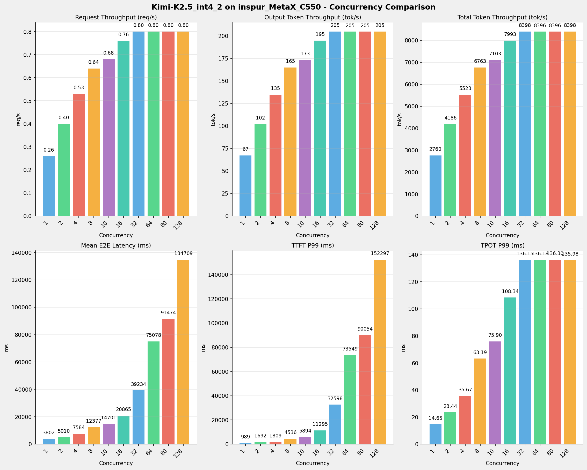
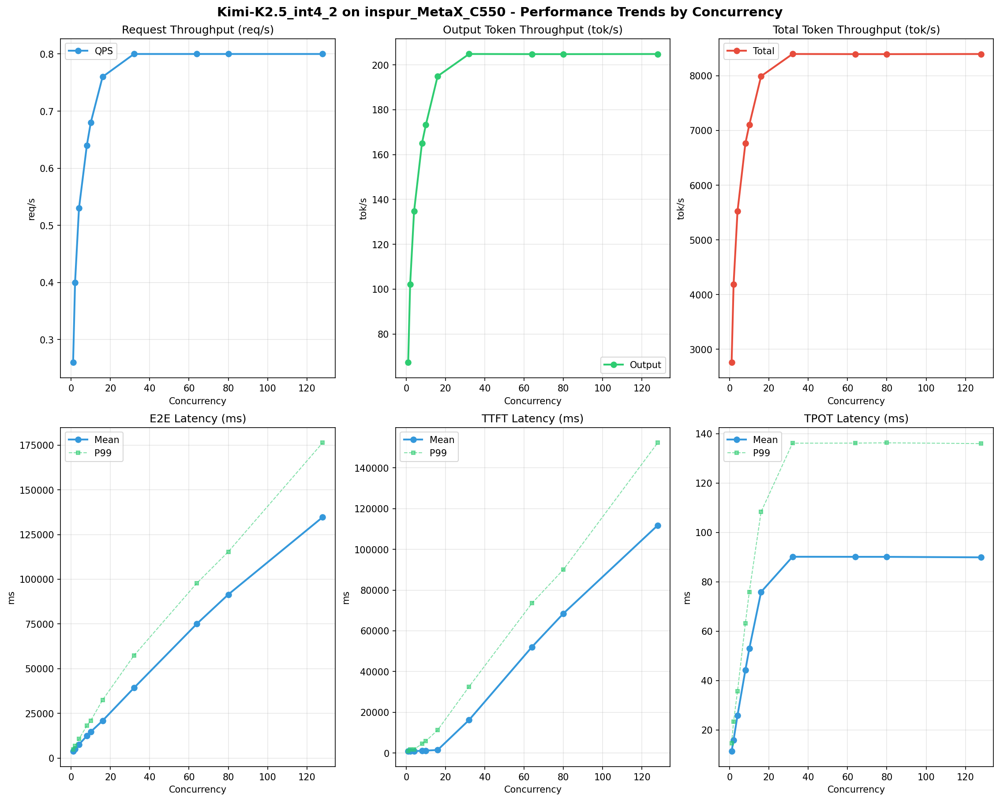

# Kimi-K2.5_int4_2模型在inspur_MetaX_C550上的Benchmark基准测试报告

**测试日期：** 2026-05-13

---

## 测试场景
使用sglang bench serve基准测试工具对不同并发数，请求上下文长度下的性能变化趋势。

**主要采集指标**：

| 指标                  | 单位         | 含义                                 |
|---------------------|------------|------------------------------------|
| E2E Latency         | ms         | End-to-End Latency，端到端延迟         |
| TTFT                | ms         | Time To First Token，首 token 延迟     |
| TPOT                | ms/token   | Time Per Output Token，每 token 生成时间 |
| ITL                 | ms         | Inter-Token Latency，token间延迟       |
| Throughput          | tokens/s   | 系统总吞吐                              |
| QPS                 | requests/s | 请求吞吐                               |

## 🤖 芯片和模型配置信息

| 参数名称                    | inspur_MetaX_C550 |
|------------------------|-------------|
| **model_name** | Kimi-K2.5_int4_2 |
| **quantization_config** | int4 |
| **model_size** | 496G |
| **max_position_embeddings** | 262144 |
| **temperature** | N/A |
| **top_k** | N/A |
| **top_p** | N/A |
| **transformers_version** | 4.56.2 |
| **sglang_version** | 0.5.9+maca3.5.3.204 |
| **python_version** | 3.10.10 |

## 🤖 SGLang启动配置信息

| 参数名称                   | inspur_MetaX_C550 |
|------------------------|-------------|
| **Model Name** | Kimi-K2.5_int4_2 |
| **Attention Backend** | flashinfer |
| **Quantization** | w4a8_int8 |
| **Tp Size** | 16 |
| **Pp Size** | 1 |
| **Nnodes** | 2 |
| **Context Length** | 262144 |
| **Cuda Graph Max Bs** | 64 |
| **Max Running Requests** | 64 |
| **Max Queued Requests** | None |
| **Chunked Prefill Size** | 8192 |
| **Disable Radix Cache** | True |
| **Tool Call Parser** | kimi_k2 |
| **Reasoning Parser** | kimi_k2 |
| **Mem Fraction Static** | 0.8 |

- **inspur_MetaX_C550**: 浪潮MetaX_C550 SGLang启动配置

## 📊 测试概览

| 项目            | 配置                                     | 备注  |
|---------------|----------------------------------------|-----|
| **数据集**       | random                                 |     |
| **并发数**       | 1, 2, 4, 8, 10, 16, 32, 64, 80, 128    |     |
| **总请求数**      | 320                                    |     |
| **请求输入上下文长度** | 10240（10k）                             |     |
| **请求输出上下文长度** | 256（0.25k）                             |     |
| **模型**        | Kimi-K2.5_int4_2                           |     |
| **被测芯片**      | inspur_MetaX_C550 |     |
| **SGLang版本**   | 0.5.9                           |     |

---

## 📋 测试结果汇总

| 并发数 | 请求吞吐量 (req/s) | 输出Token吞吐量 (tok/s) | 总Token吞吐量 (tok/s) | TTFT P99 (ms) | TPOT P99 (ms) | E2E延迟均值 (ms) |
| ----------- | ----------- | ----------- | ----------- | ----------- | ----------- | ----------- |
| 1 | 0.26 | 67.32 | 2760.23 | 988.73 | 14.65 | 3802.13 |
| 2 | 0.40 | 102.11 | 4186.34 | 1691.82 | 23.44 | 5010.27 |
| 4 | 0.53 | 134.71 | 5522.99 | 1809.49 | 35.67 | 7583.94 |
| 8 | 0.64 | 164.94 | 6762.64 | 4535.68 | 63.19 | 12377.05 |
| 10 | 0.68 | 173.25 | 7103.40 | 5894.17 | 75.90 | 14701.05 |
| 16 | 0.76 | 194.95 | 7992.89 | 11294.80 | 108.34 | 20865.09 |
| 32 | 0.80 | 204.84 | 8398.28 | 32597.67 | 136.15 | 39234.36 |
| 64 | 0.80 | 204.79 | 8396.31 | 73549.17 | 136.18 | 75077.66 |
| 80 | 0.80 | 204.78 | 8395.88 | 90053.76 | 136.30 | 91474.37 |
| 128 | 0.80 | 204.83 | 8397.97 | 152296.59 | 135.98 | 134708.95 |

## 📊 各并发级别性能柱状图

## 📈 性能趋势分析

---

### 🎯 服务基准结果详情

| 指标 | 1 并发 | 2 并发 | 4 并发 | 8 并发 | 10 并发 | 16 并发 | 32 并发 | 64 并发 | 80 并发 | 128 并发 |
|------|----------- | ----------- | ----------- | ----------- | ----------- | ----------- | ----------- | ----------- | ----------- | -----------|
| 成功请求数 | 320 | 320 | 320 | 320 | 320 | 320 | 320 | 320 | 320 | 320 |
| 测试持续时间 (s) | 1216.83 | 802.31 | 608.13 | 496.66 | 472.83 | 420.21 | 399.93 | 400.02 | 400.04 | 399.94 |
| 总输入 tokens | 3276800 | 3276800 | 3276800 | 3276800 | 3276800 | 3276800 | 3276800 | 3276800 | 3276800 | 3276800 |
| 总生成 tokens | 81920 | 81920 | 81920 | 81920 | 81920 | 81920 | 81920 | 81920 | 81920 | 81920 |
| **请求吞吐量 (req/s)** | 0.26 | 0.40 | 0.53 | 0.64 | 0.68 | 0.76 | 0.80 | 0.80 | 0.80 | 0.80 |
| **输出 token 吞吐量 (tok/s)** | 67.32 | 102.11 | 134.71 | 164.94 | 173.25 | 194.95 | 204.84 | 204.79 | 204.78 | 204.83 |
| 峰值输出 token 吞吐量 (tok/s) | 115.00 | 180.00 | 278.00 | 406.00 | 463.00 | 620.00 | 718.00 | 702.00 | 704.00 | 699.00 |
| 峰值并发请求数 | 2 | 4 | 6 | 11 | 13 | 20 | 38 | 70 | 86 | 134 |
| **总 token 吞吐量 (tok/s)** | 2760.23 | 4186.34 | 5522.99 | 6762.64 | 7103.40 | 7992.89 | 8398.28 | 8396.31 | 8395.88 | 8397.97 |

### ⏱️ 端到端延迟 (E2E Latency)

| 指标 | 1 并发 | 2 并发 | 4 并发 | 8 并发 | 10 并发 | 16 并发 | 32 并发 | 64 并发 | 80 并发 | 128 并发 |
|------|----------- | ----------- | ----------- | ----------- | ----------- | ----------- | ----------- | ----------- | ----------- | -----------|
| 平均 E2E 延迟 (ms) | 3802.13 | 5010.27 | 7583.94 | 12377.05 | 14701.05 | 20865.09 | 39234.36 | 75077.66 | 91474.37 | 134708.95 |
| 中位 E2E 延迟 (ms) | 3761.61 | 4963.62 | 7516.79 | 12279.29 | 14562.28 | 20764.98 | 39301.61 | 78490.29 | 98187.46 | 155597.31 |
| P90 E2E 延迟 (ms) | 4051.19 | 5395.86 | 8580.77 | 13819.57 | 16782.27 | 24045.24 | 44779.99 | 83766.79 | 103364.93 | 162139.46 |
| P99 E2E 延迟 (ms) | 4792.19 | 6899.49 | 10642.44 | 18033.48 | 20937.21 | 32461.94 | 57351.70 | 97818.99 | 115386.58 | 176314.05 |

### ⏱️ 首Token延迟 (TTFT)

| 指标 | 1 并发 | 2 并发 | 4 并发 | 8 并发 | 10 并发 | 16 并发 | 32 并发 | 64 并发 | 80 并发 | 128 并发 |
|------|----------- | ----------- | ----------- | ----------- | ----------- | ----------- | ----------- | ----------- | ----------- | -----------|
| 平均 TTFT (ms) | 901.81 | 947.17 | 984.34 | 1101.70 | 1210.21 | 1510.87 | 16246.03 | 52096.83 | 68496.03 | 111782.93 |
| 中位 TTFT (ms) | 897.55 | 913.63 | 913.12 | 923.95 | 931.94 | 938.35 | 16328.37 | 55427.05 | 75456.51 | 133493.89 |
| P99 TTFT (ms) | 988.73 | 1691.82 | 1809.49 | 4535.68 | 5894.17 | 11294.80 | 32597.67 | 73549.17 | 90053.76 | 152296.59 |

### ⚡ 每Token生成时间 (TPOT)

| 指标 | 1 并发 | 2 并发 | 4 并发 | 8 并发 | 10 并发 | 16 并发 | 32 并发 | 64 并发 | 80 并发 | 128 并发 |
|------|----------- | ----------- | ----------- | ----------- | ----------- | ----------- | ----------- | ----------- | ----------- | -----------|
| 平均 TPOT (ms) | 11.37 | 15.93 | 25.88 | 44.22 | 52.91 | 75.90 | 90.15 | 90.12 | 90.11 | 89.91 |
| 中位 TPOT (ms) | 11.21 | 15.85 | 25.85 | 44.36 | 53.12 | 76.02 | 91.35 | 91.46 | 91.35 | 91.22 |
| P99 TPOT (ms) | 14.65 | 23.44 | 35.67 | 63.19 | 75.90 | 108.34 | 136.15 | 136.18 | 136.30 | 135.98 |

### 🔄 Token间延迟 (ITL)

| 指标 | 1 并发 | 2 并发 | 4 并发 | 8 并发 | 10 并发 | 16 并发 | 32 并发 | 64 并发 | 80 并发 | 128 并发 |
|------|----------- | ----------- | ----------- | ----------- | ----------- | ----------- | ----------- | ----------- | ----------- | -----------|
| 平均 ITL (ms) | 11.37 | 15.93 | 25.88 | 44.22 | 52.91 | 75.90 | 90.15 | 90.12 | 90.11 | 89.91 |
| 中位 ITL (ms) | 10.96 | 12.21 | 15.34 | 20.06 | 22.20 | 26.39 | 29.39 | 29.40 | 29.46 | 29.43 |
| P95 ITL (ms) | 21.84 | 24.44 | 30.88 | 41.68 | 311.31 | 463.73 | 462.06 | 461.76 | 461.88 | 461.77 |
| P99 ITL (ms) | 22.31 | 25.49 | 456.82 | 466.65 | 589.03 | 916.82 | 925.38 | 926.00 | 925.37 | 924.61 |

---

## 📝 分析总结

### 1. 吞吐量性能分析

**请求吞吐量 (QPS)**: 随着并发级别增加，QPS持续上升。
低并发(1,2,4)平均 QPS: 0.40 req/s；
中并发(8,10,16,32)平均 QPS: 0.72 req/s；
高并发(64,80,128)平均 QPS: 0.80 req/s；
最高 QPS 出现在 32 并发，达到 0.80 req/s。

**Token总吞吐量**: 最高达到 8398 tok/s (32 并发)。

### 2. 端到端延迟 (E2E Latency) 分析

E2E延迟随并发增加显著上升。
低并发平均 P99 E2E: 7445ms；
高并发平均 P99 E2E: 129840ms；
最高 P99 E2E 出现在 128 并发，达到 176314ms。

### 3. 首Token延迟 (TTFT) 分析

TTFT随并发增加显著上升。
低并发平均 P99 TTFT: 1497ms；
高并发平均 P99 TTFT: 105300ms；
最高 P99 TTFT 出现在 128 并发，达到 152297ms。

### 4. Token生成时间 (TPOT) 分析

TPOT随并发增加也呈上升趋势。
低并发平均 P99 TPOT: 24.59ms；
高并发平均 P99 TPOT: 136.15ms；
最高 P99 TPOT 出现在 80 并发，达到 136.30ms。

### 5. Token间延迟 (ITL) 分析

ITL随并发增加呈上升趋势。
低并发平均 P99 ITL: 168.21ms；
高并发平均 P99 ITL: 925.33ms；
最高 P99 ITL 出现在 64 并发，达到 926.00ms。

### 6. 综合评估

**吞吐量增长**: 从最低并发到最高并发，QPS增长了 207.7%。
**E2E延迟恶化**: 高并发相比低并发，E2E P99增加了 2268.3%。
**TTFT延迟恶化**: 高并发相比低并发，TTFT P99增加了 10075.6%。
**TPOT延迟恶化**: 高并发相比低并发，TPOT P99增加了 454.4%。

---

*报告生成时间: 2026-05-13*

