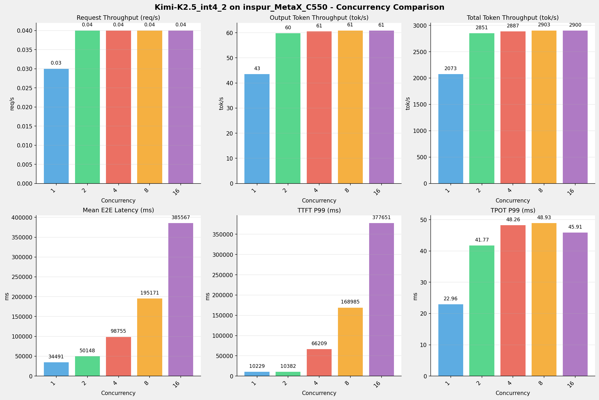
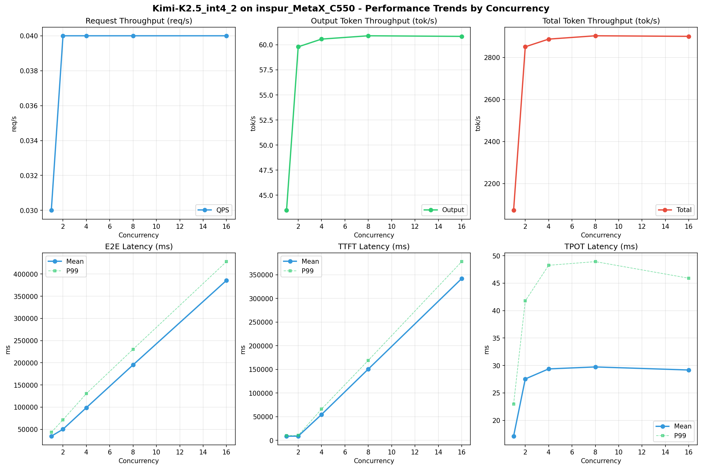

# Kimi-K2.5_int4_2模型在inspur_MetaX_C550上的Benchmark基准测试报告

**测试日期：** 2026-05-13

---

## 测试场景
使用sglang bench serve基准测试工具对不同并发数，请求上下文长度下的性能变化趋势。

**主要采集指标**：

| 指标                  | 单位         | 含义                                 |
|---------------------|------------|------------------------------------|
| E2E Latency         | ms         | End-to-End Latency，端到端延迟         |
| TTFT                | ms         | Time To First Token，首 token 延迟     |
| TPOT                | ms/token   | Time Per Output Token，每 token 生成时间 |
| ITL                 | ms         | Inter-Token Latency，token间延迟       |
| Throughput          | tokens/s   | 系统总吞吐                              |
| QPS                 | requests/s | 请求吞吐                               |

## 🤖 芯片和模型配置信息

| 参数名称                    | inspur_MetaX_C550 |
|------------------------|-------------|
| **model_name** | Kimi-K2.5_int4_2 |
| **quantization_config** | int4 |
| **model_size** | 496G |
| **max_position_embeddings** | 262144 |
| **temperature** | N/A |
| **top_k** | N/A |
| **top_p** | N/A |
| **transformers_version** | 4.56.2 |
| **sglang_version** | 0.5.9+maca3.5.3.204 |
| **python_version** | 3.10.10 |

## 🤖 SGLang启动配置信息

| 参数名称                   | inspur_MetaX_C550 |
|------------------------|-------------|
| **Model Name** | Kimi-K2.5_int4_2 |
| **Attention Backend** | flashinfer |
| **Quantization** | w4a8_int8 |
| **Tp Size** | 16 |
| **Pp Size** | 1 |
| **Nnodes** | 2 |
| **Context Length** | 262144 |
| **Cuda Graph Max Bs** | 64 |
| **Max Running Requests** | 64 |
| **Max Queued Requests** | None |
| **Chunked Prefill Size** | 8192 |
| **Disable Radix Cache** | True |
| **Tool Call Parser** | kimi_k2 |
| **Reasoning Parser** | kimi_k2 |
| **Mem Fraction Static** | 0.8 |

- **inspur_MetaX_C550**: 浪潮MetaX_C550 SGLang启动配置

## 📊 测试概览

| 项目            | 配置                                     | 备注  |
|---------------|----------------------------------------|-----|
| **数据集**       | random                                 |     |
| **并发数**       | 1, 2, 4, 8, 16, 32, 64, 80, 128    |     |
| **总请求数**      | 300                                    |     |
| **请求输入上下文长度** | 70000（68k）                             |     |
| **请求输出上下文长度** | 1500（1k）                             |     |
| **模型**        | Kimi-K2.5_int4_2                           |     |
| **被测芯片**      | inspur_MetaX_C550 |     |
| **SGLang版本**   | 0.5.9                           |     |

---

## 📋 测试结果汇总

| 并发数 | 请求吞吐量 (req/s) | 输出Token吞吐量 (tok/s) | 总Token吞吐量 (tok/s) | TTFT P99 (ms) | TPOT P99 (ms) | E2E延迟均值 (ms) |
| ----------- | ----------- | ----------- | ----------- | ----------- | ----------- | ----------- |
| 1 | 0.03 | 43.49 | 2072.97 | 10228.71 | 22.96 | 34491.10 |
| 2 | 0.04 | 59.80 | 2850.51 | 10382.12 | 41.77 | 50148.29 |
| 4 | 0.04 | 60.57 | 2887.01 | 66208.88 | 48.26 | 98755.04 |
| 8 | 0.04 | 60.90 | 2902.86 | 168985.21 | 48.93 | 195170.98 |
| 16 | 0.04 | 60.84 | 2900.15 | 377651.02 | 45.91 | 385567.47 |

## 📊 各并发级别性能柱状图

## 📈 性能趋势分析

---

### 🎯 服务基准结果详情

| 指标 | 1 并发 | 2 并发 | 4 并发 | 8 并发 | 16 并发 |
|------|----------- | ----------- | ----------- | ----------- | -----------|
| 成功请求数 | 300 | 300 | 300 | 300 | 300 |
| 测试持续时间 (s) | 10347.49 | 7524.96 | 7429.84 | 7389.27 | 7396.17 |
| 总输入 tokens | 21000000 | 21000000 | 21000000 | 21000000 | 21000000 |
| 总生成 tokens | 450000 | 450000 | 450000 | 450000 | 450000 |
| **请求吞吐量 (req/s)** | 0.03 | 0.04 | 0.04 | 0.04 | 0.04 |
| **输出 token 吞吐量 (tok/s)** | 43.49 | 59.80 | 60.57 | 60.90 | 60.84 |
| 峰值输出 token 吞吐量 (tok/s) | 102.00 | 231.00 | 131.00 | 323.00 | 131.00 |
| 峰值并发请求数 | 2 | 3 | 6 | 9 | 18 |
| **总 token 吞吐量 (tok/s)** | 2072.97 | 2850.51 | 2887.01 | 2902.86 | 2900.15 |

### ⏱️ 端到端延迟 (E2E Latency)

| 指标 | 1 并发 | 2 并发 | 4 并发 | 8 并发 | 16 并发 |
|------|----------- | ----------- | ----------- | ----------- | -----------|
| 平均 E2E 延迟 (ms) | 34491.10 | 50148.29 | 98755.04 | 195170.98 | 385567.47 |
| 中位 E2E 延迟 (ms) | 34230.65 | 49732.48 | 99434.98 | 197754.49 | 394462.60 |
| P90 E2E 延迟 (ms) | 36921.36 | 54104.38 | 113029.22 | 213205.98 | 414741.15 |
| P99 E2E 延迟 (ms) | 43244.51 | 71489.03 | 130416.24 | 230348.21 | 427889.53 |

### ⏱️ 首Token延迟 (TTFT)

| 指标 | 1 并发 | 2 并发 | 4 并发 | 8 并发 | 16 并发 |
|------|----------- | ----------- | ----------- | ----------- | -----------|
| 平均 TTFT (ms) | 8832.07 | 8843.36 | 54715.01 | 150585.56 | 341822.97 |
| 中位 TTFT (ms) | 8811.14 | 8794.20 | 57637.65 | 155333.08 | 352394.72 |
| P99 TTFT (ms) | 10228.71 | 10382.12 | 66208.88 | 168985.21 | 377651.02 |

### ⚡ 每Token生成时间 (TPOT)

| 指标 | 1 并发 | 2 并发 | 4 并发 | 8 并发 | 16 并发 |
|------|----------- | ----------- | ----------- | ----------- | -----------|
| 平均 TPOT (ms) | 17.12 | 27.55 | 29.38 | 29.74 | 29.18 |
| 中位 TPOT (ms) | 16.93 | 27.27 | 28.10 | 28.38 | 28.09 |
| P99 TPOT (ms) | 22.96 | 41.77 | 48.26 | 48.93 | 45.91 |

### 🔄 Token间延迟 (ITL)

| 指标 | 1 并发 | 2 并发 | 4 并发 | 8 并发 | 16 并发 |
|------|----------- | ----------- | ----------- | ----------- | -----------|
| 平均 ITL (ms) | 17.12 | 27.56 | 29.38 | 29.74 | 29.18 |
| 中位 ITL (ms) | 14.81 | 18.89 | 18.94 | 18.95 | 18.95 |
| P95 ITL (ms) | 29.67 | 37.83 | 38.00 | 38.07 | 38.03 |
| P99 ITL (ms) | 30.07 | 38.62 | 46.70 | 46.78 | 46.74 |

---

## 📝 分析总结

### 1. 吞吐量性能分析

**请求吞吐量 (QPS)**: 随着并发级别增加，QPS持续上升。
低并发(1,2,4)平均 QPS: 0.04 req/s；
中并发(8,16)平均 QPS: 0.04 req/s；
最高 QPS 出现在 2 并发，达到 0.04 req/s。

**Token总吞吐量**: 最高达到 2903 tok/s (8 并发)。

### 2. 端到端延迟 (E2E Latency) 分析

E2E延迟随并发增加显著上升。
低并发平均 P99 E2E: 81717ms；
最高 P99 E2E 出现在 16 并发，达到 427890ms。

### 3. 首Token延迟 (TTFT) 分析

TTFT随并发增加显著上升。
低并发平均 P99 TTFT: 28940ms；
最高 P99 TTFT 出现在 16 并发，达到 377651ms。

### 4. Token生成时间 (TPOT) 分析

TPOT随并发增加也呈上升趋势。
低并发平均 P99 TPOT: 37.66ms；
最高 P99 TPOT 出现在 8 并发，达到 48.93ms。

### 5. Token间延迟 (ITL) 分析

ITL随并发增加呈上升趋势。
低并发平均 P99 ITL: 38.46ms；
最高 P99 ITL 出现在 8 并发，达到 46.78ms。

### 6. 综合评估

**吞吐量增长**: 从最低并发到最高并发，QPS增长了 33.3%。
**E2E延迟恶化**: 高并发相比低并发，E2E P99增加了 423.6%。
**TTFT延迟恶化**: 高并发相比低并发，TTFT P99增加了 1204.9%。
**TPOT延迟恶化**: 高并发相比低并发，TPOT P99增加了 29.9%。

---

*报告生成时间: 2026-05-13*

