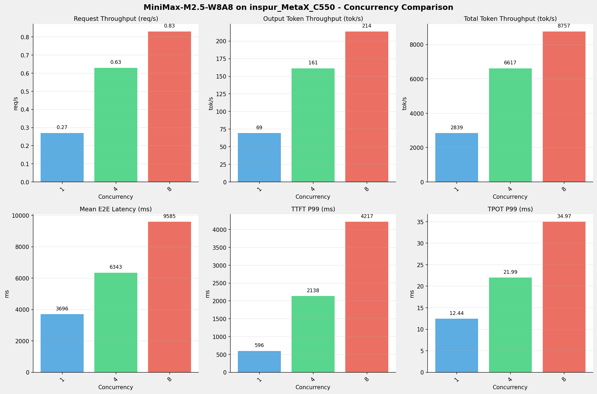
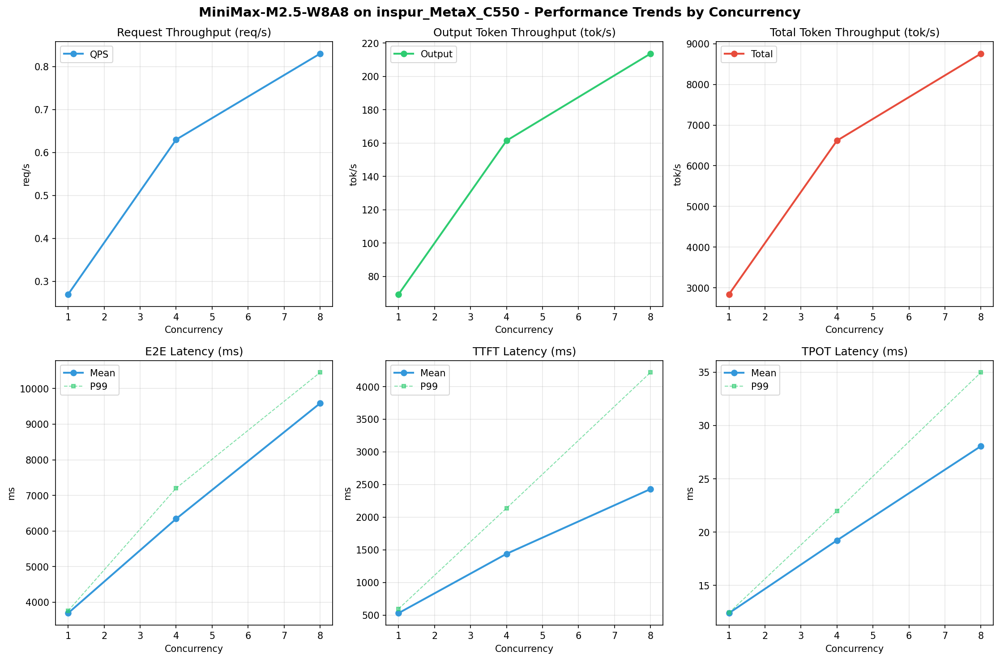

# MiniMax-M2.5-W8A8模型在inspur_MetaX_C550上的Benchmark基准测试报告

**测试日期：** 2026-04-30

---

## 测试场景
在固定请求数，输入上下文和输出上下文长度下，使用sglang bench serve工具对并发数逐级增加场景的性能基准验证。分析同一芯片同一模型在不同并发级别下的性能指标变化趋势。

**主要采集指标**：

| 指标                  | 单位         | 含义                                 |
|---------------------|------------|------------------------------------|
| E2E Latency         | ms         | End-to-End Latency，端到端延迟         |
| TTFT                | ms         | Time To First Token，首 token 延迟     |
| TPOT                | ms/token   | Time Per Output Token，每 token 生成时间 |
| ITL                 | ms         | Inter-Token Latency，token间延迟       |
| Throughput          | tokens/s   | 系统总吞吐                              |
| QPS                 | requests/s | 请求吞吐                               |

## 📊 测试概览

| 项目            | 配置                                     | 备注  |
|---------------|----------------------------------------|-----|
| **数据集**       | random                                 |     |
| **并发数**       | 1, 4, 8    |     |
| **总请求数**      | 320                                    |     |
| **请求输入上下文长度** | 10240（10k）                             |     |
| **请求输出上下文长度** | 256（0.25k）                             |     |
| **模型**        | MiniMax-M2.5-W8A8                           |     |
| **被测芯片**      | inspur_MetaX_C550 |     |
| **SGLang版本**   | 0.5.9                           |     |

---

## 🤖 芯片和模型配置信息

| 参数名称                    | inspur_MetaX_C550 |
|------------------------|-------------|
| **model_name** | MiniMax-M2.5-W8A8 |
| **quantization_config** | int8 |
| **model_size** | 215G |
| **max_position_embeddings** | 196608 |
| **temperature** | N/A |
| **top_k** | 40 |
| **top_p** | 0.95 |

---

## 🤖 SGLang启动配置信息

| 参数名称                   | inspur_MetaX_C550 |
|------------------------|-------------|
| **Model Name** | MiniMax-M2.5-W8A8 |
| **Attention Backend** | flashinfer |
| **Quantization** | w8a8_int8 |
| **TP Size** | 8 |
| **PP Size** | 1 |
| **Num Nodes** | 1 |
| **Data Type** | N/A |
| **Context Length** | 196608 |
| **Max Running Requests** | 64 |
| **Max Queued Requests** | None |
| **Disable Radix Cache** | True |
| **Tool Call Parser** | minimax-m2 |
| **Reasoning Parser** | minimax-append-think |
| **Memory Fraction Static** | 0.9 |

- **inspur_MetaX_C550**: 浪潮MetaX_C550 SGLang启动配置

---

## 📋 测试汇总

| 并发数 | 请求吞吐量 (req/s) | 输出Token吞吐量 (tok/s) | 总Token吞吐量 (tok/s) | TTFT P99 (ms) | TPOT P99 (ms) | E2E延迟均值 (ms) |
| ----------- | ----------- | ----------- | ----------- | ----------- | ----------- | ----------- |
| 1 | 0.27 | 69.26 | 2839.48 | 596.38 | 12.44 | 3695.95 |
| 4 | 0.63 | 161.40 | 6617.46 | 2137.97 | 21.99 | 6342.59 |
| 8 | 0.83 | 213.59 | 8757.21 | 4216.68 | 34.97 | 9585.27 |

---

## 📊 各并发级别性能柱状图

---

## 📈 性能趋势分析

---

## 🎯 服务基准结果

| 指标 | 1 并发 | 4 并发 | 8 并发 |
|------|----------- | ----------- | -----------|
| 成功请求数 | 320 | 320 | 320 |
| 测试持续时间 (s) | 1182.87 | 507.55 | 383.54 |
| 总输入 tokens | 3276800 | 3276800 | 3276800 |
| 总生成 tokens | 81920 | 81920 | 81920 |
| **请求吞吐量 (req/s)** | 0.27 | 0.63 | 0.83 |
| **输出 token 吞吐量 (tok/s)** | 69.26 | 161.40 | 213.59 |
| 峰值输出 token 吞吐量 (tok/s) | 81.00 | 236.00 | 368.00 |
| 峰值并发请求数 | 2 | 8 | 16 |
| **总 token 吞吐量 (tok/s)** | 2839.48 | 6617.46 | 8757.21 |

---

## ⏱️ 端到端延迟 (E2E Latency)

| 指标 | 1 并发 | 4 并发 | 8 并发 |
|------|----------- | ----------- | -----------|
| 平均 E2E 延迟 (ms) | 3695.95 | 6342.59 | 9585.27 |
| 中位 E2E 延迟 (ms) | 3689.68 | 6311.83 | 9513.92 |
| P90 E2E 延迟 (ms) | 3698.39 | 6350.06 | 9720.24 |
| P99 E2E 延迟 (ms) | 3762.23 | 7203.11 | 10451.03 |

---

## ⏱️ 首Token延迟 (TTFT)

| 指标 | 1 并发 | 4 并发 | 8 并发 |
|------|----------- | ----------- | -----------|
| 平均 TTFT (ms) | 530.76 | 1439.04 | 2430.66 |
| 中位 TTFT (ms) | 525.81 | 1627.92 | 2749.83 |
| P99 TTFT (ms) | 596.38 | 2137.97 | 4216.68 |

---

## ⚡ 每Token生成时间 (TPOT)

| 指标 | 1 并发 | 4 并发 | 8 并发 |
|------|----------- | ----------- | -----------|
| 平均 TPOT (ms) | 12.41 | 19.23 | 28.06 |
| 中位 TPOT (ms) | 12.41 | 19.66 | 27.90 |
| P99 TPOT (ms) | 12.44 | 21.99 | 34.97 |

---

## 🔄 Token间延迟 (ITL)

| 指标 | 1 并发 | 4 并发 | 8 并发 |
|------|----------- | ----------- | -----------|
| 平均 ITL (ms) | 12.41 | 19.23 | 28.06 |
| 中位 ITL (ms) | 12.41 | 17.17 | 22.26 |
| P95 ITL (ms) | 12.45 | 17.40 | 22.84 |
| P99 ITL (ms) | 14.88 | 22.33 | 27.01 |

---

## 📝 分析总结

### 1. 吞吐量性能分析

**请求吞吐量 (QPS)**: 随着并发级别增加，QPS持续上升。
低并发(1,4)平均 QPS: 0.45 req/s；
中并发(8)平均 QPS: 0.83 req/s；
最高 QPS 出现在 8 并发，达到 0.83 req/s。

**Token总吞吐量**: 最高达到 8757 tok/s (8 并发)。

### 2. 端到端延迟 (E2E Latency) 分析

E2E延迟随并发增加显著上升。
低并发平均 P99 E2E: 5483ms；
最高 P99 E2E 出现在 8 并发，达到 10451ms。

### 3. 首Token延迟 (TTFT) 分析

TTFT随并发增加显著上升。
低并发平均 P99 TTFT: 1367ms；
最高 P99 TTFT 出现在 8 并发，达到 4217ms。

### 4. Token生成时间 (TPOT) 分析

TPOT随并发增加也呈上升趋势。
低并发平均 P99 TPOT: 17.21ms；
最高 P99 TPOT 出现在 8 并发，达到 34.97ms。

### 5. Token间延迟 (ITL) 分析

ITL随并发增加呈上升趋势。
低并发平均 P99 ITL: 18.61ms；
最高 P99 ITL 出现在 8 并发，达到 27.01ms。

### 6. 综合评估

**吞吐量增长**: 从最低并发到最高并发，QPS增长了 207.4%。
**E2E延迟恶化**: 高并发相比低并发，E2E P99增加了 90.6%。
**TTFT延迟恶化**: 高并发相比低并发，TTFT P99增加了 208.4%。
**TPOT延迟恶化**: 高并发相比低并发，TPOT P99增加了 103.1%。

---

*报告生成时间: 2026-04-30*

