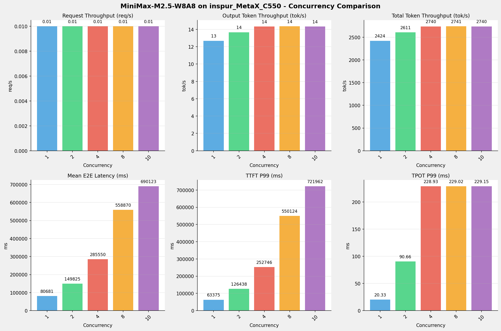
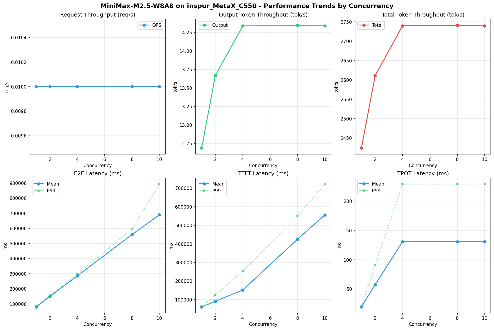

# MiniMax-M2.5-W8A8模型在inspur_MetaX_C550上的Benchmark基准测试报告

**测试日期：** 2026-05-15

---

## 测试场景
使用sglang bench serve基准测试工具对不同并发数，请求上下文长度下的性能变化趋势。

**主要采集指标**：

| 指标                  | 单位         | 含义                                 |
|---------------------|------------|------------------------------------|
| Request throughput  | req/s      | 请求吞吐量                              |
| Input token throughput | tok/s   | 输入token吞吐量                        |
| Output token throughput | tok/s  | 输出token吞吐量                        |
| Total token throughput | tok/s   | 总token吞吐量                         |
| TTFT                | ms         | Time To First Token，首 token 延迟     |
| TPOT                | ms/token   | Time Per Output Token，每 token 生成时间 |
| ITL                 | ms         | Inter-Token Latency，token间延迟       |
| E2E Latency         | ms         | End-to-End Latency，端到端延迟         |

## 🤖 芯片和模型配置信息

| 参数名称                    | inspur_MetaX_C550 |
|------------------------|-------------|
| **model_name** | MiniMax-M2.5-W8A8 |
| **quantization_config** | int8 |
| **model_size** | 215G |
| **max_position_embeddings** | 196608 |
| **temperature** | N/A |
| **top_k** | 40 |
| **top_p** | 0.95 |
| **transformers_version** | 4.57.6 |
| **sglang_version** | 0.5.9+maca3.5.3.204 |
| **python_version** | 3.10.10 |

## 🤖 SGLang启动配置信息

| 参数名称                   | inspur_MetaX_C550 |
|------------------------|-------------|
| **Model Name** | MiniMax-M2.5-W8A8 |
| **Attention Backend** | flashinfer |
| **Quantization** | w8a8_int8 |
| **Tp Size** | 8 |
| **Pp Size** | 1 |
| **Nnodes** | 1 |
| **Context Length** | 196608 |
| **Max Running Requests** | 64 |
| **Max Queued Requests** | None |
| **Disable Radix Cache** | True |
| **Tool Call Parser** | minimax-m2 |
| **Reasoning Parser** | minimax-append-think |
| **Mem Fraction Static** | 0.9 |

- **inspur_MetaX_C550**: 浪潮MetaX_C550 SGLang启动配置

## 📊 测试概览

| 项目            | 配置                                     | 备注  |
|---------------|----------------------------------------|-----|
| **数据集**       | random                                 |     |
| **并发数**       | 1, 2, 4, 8, 10    |     |
| **总请求数**      | 100                                    |     |
| **请求输入上下文长度** | 194560（190k）                             |     |
| **请求输出上下文长度** | 1024（1k）                             |     |
| **模型**        | MiniMax-M2.5-W8A8                           |     |
| **被测芯片**      | inspur_MetaX_C550 |     |
| **SGLang版本**   | 0.5.9                           |     |

---

## 📋 测试结果汇总

| 并发数 | 请求吞吐量 (req/s) | 输出Token吞吐量 (tok/s) | 总Token吞吐量 (tok/s) | TTFT P99 (ms) | TPOT P99 (ms) | E2E延迟均值 (ms) |
| ----------- | ----------- | ----------- | ----------- | ----------- | ----------- | ----------- |
| 1 | 0.01 | 12.69 | 2424.14 | 63374.54 | 20.33 | 80681.04 |
| 2 | 0.01 | 13.67 | 2610.79 | 126438.40 | 90.66 | 149824.72 |
| 4 | 0.01 | 14.34 | 2739.69 | 252746.14 | 228.93 | 285550.39 |
| 8 | 0.01 | 14.35 | 2741.37 | 550123.80 | 229.02 | 558870.27 |
| 10 | 0.01 | 14.34 | 2739.59 | 721962.01 | 229.15 | 690123.07 |

## 📊 各并发级别性能柱状图

## 📈 性能趋势分析

---

### 🎯 服务基准结果详情

| 指标 | 1 并发 | 2 并发 | 4 并发 | 8 并发 | 10 并发 |
|------|----------- | ----------- | ----------- | ----------- | -----------|
| 成功请求数 | 100 | 100 | 100 | 100 | 100 |
| 测试持续时间 (s) | 8068.18 | 7491.36 | 7138.91 | 7134.54 | 7139.17 |
| 总输入 tokens | 19456000 | 19456000 | 19456000 | 19456000 | 19456000 |
| 总生成 tokens | 102400 | 102400 | 102400 | 102400 | 102400 |
| **请求吞吐量 (req/s)** | 0.01 | 0.01 | 0.01 | 0.01 | 0.01 |
| **输入 token 吞吐量 (tok/s)** | 2411.45 | 2597.12 | 2725.34 | 2727.02 | 2725.25 |
| **输出 token 吞吐量 (tok/s)** | 12.69 | 13.67 | 14.34 | 14.35 | 14.34 |
| 峰值输出 token 吞吐量 (tok/s) | 50.00 | 70.00 | 93.00 | 92.00 | 93.00 |
| 峰值并发请求数 | 3 | 5 | 8 | 12 | 14 |
| **总 token 吞吐量 (tok/s)** | 2424.14 | 2610.79 | 2739.69 | 2741.37 | 2739.59 |

### ⏱️ 端到端延迟 (E2E Latency)

| 指标 | 1 并发 | 2 并发 | 4 并发 | 8 并发 | 10 并发 |
|------|----------- | ----------- | ----------- | ----------- | -----------|
| 平均 E2E 延迟 (ms) | 80681.04 | 149824.72 | 285550.39 | 558870.27 | 690123.07 |
| 中位 E2E 延迟 (ms) | 84034.37 | 156079.30 | 297529.83 | 594599.95 | 595287.20 |
| P90 E2E 延迟 (ms) | 84131.89 | 156219.53 | 297678.91 | 594851.66 | 892727.67 |
| P99 E2E 延迟 (ms) | 84165.35 | 156247.42 | 297902.96 | 595179.12 | 892917.91 |

### ⏱️ 首Token延迟 (TTFT)

| 指标 | 1 并发 | 2 并发 | 4 并发 | 8 并发 | 10 并发 |
|------|----------- | ----------- | ----------- | ----------- | -----------|
| 平均 TTFT (ms) | 60714.60 | 91040.24 | 151789.54 | 425053.85 | 556209.89 |
| 中位 TTFT (ms) | 63251.29 | 63633.21 | 126783.24 | 423822.71 | 550150.31 |
| P99 TTFT (ms) | 63374.54 | 126438.40 | 252746.14 | 550123.80 | 721962.01 |

### ⚡ 每Token生成时间 (TPOT)

| 指标 | 1 并发 | 2 并发 | 4 并发 | 8 并发 | 10 并发 |
|------|----------- | ----------- | ----------- | ----------- | -----------|
| 平均 TPOT (ms) | 19.52 | 57.46 | 130.75 | 130.81 | 130.90 |
| 中位 TPOT (ms) | 20.32 | 29.20 | 105.27 | 105.27 | 105.41 |
| P99 TPOT (ms) | 20.33 | 90.66 | 228.93 | 229.02 | 229.15 |

### 🔄 Token间延迟 (ITL)

| 指标 | 1 并发 | 2 并发 | 4 并发 | 8 并发 | 10 并发 |
|------|----------- | ----------- | ----------- | ----------- | -----------|
| 平均 ITL (ms) | 20.32 | 59.84 | 136.17 | 136.22 | 136.32 |
| 中位 ITL (ms) | 20.32 | 29.14 | 43.91 | 43.95 | 43.98 |
| P95 ITL (ms) | 20.36 | 29.24 | 44.19 | 44.20 | 44.25 |
| P99 ITL (ms) | 24.42 | 32.89 | 46.66 | 46.82 | 46.84 |

---

## 📝 分析总结

### 1. 吞吐量性能分析

**请求吞吐量 (QPS)**: 随着并发级别增加，QPS持续上升。
低并发(1,2,4)平均 QPS: 0.01 req/s；
中并发(8,10)平均 QPS: 0.01 req/s；
最高 QPS 出现在 1 并发，达到 0.01 req/s。

**Token总吞吐量**: 最高达到 2741 tok/s (8 并发)。

### 2. 端到端延迟 (E2E Latency) 分析

E2E延迟随并发增加显著上升。
低并发平均 P99 E2E: 179439ms；
最高 P99 E2E 出现在 10 并发，达到 892918ms。

### 3. 首Token延迟 (TTFT) 分析

TTFT随并发增加显著上升。
低并发平均 P99 TTFT: 147520ms；
最高 P99 TTFT 出现在 10 并发，达到 721962ms。

### 4. Token生成时间 (TPOT) 分析

TPOT随并发增加也呈上升趋势。
低并发平均 P99 TPOT: 113.31ms；
最高 P99 TPOT 出现在 10 并发，达到 229.15ms。

### 5. Token间延迟 (ITL) 分析

ITL随并发增加呈上升趋势。
低并发平均 P99 ITL: 34.66ms；
最高 P99 ITL 出现在 10 并发，达到 46.84ms。

### 6. 综合评估

**吞吐量增长**: 从最低并发到最高并发，QPS增长了 0.0%。
**E2E延迟恶化**: 高并发相比低并发，E2E P99增加了 397.6%。
**TTFT延迟恶化**: 高并发相比低并发，TTFT P99增加了 389.4%。
**TPOT延迟恶化**: 高并发相比低并发，TPOT P99增加了 102.2%。

---

*报告生成时间: 2026-05-15*

