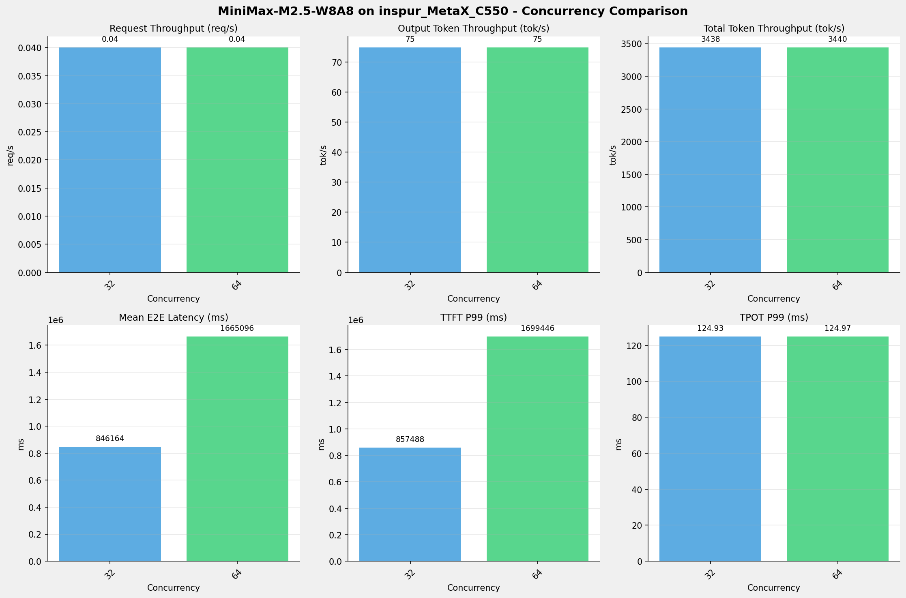
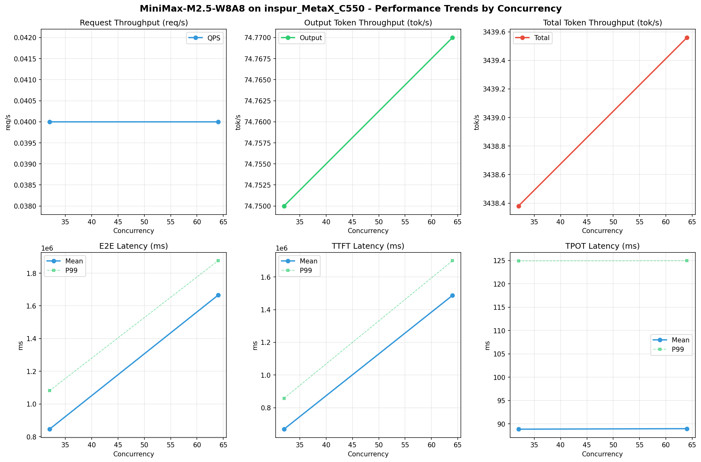

# MiniMax-M2.5-W8A8模型在inspur_MetaX_C550上的Benchmark基准测试报告

**测试日期：** 2026-04-30

---

## 测试场景
在固定请求数，输入上下文和输出上下文长度下，使用sglang bench serve工具对并发数逐级增加场景的性能基准验证。分析同一芯片同一模型在不同并发级别下的性能指标变化趋势。

**主要采集指标**：

| 指标                  | 单位         | 含义                                 |
|---------------------|------------|------------------------------------|
| E2E Latency         | ms         | End-to-End Latency，端到端延迟         |
| TTFT                | ms         | Time To First Token，首 token 延迟     |
| TPOT                | ms/token   | Time Per Output Token，每 token 生成时间 |
| ITL                 | ms         | Inter-Token Latency，token间延迟       |
| Throughput          | tokens/s   | 系统总吞吐                              |
| QPS                 | requests/s | 请求吞吐                               |

## 📊 测试概览

| 项目            | 配置                                     | 备注  |
|---------------|----------------------------------------|-----|
| **数据集**       | random                                 |     |
| **并发数**       | 32, 64    |     |
| **总请求数**      | 1000                                    |     |
| **请求输入上下文长度** | 90000（87k）                             |     |
| **请求输出上下文长度** | 2000（1k）                             |     |
| **模型**        | MiniMax-M2.5-W8A8                           |     |
| **被测芯片**      | inspur_MetaX_C550 |     |
| **SGLang版本**   | 0.5.9                           |     |

---

## 🤖 芯片和模型配置信息

| 参数名称                    | inspur_MetaX_C550 |
|------------------------|-------------|
| **model_name** | MiniMax-M2.5-W8A8 |
| **quantization_config** | int8 |
| **model_size** | 215G |
| **max_position_embeddings** | 196608 |
| **temperature** | N/A |
| **top_k** | 40 |
| **top_p** | 0.95 |

---

## 🤖 SGLang启动配置信息

| 参数名称                   | inspur_MetaX_C550 |
|------------------------|-------------|
| **Model Name** | MiniMax-M2.5-W8A8 |
| **Attention Backend** | flashinfer |
| **Quantization** | w8a8_int8 |
| **TP Size** | 8 |
| **PP Size** | 1 |
| **Num Nodes** | 1 |
| **Data Type** | N/A |
| **Context Length** | 196608 |
| **Max Running Requests** | 64 |
| **Max Queued Requests** | None |
| **Disable Radix Cache** | True |
| **Tool Call Parser** | minimax-m2 |
| **Reasoning Parser** | minimax-append-think |
| **Memory Fraction Static** | 0.9 |

- **inspur_MetaX_C550**: 浪潮MetaX_C550 SGLang启动配置

---

## 📋 测试汇总

| 并发数 | 请求吞吐量 (req/s) | 输出Token吞吐量 (tok/s) | 总Token吞吐量 (tok/s) | TTFT P99 (ms) | TPOT P99 (ms) | E2E延迟均值 (ms) |
| ----------- | ----------- | ----------- | ----------- | ----------- | ----------- | ----------- |
| 32 | 0.04 | 74.75 | 3438.38 | 857488.09 | 124.93 | 846163.95 |
| 64 | 0.04 | 74.77 | 3439.56 | 1699446.48 | 124.97 | 1665095.54 |

---

## 📊 各并发级别性能柱状图

---

## 📈 性能趋势分析

---

## 🎯 服务基准结果

| 指标 | 32 并发 | 64 并发 |
|------|----------- | -----------|
| 成功请求数 | 1000 | 1000 |
| 测试持续时间 (s) | 26756.76 | 26747.60 |
| 总输入 tokens | 90000000 | 90000000 |
| 总生成 tokens | 2000000 | 2000000 |
| **请求吞吐量 (req/s)** | 0.04 | 0.04 |
| **输出 token 吞吐量 (tok/s)** | 74.75 | 74.77 |
| 峰值输出 token 吞吐量 (tok/s) | 190.00 | 190.00 |
| 峰值并发请求数 | 42 | 74 |
| **总 token 吞吐量 (tok/s)** | 3438.38 | 3439.56 |

---

## ⏱️ 端到端延迟 (E2E Latency)

| 指标 | 32 并发 | 64 并发 |
|------|----------- | -----------|
| 平均 E2E 延迟 (ms) | 846163.95 | 1665095.54 |
| 中位 E2E 延迟 (ms) | 793186.54 | 1609326.90 |
| P90 E2E 延迟 (ms) | 1056601.94 | 1855025.08 |
| P99 E2E 延迟 (ms) | 1081494.77 | 1875852.49 |

---

## ⏱️ 首Token延迟 (TTFT)

| 指标 | 32 并发 | 64 并发 |
|------|----------- | -----------|
| 平均 TTFT (ms) | 668545.83 | 1487255.15 |
| 中位 TTFT (ms) | 650829.87 | 1485885.19 |
| P99 TTFT (ms) | 857488.09 | 1699446.48 |

---

## ⚡ 每Token生成时间 (TPOT)

| 指标 | 32 并发 | 64 并发 |
|------|----------- | -----------|
| 平均 TPOT (ms) | 88.85 | 88.96 |
| 中位 TPOT (ms) | 86.29 | 86.30 |
| P99 TPOT (ms) | 124.93 | 124.97 |

---

## 🔄 Token间延迟 (ITL)

| 指标 | 32 并发 | 64 并发 |
|------|----------- | -----------|
| 平均 ITL (ms) | 88.85 | 88.96 |
| 中位 ITL (ms) | 55.20 | 55.18 |
| P95 ITL (ms) | 56.30 | 56.15 |
| P99 ITL (ms) | 58.30 | 58.25 |

---

## 📝 分析总结

### 1. 吞吐量性能分析

**请求吞吐量 (QPS)**: 随着并发级别增加，QPS持续上升。
中并发(32)平均 QPS: 0.04 req/s；
高并发(64)平均 QPS: 0.04 req/s；
最高 QPS 出现在 32 并发，达到 0.04 req/s。

**Token总吞吐量**: 最高达到 3440 tok/s (64 并发)。

### 2. 端到端延迟 (E2E Latency) 分析

E2E延迟随并发增加显著上升。
高并发平均 P99 E2E: 1875852ms；
最高 P99 E2E 出现在 64 并发，达到 1875852ms。

### 3. 首Token延迟 (TTFT) 分析

TTFT随并发增加显著上升。
高并发平均 P99 TTFT: 1699446ms；
最高 P99 TTFT 出现在 64 并发，达到 1699446ms。

### 4. Token生成时间 (TPOT) 分析

TPOT随并发增加也呈上升趋势。
高并发平均 P99 TPOT: 124.97ms；
最高 P99 TPOT 出现在 64 并发，达到 124.97ms。

### 5. Token间延迟 (ITL) 分析

ITL随并发增加呈上升趋势。
高并发平均 P99 ITL: 58.25ms；
最高 P99 ITL 出现在 32 并发，达到 58.30ms。

### 6. 综合评估

**吞吐量增长**: 从最低并发到最高并发，QPS增长了 0.0%。

---

*报告生成时间: 2026-04-30*

