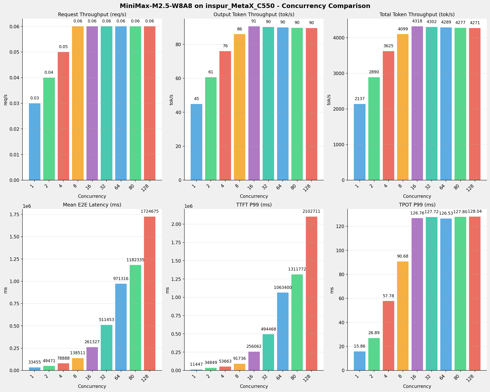
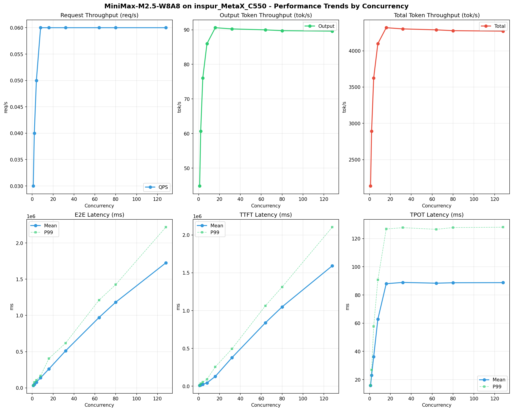

# MiniMax-M2.5-W8A8模型在inspur_MetaX_C550上的Benchmark基准测试报告

**测试日期：** 2026-05-15

---

## 测试场景
使用sglang bench serve基准测试工具对不同并发数，请求上下文长度下的性能变化趋势。

**主要采集指标**：

| 指标                  | 单位         | 含义                                 |
|---------------------|------------|------------------------------------|
| Request throughput  | req/s      | 请求吞吐量                              |
| Input token throughput | tok/s   | 输入token吞吐量                        |
| Output token throughput | tok/s  | 输出token吞吐量                        |
| Total token throughput | tok/s   | 总token吞吐量                         |
| TTFT                | ms         | Time To First Token，首 token 延迟     |
| TPOT                | ms/token   | Time Per Output Token，每 token 生成时间 |
| ITL                 | ms         | Inter-Token Latency，token间延迟       |
| E2E Latency         | ms         | End-to-End Latency，端到端延迟         |

## 🤖 芯片和模型配置信息

| 参数名称                    | inspur_MetaX_C550 |
|------------------------|-------------|
| **model_name** | MiniMax-M2.5-W8A8 |
| **quantization_config** | int8 |
| **model_size** | 215G |
| **max_position_embeddings** | 196608 |
| **temperature** | N/A |
| **top_k** | 40 |
| **top_p** | 0.95 |
| **transformers_version** | 4.57.6 |
| **sglang_version** | 0.5.9+maca3.5.3.204 |
| **python_version** | 3.10.10 |

## 🤖 SGLang启动配置信息

| 参数名称                   | inspur_MetaX_C550 |
|------------------------|-------------|
| **Model Name** | MiniMax-M2.5-W8A8 |
| **Attention Backend** | flashinfer |
| **Quantization** | w8a8_int8 |
| **Tp Size** | 8 |
| **Pp Size** | 1 |
| **Nnodes** | 1 |
| **Context Length** | 196608 |
| **Max Running Requests** | 64 |
| **Max Queued Requests** | None |
| **Disable Radix Cache** | True |
| **Tool Call Parser** | minimax-m2 |
| **Reasoning Parser** | minimax-append-think |
| **Mem Fraction Static** | 0.9 |

- **inspur_MetaX_C550**: 浪潮MetaX_C550 SGLang启动配置

## 📊 测试概览

| 项目            | 配置                                     | 备注  |
|---------------|----------------------------------------|-----|
| **数据集**       | random                                 |     |
| **并发数**       | 1, 2, 4, 8, 16, 32, 64, 80, 128    |     |
| **总请求数**      | 300                                    |     |
| **请求输入上下文长度** | 70000（68k）                             |     |
| **请求输出上下文长度** | 1500（1k）                             |     |
| **模型**        | MiniMax-M2.5-W8A8                           |     |
| **被测芯片**      | inspur_MetaX_C550 |     |
| **SGLang版本**   | 0.5.9                           |     |

---

## 📋 测试结果汇总

| 并发数 | 请求吞吐量 (req/s) | 输出Token吞吐量 (tok/s) | 总Token吞吐量 (tok/s) | TTFT P99 (ms) | TPOT P99 (ms) | E2E延迟均值 (ms) |
| ----------- | ----------- | ----------- | ----------- | ----------- | ----------- | ----------- |
| 1 | 0.03 | 44.83 | 2137.13 | 11447.33 | 15.86 | 33455.48 |
| 2 | 0.04 | 60.64 | 2890.50 | 34848.72 | 26.89 | 49470.99 |
| 4 | 0.05 | 76.05 | 3625.24 | 53663.29 | 57.78 | 78888.00 |
| 8 | 0.06 | 85.98 | 4098.56 | 91735.80 | 90.68 | 138510.87 |
| 16 | 0.06 | 90.59 | 4318.09 | 256062.39 | 126.76 | 261327.40 |
| 32 | 0.06 | 90.24 | 4301.58 | 494467.75 | 127.72 | 511453.47 |
| 64 | 0.06 | 89.97 | 4288.52 | 1063399.69 | 126.53 | 971316.36 |
| 80 | 0.06 | 89.73 | 4277.11 | 1311772.38 | 127.80 | 1182334.74 |
| 128 | 0.06 | 89.60 | 4270.93 | 2102711.33 | 128.04 | 1724674.66 |

## 📊 各并发级别性能柱状图

## 📈 性能趋势分析

---

### 🎯 服务基准结果详情

| 指标 | 1 并发 | 2 并发 | 4 并发 | 8 并发 | 16 并发 | 32 并发 | 64 并发 | 80 并发 | 128 并发 |
|------|----------- | ----------- | ----------- | ----------- | ----------- | ----------- | ----------- | ----------- | -----------|
| 成功请求数 | 300 | 300 | 300 | 300 | 300 | 300 | 300 | 300 | 300 |
| 测试持续时间 (s) | 10036.82 | 7420.87 | 5916.84 | 5233.55 | 4967.48 | 4986.54 | 5001.72 | 5015.07 | 5022.32 |
| 总输入 tokens | 21000000 | 21000000 | 21000000 | 21000000 | 21000000 | 21000000 | 21000000 | 21000000 | 21000000 |
| 总生成 tokens | 450000 | 450000 | 450000 | 450000 | 450000 | 450000 | 450000 | 450000 | 450000 |
| **请求吞吐量 (req/s)** | 0.03 | 0.04 | 0.05 | 0.06 | 0.06 | 0.06 | 0.06 | 0.06 | 0.06 |
| **输入 token 吞吐量 (tok/s)** | 2092.30 | 2829.86 | 3549.19 | 4012.57 | 4227.50 | 4211.34 | 4198.55 | 4187.38 | 4181.33 |
| **输出 token 吞吐量 (tok/s)** | 44.83 | 60.64 | 76.05 | 85.98 | 90.59 | 90.24 | 89.97 | 89.73 | 89.60 |
| 峰值输出 token 吞吐量 (tok/s) | 65.00 | 102.00 | 156.00 | 200.00 | 240.00 | 236.00 | 240.00 | 228.00 | 240.00 |
| 峰值并发请求数 | 2 | 4 | 8 | 16 | 28 | 44 | 76 | 92 | 140 |
| **总 token 吞吐量 (tok/s)** | 2137.13 | 2890.50 | 3625.24 | 4098.56 | 4318.09 | 4301.58 | 4288.52 | 4277.11 | 4270.93 |

### ⏱️ 端到端延迟 (E2E Latency)

| 指标 | 1 并发 | 2 并发 | 4 并发 | 8 并发 | 16 并发 | 32 并发 | 64 并发 | 80 并发 | 128 并发 |
|------|----------- | ----------- | ----------- | ----------- | ----------- | ----------- | ----------- | ----------- | -----------|
| 平均 E2E 延迟 (ms) | 33455.48 | 49470.99 | 78888.00 | 138510.87 | 261327.40 | 511453.47 | 971316.36 | 1182334.74 | 1724674.66 |
| 中位 E2E 延迟 (ms) | 33253.29 | 49038.29 | 78106.08 | 137678.98 | 195537.68 | 587189.55 | 990617.78 | 1377892.49 | 2004311.65 |
| P90 E2E 延迟 (ms) | 33285.40 | 49105.06 | 78252.23 | 140438.10 | 393952.01 | 602780.99 | 1192454.61 | 1410899.98 | 2201907.62 |
| P99 E2E 延迟 (ms) | 35227.93 | 78147.37 | 106390.46 | 165851.60 | 405966.76 | 617720.72 | 1210763.24 | 1425006.74 | 2217012.52 |

### ⏱️ 首Token延迟 (TTFT)

| 指标 | 1 并发 | 2 并发 | 4 并发 | 8 并发 | 16 并发 | 32 并发 | 64 并发 | 80 并发 | 128 并发 |
|------|----------- | ----------- | ----------- | ----------- | ----------- | ----------- | ----------- | ----------- | -----------|
| 平均 TTFT (ms) | 9714.72 | 14764.48 | 24615.55 | 44338.87 | 129429.07 | 378189.16 | 838886.47 | 1049426.46 | 1591633.34 |
| 中位 TTFT (ms) | 9538.87 | 18692.36 | 25064.39 | 47812.06 | 105763.75 | 416871.49 | 889339.36 | 1203668.61 | 1915267.15 |
| P99 TTFT (ms) | 11447.33 | 34848.72 | 53663.29 | 91735.80 | 256062.39 | 494467.75 | 1063399.69 | 1311772.38 | 2102711.33 |

### ⚡ 每Token生成时间 (TPOT)

| 指标 | 1 并发 | 2 并发 | 4 并发 | 8 并发 | 16 并发 | 32 并发 | 64 并发 | 80 并发 | 128 并发 |
|------|----------- | ----------- | ----------- | ----------- | ----------- | ----------- | ----------- | ----------- | -----------|
| 平均 TPOT (ms) | 15.84 | 23.15 | 36.21 | 62.82 | 87.99 | 88.90 | 88.35 | 88.66 | 88.75 |
| 中位 TPOT (ms) | 15.82 | 24.20 | 36.57 | 60.84 | 86.79 | 91.12 | 87.41 | 87.49 | 87.52 |
| P99 TPOT (ms) | 15.86 | 26.89 | 57.78 | 90.68 | 126.76 | 127.72 | 126.53 | 127.80 | 128.04 |

### 🔄 Token间延迟 (ITL)

| 指标 | 1 并发 | 2 并发 | 4 并发 | 8 并发 | 16 并发 | 32 并发 | 64 并发 | 80 并发 | 128 并发 |
|------|----------- | ----------- | ----------- | ----------- | ----------- | ----------- | ----------- | ----------- | -----------|
| 平均 ITL (ms) | 15.84 | 23.15 | 36.21 | 62.82 | 87.99 | 88.90 | 88.35 | 88.66 | 88.75 |
| 中位 ITL (ms) | 15.82 | 20.03 | 26.43 | 40.52 | 53.12 | 53.13 | 53.19 | 53.27 | 53.25 |
| P95 ITL (ms) | 15.86 | 20.50 | 28.58 | 43.06 | 54.87 | 56.11 | 56.13 | 56.19 | 56.19 |
| P99 ITL (ms) | 19.67 | 25.32 | 31.14 | 43.86 | 56.23 | 57.66 | 57.55 | 57.68 | 57.44 |

---

## 📝 分析总结

### 1. 吞吐量性能分析

**请求吞吐量 (QPS)**: 随着并发级别增加，QPS持续上升。
低并发(1,2,4)平均 QPS: 0.04 req/s；
中并发(8,16,32)平均 QPS: 0.06 req/s；
高并发(64,80,128)平均 QPS: 0.06 req/s；
最高 QPS 出现在 8 并发，达到 0.06 req/s。

**Token总吞吐量**: 最高达到 4318 tok/s (16 并发)。

### 2. 端到端延迟 (E2E Latency) 分析

E2E延迟随并发增加显著上升。
低并发平均 P99 E2E: 73255ms；
高并发平均 P99 E2E: 1617594ms；
最高 P99 E2E 出现在 128 并发，达到 2217013ms。

### 3. 首Token延迟 (TTFT) 分析

TTFT随并发增加显著上升。
低并发平均 P99 TTFT: 33320ms；
高并发平均 P99 TTFT: 1492628ms；
最高 P99 TTFT 出现在 128 并发，达到 2102711ms。

### 4. Token生成时间 (TPOT) 分析

TPOT随并发增加也呈上升趋势。
低并发平均 P99 TPOT: 33.51ms；
高并发平均 P99 TPOT: 127.46ms；
最高 P99 TPOT 出现在 128 并发，达到 128.04ms。

### 5. Token间延迟 (ITL) 分析

ITL随并发增加呈上升趋势。
低并发平均 P99 ITL: 25.38ms；
高并发平均 P99 ITL: 57.56ms；
最高 P99 ITL 出现在 80 并发，达到 57.68ms。

### 6. 综合评估

**吞吐量增长**: 从最低并发到最高并发，QPS增长了 100.0%。
**E2E延迟恶化**: 高并发相比低并发，E2E P99增加了 2926.4%。
**TTFT延迟恶化**: 高并发相比低并发，TTFT P99增加了 6210.7%。
**TPOT延迟恶化**: 高并发相比低并发，TPOT P99增加了 282.1%。

---

*报告生成时间: 2026-05-15*

