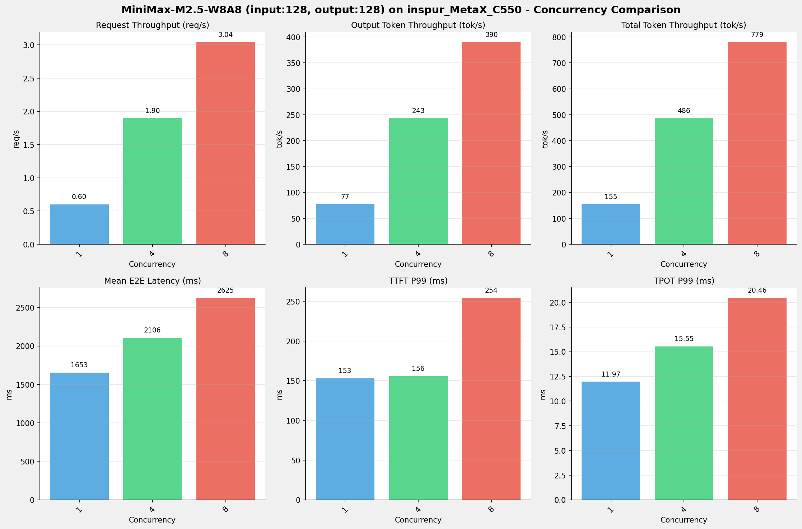
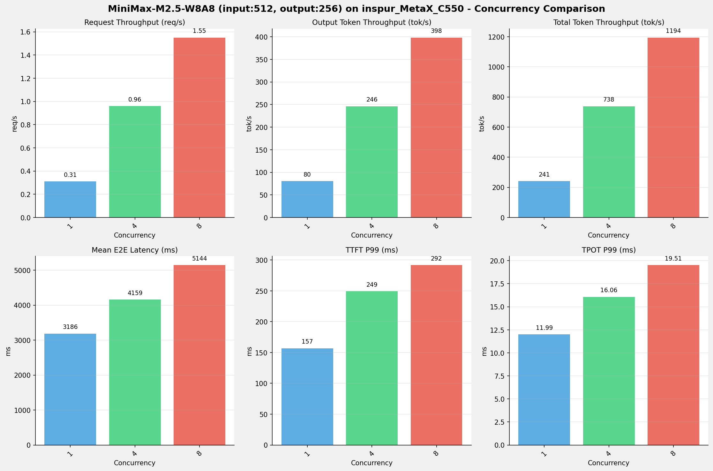
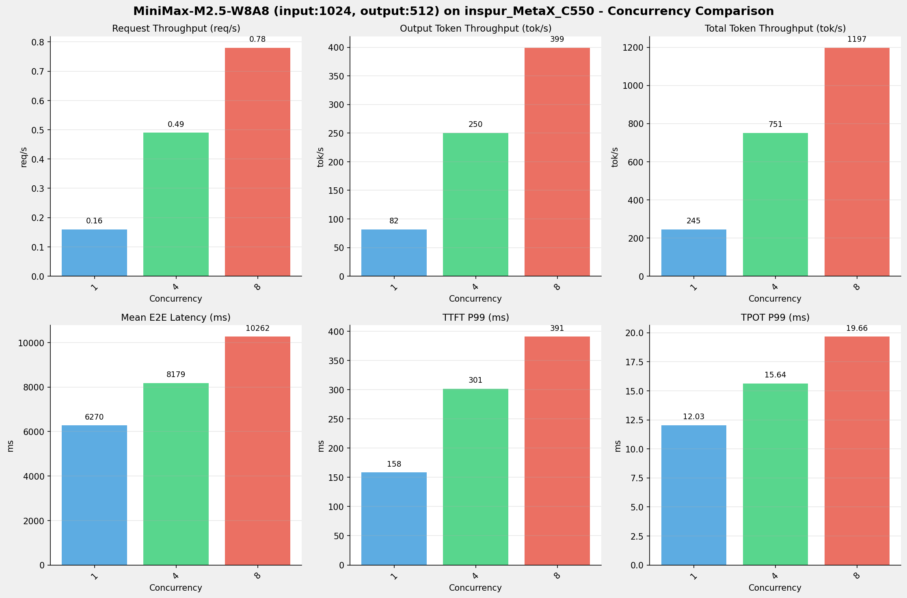
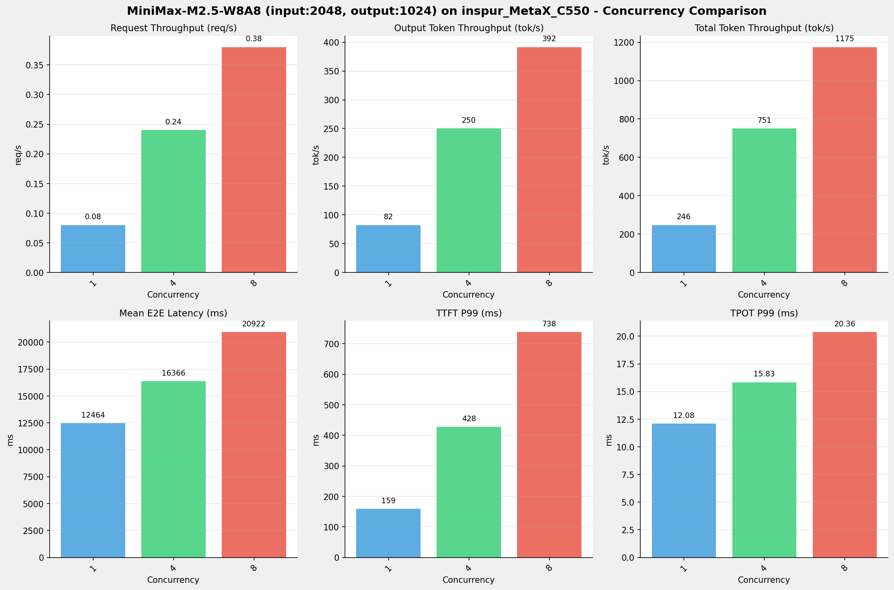
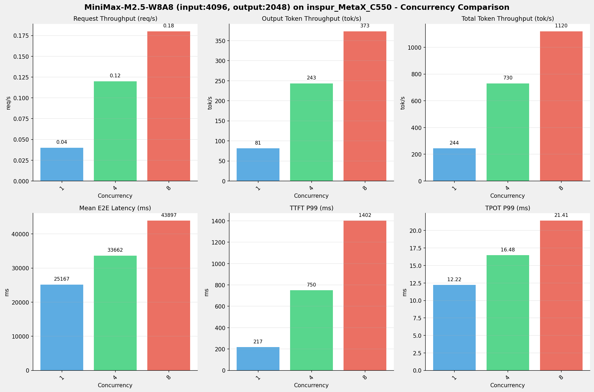
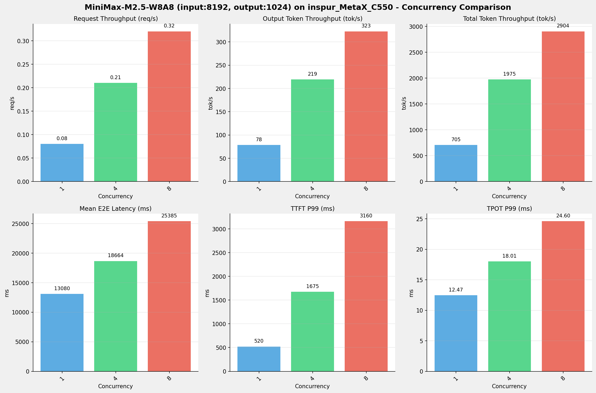
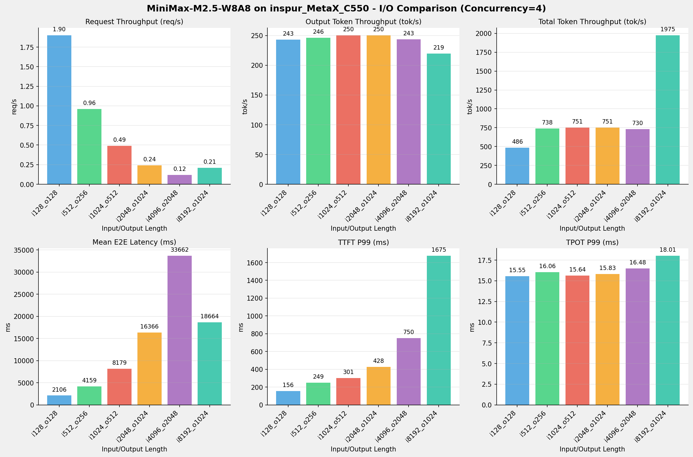
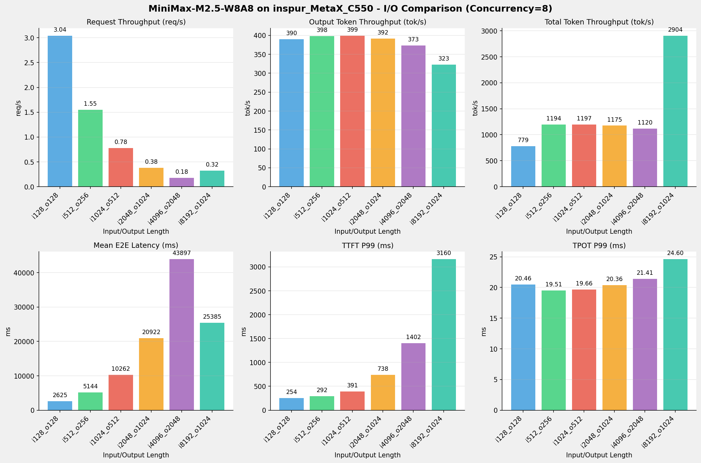

# MiniMax-M2.5-W8A8模型在inspur_MetaX_C550上的多I/O测试报告

**测试日期：** 2026-04-30

---

## 测试场景
测试不同输入输出长度和并发级别下的性能表现，分析同一芯片同一模型在不同输入输出长度和并发级别下的性能指标变化趋势。

**主要采集指标**：

| 指标                  | 单位         | 含义                                 |
|---------------------|------------|------------------------------------|
| E2E Latency         | ms         | End-to-End Latency，端到端延迟         |
| TTFT                | ms         | Time To First Token，首 token 延迟     |
| TPOT                | ms/token   | Time Per Output Token，每 token 生成时间 |
| ITL                 | ms         | Inter-Token Latency，token间延迟       |
| Throughput          | tokens/s   | 系统总吞吐                              |
| QPS                 | requests/s | 请求吞吐                               |

---

## 📊 测试概览

| 项目            | 配置                                     | 备注  |
|---------------|----------------------------------------|-----|
| **数据集**       | random                                 |     |
| **并发数**       | 1, 4, 8    |     |
| **总请求数**      | 1000                                    |     |
| **输入输出长度** | (128, 128), (512, 256), (1024, 512), (2048, 1024), (4096, 2048), (8192, 1024) |     |
| **模型**        | MiniMax-M2.5-W8A8                           |     |
| **被测芯片**      | inspur_MetaX_C550 |     |
| **SGLang版本**   | 0.5.9                           |     |

---

## 🤖 芯片和模型配置信息

| 参数名称                    | inspur_MetaX_C550 |
|------------------------|-------------|
| **model_name** | MiniMax-M2.5-W8A8 |
| **quantization_config** | int8 |
| **model_size** | 215G |
| **max_position_embeddings** | 196608 |
| **temperature** | N/A |
| **top_k** | 40 |
| **top_p** | 0.95 |

---

## 🤖 SGLang启动配置信息

| 参数名称                   | inspur_MetaX_C550 |
|------------------------|-------------|
| **Model Name** | MiniMax-M2.5-W8A8 |
| **Attention Backend** | flashinfer |
| **Quantization** | w8a8_int8 |
| **TP Size** | 8 |
| **PP Size** | 1 |
| **Num Nodes** | 1 |
| **Data Type** | N/A |
| **Context Length** | 196608 |
| **Max Running Requests** | 64 |

---

## 📋 各I/O测试汇总（随并发变化）

### input: 128, output: 128

| 并发数 | 请求吞吐量 (req/s) | 输出Token吞吐量 (tok/s) | 总Token吞吐量 (tok/s) | TTFT P99 (ms) | TPOT P99 (ms) | E2E延迟均值 (ms) |
| --------------- | --------------- | --------------- | --------------- | --------------- | --------------- | --------------- |
| 1 | 0.60 | 77.40 | 154.81 | 153.05 | 11.97 | 1653.19 |
| 4 | 1.90 | 242.97 | 485.94 | 155.80 | 15.55 | 2106.04 |
| 8 | 3.04 | 389.71 | 779.42 | 254.37 | 20.46 | 2625.12 |

---

### input: 512, output: 256

| 并发数 | 请求吞吐量 (req/s) | 输出Token吞吐量 (tok/s) | 总Token吞吐量 (tok/s) | TTFT P99 (ms) | TPOT P99 (ms) | E2E延迟均值 (ms) |
| --------------- | --------------- | --------------- | --------------- | --------------- | --------------- | --------------- |
| 1 | 0.31 | 80.35 | 241.04 | 156.87 | 11.99 | 3185.64 |
| 4 | 0.96 | 246.10 | 738.30 | 249.24 | 16.06 | 4159.12 |
| 8 | 1.55 | 397.98 | 1193.94 | 291.68 | 19.51 | 5143.98 |

---

### input: 1024, output: 512

| 并发数 | 请求吞吐量 (req/s) | 输出Token吞吐量 (tok/s) | 总Token吞吐量 (tok/s) | TTFT P99 (ms) | TPOT P99 (ms) | E2E延迟均值 (ms) |
| --------------- | --------------- | --------------- | --------------- | --------------- | --------------- | --------------- |
| 1 | 0.16 | 81.65 | 244.96 | 158.39 | 12.03 | 6269.82 |
| 4 | 0.49 | 250.36 | 751.07 | 301.36 | 15.64 | 8179.01 |
| 8 | 0.78 | 399.06 | 1197.18 | 390.54 | 19.66 | 10262.02 |

---

### input: 2048, output: 1024

| 并发数 | 请求吞吐量 (req/s) | 输出Token吞吐量 (tok/s) | 总Token吞吐量 (tok/s) | TTFT P99 (ms) | TPOT P99 (ms) | E2E延迟均值 (ms) |
| --------------- | --------------- | --------------- | --------------- | --------------- | --------------- | --------------- |
| 1 | 0.08 | 82.15 | 246.46 | 159.25 | 12.08 | 12463.90 |
| 4 | 0.24 | 250.25 | 750.74 | 427.62 | 15.83 | 16366.33 |
| 8 | 0.38 | 391.51 | 1174.52 | 738.03 | 20.36 | 20921.57 |

---

### input: 4096, output: 2048

| 并发数 | 请求吞吐量 (req/s) | 输出Token吞吐量 (tok/s) | 总Token吞吐量 (tok/s) | TTFT P99 (ms) | TPOT P99 (ms) | E2E延迟均值 (ms) |
| --------------- | --------------- | --------------- | --------------- | --------------- | --------------- | --------------- |
| 1 | 0.04 | 81.37 | 244.12 | 217.04 | 12.22 | 25167.30 |
| 4 | 0.12 | 243.35 | 730.04 | 750.50 | 16.48 | 33662.10 |
| 8 | 0.18 | 373.22 | 1119.65 | 1401.61 | 21.41 | 43896.57 |

---

### input: 8192, output: 1024

| 并发数 | 请求吞吐量 (req/s) | 输出Token吞吐量 (tok/s) | 总Token吞吐量 (tok/s) | TTFT P99 (ms) | TPOT P99 (ms) | E2E延迟均值 (ms) |
| --------------- | --------------- | --------------- | --------------- | --------------- | --------------- | --------------- |
| 1 | 0.08 | 78.29 | 704.57 | 520.17 | 12.47 | 13079.88 |
| 4 | 0.21 | 219.44 | 1975.00 | 1674.84 | 18.01 | 18663.66 |
| 8 | 0.32 | 322.67 | 2904.05 | 3159.86 | 24.60 | 25384.99 |

---

## 📊 I/O对比（固定并发数）

### 并发数 = 1

| 指标 | i128_o128 | i512_o256 | i1024_o512 | i2048_o1024 | i4096_o2048 | i8192_o1024 |
| --- | --- | --- | --- | --- | --- | --- |
| 请求吞吐量 (req/s) | 0.60 | 0.31 | 0.16 | 0.08 | 0.04 | 0.08 |
| 输出Token吞吐量 (tok/s) | 77.40 | 80.35 | 81.65 | 82.15 | 81.37 | 78.29 |
| 总Token吞吐量 (tok/s) | 154.81 | 241.04 | 244.96 | 246.46 | 244.12 | 704.57 |
| TTFT P99 (ms) | 153.05 | 156.87 | 158.39 | 159.25 | 217.04 | 520.17 |
| TPOT P99 (ms) | 11.97 | 11.99 | 12.03 | 12.08 | 12.22 | 12.47 |
| E2E延迟均值 (ms) | 1653.19 | 3185.64 | 6269.82 | 12463.90 | 25167.30 | 13079.88 |

---

### 并发数 = 4

| 指标 | i128_o128 | i512_o256 | i1024_o512 | i2048_o1024 | i4096_o2048 | i8192_o1024 |
| --- | --- | --- | --- | --- | --- | --- |
| 请求吞吐量 (req/s) | 1.90 | 0.96 | 0.49 | 0.24 | 0.12 | 0.21 |
| 输出Token吞吐量 (tok/s) | 242.97 | 246.10 | 250.36 | 250.25 | 243.35 | 219.44 |
| 总Token吞吐量 (tok/s) | 485.94 | 738.30 | 751.07 | 750.74 | 730.04 | 1975.00 |
| TTFT P99 (ms) | 155.80 | 249.24 | 301.36 | 427.62 | 750.50 | 1674.84 |
| TPOT P99 (ms) | 15.55 | 16.06 | 15.64 | 15.83 | 16.48 | 18.01 |
| E2E延迟均值 (ms) | 2106.04 | 4159.12 | 8179.01 | 16366.33 | 33662.10 | 18663.66 |

---

### 并发数 = 8

| 指标 | i128_o128 | i512_o256 | i1024_o512 | i2048_o1024 | i4096_o2048 | i8192_o1024 |
| --- | --- | --- | --- | --- | --- | --- |
| 请求吞吐量 (req/s) | 3.04 | 1.55 | 0.78 | 0.38 | 0.18 | 0.32 |
| 输出Token吞吐量 (tok/s) | 389.71 | 397.98 | 399.06 | 391.51 | 373.22 | 322.67 |
| 总Token吞吐量 (tok/s) | 779.42 | 1193.94 | 1197.18 | 1174.52 | 1119.65 | 2904.05 |
| TTFT P99 (ms) | 254.37 | 291.68 | 390.54 | 738.03 | 1401.61 | 3159.86 |
| TPOT P99 (ms) | 20.46 | 19.51 | 19.66 | 20.36 | 21.41 | 24.60 |
| E2E延迟均值 (ms) | 2625.12 | 5143.98 | 10262.02 | 20921.57 | 43896.57 | 25384.99 |

---

## 📝 详细性能数据

### input: 128, output: 128

#### 服务基准结果

| 指标 | 1 并发 | 4 并发 | 8 并发 |
| ----------- | ----------- | ----------- | ----------- |
| 成功请求数 | 1000 | 1000 | 1000 |
| 测试持续时间 (s) | 1653.66 | 526.81 | 328.45 |
| 总输入 tokens | 128000 | 128000 | 128000 |
| 总生成 tokens | 128000 | 128000 | 128000 |
| **请求吞吐量 (req/s)** | 0.60 | 1.90 | 3.04 |
| **输出 token 吞吐量 (tok/s)** | 77.40 | 242.97 | 389.71 |
| 峰值输出 token 吞吐量 (tok/s) | 85.00 | 264.00 | 424.00 |
| 总 token 吞吐量 (tok/s) | 154.81 | 485.94 | 779.42 |

#### TTFT

| 指标 | 1 并发 | 4 并发 | 8 并发 |
|----------- | ----------- | ----------- | -----------|
| 平均 TTFT (ms) | 139.21 | 142.27 | 150.13 |
| P99 TTFT (ms) | 153.05 | 155.80 | 254.37 |

#### TPOT

| 指标 | 1 并发 | 4 并发 | 8 并发 |
|----------- | ----------- | ----------- | -----------|
| 平均 TPOT (ms) | 11.92 | 15.46 | 19.49 |
| P99 TPOT (ms) | 11.97 | 15.55 | 20.46 |

#### ITL

| 指标 | 1 并发 | 4 并发 | 8 并发 |
|----------- | ----------- | ----------- | -----------|
| 平均 ITL (ms) | 11.92 | 15.46 | 19.49 |
| P99 ITL (ms) | 15.08 | 21.82 | 26.82 |

---

### input: 512, output: 256

#### 服务基准结果

| 指标 | 1 并发 | 4 并发 | 8 并发 |
| ----------- | ----------- | ----------- | ----------- |
| 成功请求数 | 1000 | 1000 | 1000 |
| 测试持续时间 (s) | 3186.16 | 1040.23 | 643.25 |
| 总输入 tokens | 512000 | 512000 | 512000 |
| 总生成 tokens | 256000 | 256000 | 256000 |
| **请求吞吐量 (req/s)** | 0.31 | 0.96 | 1.55 |
| **输出 token 吞吐量 (tok/s)** | 80.35 | 246.10 | 397.98 |
| 峰值输出 token 吞吐量 (tok/s) | 85.00 | 264.00 | 424.00 |
| 总 token 吞吐量 (tok/s) | 241.04 | 738.30 | 1193.94 |

#### TTFT

| 指标 | 1 并发 | 4 并发 | 8 并发 |
|----------- | ----------- | ----------- | -----------|
| 平均 TTFT (ms) | 141.95 | 152.81 | 215.00 |
| P99 TTFT (ms) | 156.87 | 249.24 | 291.68 |

#### TPOT

| 指标 | 1 并发 | 4 并发 | 8 并发 |
|----------- | ----------- | ----------- | -----------|
| 平均 TPOT (ms) | 11.94 | 15.71 | 19.33 |
| P99 TPOT (ms) | 11.99 | 16.06 | 19.51 |

#### ITL

| 指标 | 1 并发 | 4 并发 | 8 并发 |
|----------- | ----------- | ----------- | -----------|
| 平均 ITL (ms) | 11.94 | 15.71 | 19.33 |
| P99 ITL (ms) | 15.35 | 23.55 | 26.40 |

---

### input: 1024, output: 512

#### 服务基准结果

| 指标 | 1 并发 | 4 并发 | 8 并发 |
| ----------- | ----------- | ----------- | ----------- |
| 成功请求数 | 1000 | 1000 | 1000 |
| 测试持续时间 (s) | 6270.34 | 2045.08 | 1283.02 |
| 总输入 tokens | 1024000 | 1024000 | 1024000 |
| 总生成 tokens | 512000 | 512000 | 512000 |
| **请求吞吐量 (req/s)** | 0.16 | 0.49 | 0.78 |
| **输出 token 吞吐量 (tok/s)** | 81.65 | 250.36 | 399.06 |
| 峰值输出 token 吞吐量 (tok/s) | 85.00 | 264.00 | 424.00 |
| 总 token 吞吐量 (tok/s) | 244.96 | 751.07 | 1197.18 |

#### TTFT

| 指标 | 1 并发 | 4 并发 | 8 并发 |
|----------- | ----------- | ----------- | -----------|
| 平均 TTFT (ms) | 143.03 | 241.51 | 325.14 |
| P99 TTFT (ms) | 158.39 | 301.36 | 390.54 |

#### TPOT

| 指标 | 1 并发 | 4 并发 | 8 并发 |
|----------- | ----------- | ----------- | -----------|
| 平均 TPOT (ms) | 11.99 | 15.53 | 19.45 |
| P99 TPOT (ms) | 12.03 | 15.64 | 19.66 |

#### ITL

| 指标 | 1 并发 | 4 并发 | 8 并发 |
|----------- | ----------- | ----------- | -----------|
| 平均 ITL (ms) | 11.99 | 15.53 | 19.45 |
| P99 ITL (ms) | 17.67 | 21.83 | 27.69 |

---

### input: 2048, output: 1024

#### 服务基准结果

| 指标 | 1 并发 | 4 并发 | 8 并发 |
| ----------- | ----------- | ----------- | ----------- |
| 成功请求数 | 1000 | 1000 | 1000 |
| 测试持续时间 (s) | 12464.41 | 4091.94 | 2615.53 |
| 总输入 tokens | 2048000 | 2048000 | 2048000 |
| 总生成 tokens | 1024000 | 1024000 | 1024000 |
| **请求吞吐量 (req/s)** | 0.08 | 0.24 | 0.38 |
| **输出 token 吞吐量 (tok/s)** | 82.15 | 250.25 | 391.51 |
| 峰值输出 token 吞吐量 (tok/s) | 84.00 | 260.00 | 416.00 |
| 总 token 吞吐量 (tok/s) | 246.46 | 750.74 | 1174.52 |

#### TTFT

| 指标 | 1 并发 | 4 并发 | 8 并发 |
|----------- | ----------- | ----------- | -----------|
| 平均 TTFT (ms) | 141.97 | 341.07 | 549.16 |
| P99 TTFT (ms) | 159.25 | 427.62 | 738.03 |

#### TPOT

| 指标 | 1 并发 | 4 并发 | 8 并发 |
|----------- | ----------- | ----------- | -----------|
| 平均 TPOT (ms) | 12.04 | 15.66 | 19.91 |
| P99 TPOT (ms) | 12.08 | 15.83 | 20.36 |

#### ITL

| 指标 | 1 并发 | 4 并发 | 8 并发 |
|----------- | ----------- | ----------- | -----------|
| 平均 ITL (ms) | 12.04 | 15.66 | 19.91 |
| P99 ITL (ms) | 16.73 | 21.32 | 27.78 |

---

### input: 4096, output: 2048

#### 服务基准结果

| 指标 | 1 并发 | 4 并发 | 8 并发 |
| ----------- | ----------- | ----------- | ----------- |
| 成功请求数 | 1000 | 1000 | 1000 |
| 测试持续时间 (s) | 25167.85 | 8415.94 | 5487.44 |
| 总输入 tokens | 4096000 | 4096000 | 4096000 |
| 总生成 tokens | 2048000 | 2048000 | 2048000 |
| **请求吞吐量 (req/s)** | 0.04 | 0.12 | 0.18 |
| **输出 token 吞吐量 (tok/s)** | 81.37 | 243.35 | 373.22 |
| 峰值输出 token 吞吐量 (tok/s) | 83.00 | 256.00 | 400.00 |
| 总 token 吞吐量 (tok/s) | 244.12 | 730.04 | 1119.65 |

#### TTFT

| 指标 | 1 并发 | 4 并发 | 8 并发 |
|----------- | ----------- | ----------- | -----------|
| 平均 TTFT (ms) | 197.31 | 573.04 | 931.87 |
| P99 TTFT (ms) | 217.04 | 750.50 | 1401.61 |

#### TPOT

| 指标 | 1 并发 | 4 并发 | 8 并发 |
|----------- | ----------- | ----------- | -----------|
| 平均 TPOT (ms) | 12.20 | 16.16 | 20.99 |
| P99 TPOT (ms) | 12.22 | 16.48 | 21.41 |

#### ITL

| 指标 | 1 并发 | 4 并发 | 8 并发 |
|----------- | ----------- | ----------- | -----------|
| 平均 ITL (ms) | 12.20 | 16.16 | 20.99 |
| P99 ITL (ms) | 16.26 | 21.81 | 28.13 |

---

### input: 8192, output: 1024

#### 服务基准结果

| 指标 | 1 并发 | 4 并发 | 8 并发 |
| ----------- | ----------- | ----------- | ----------- |
| 成功请求数 | 1000 | 1000 | 1000 |
| 测试持续时间 (s) | 13080.41 | 4666.34 | 3173.50 |
| 总输入 tokens | 8192000 | 8192000 | 8192000 |
| 总生成 tokens | 1024000 | 1024000 | 1024000 |
| **请求吞吐量 (req/s)** | 0.08 | 0.21 | 0.32 |
| **输出 token 吞吐量 (tok/s)** | 78.29 | 219.44 | 322.67 |
| 峰值输出 token 吞吐量 (tok/s) | 82.00 | 244.00 | 376.00 |
| 总 token 吞吐量 (tok/s) | 704.57 | 1975.00 | 2904.05 |

#### TTFT

| 指标 | 1 并发 | 4 并发 | 8 并发 |
|----------- | ----------- | ----------- | -----------|
| 平均 TTFT (ms) | 373.11 | 1002.75 | 1745.96 |
| P99 TTFT (ms) | 520.17 | 1674.84 | 3159.86 |

#### TPOT

| 指标 | 1 并发 | 4 并发 | 8 并发 |
|----------- | ----------- | ----------- | -----------|
| 平均 TPOT (ms) | 12.42 | 17.26 | 23.11 |
| P99 TPOT (ms) | 12.47 | 18.01 | 24.60 |

#### ITL

| 指标 | 1 并发 | 4 并发 | 8 并发 |
|----------- | ----------- | ----------- | -----------|
| 平均 ITL (ms) | 12.42 | 17.26 | 23.11 |
| P99 ITL (ms) | 17.77 | 23.89 | 27.16 |

---

*报告生成时间: 2026-04-30*

