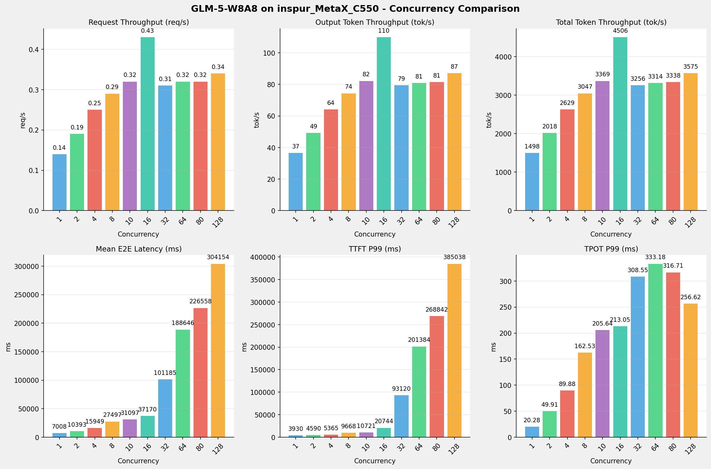
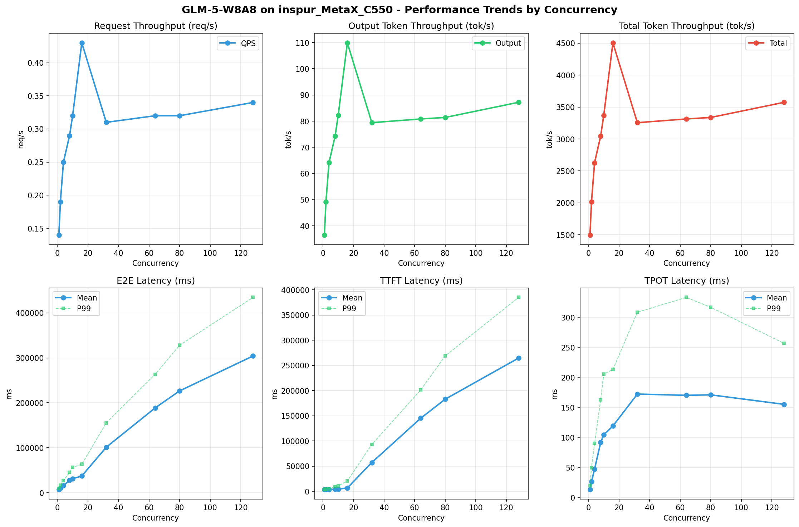
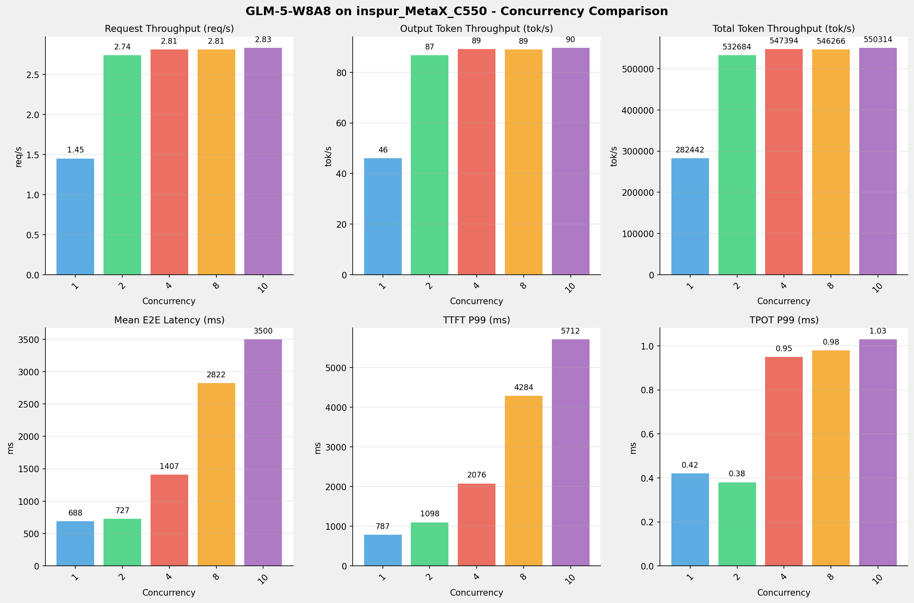
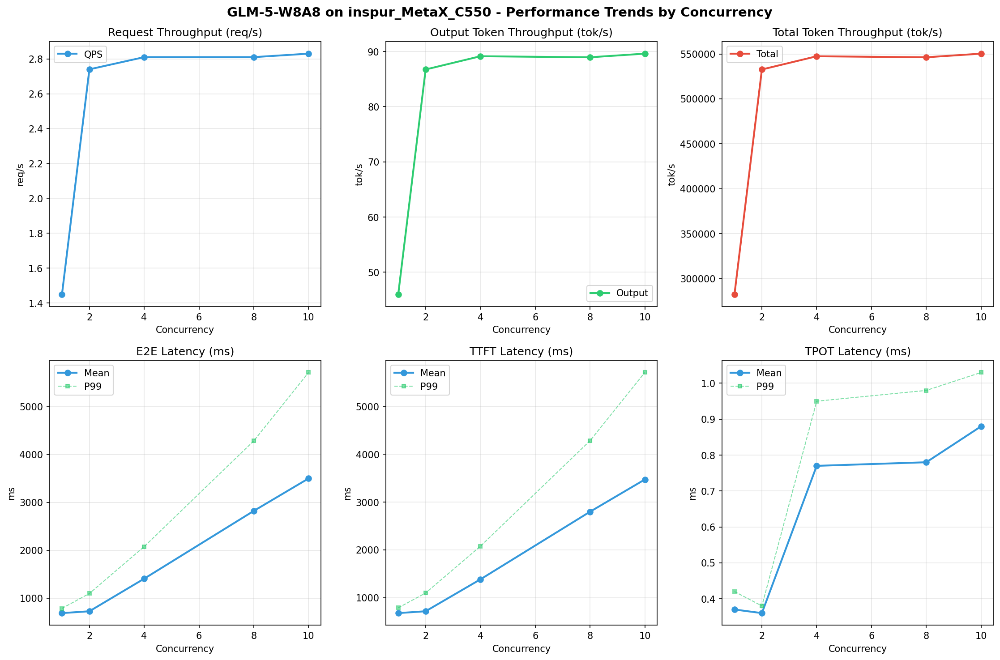
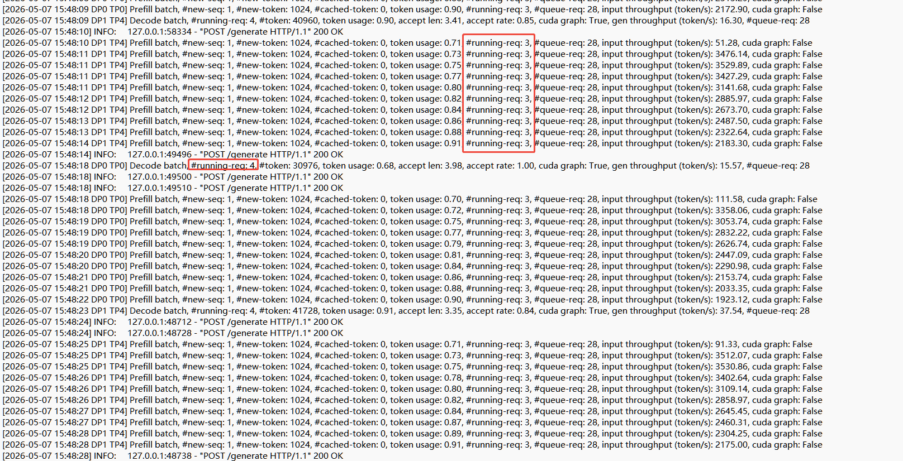
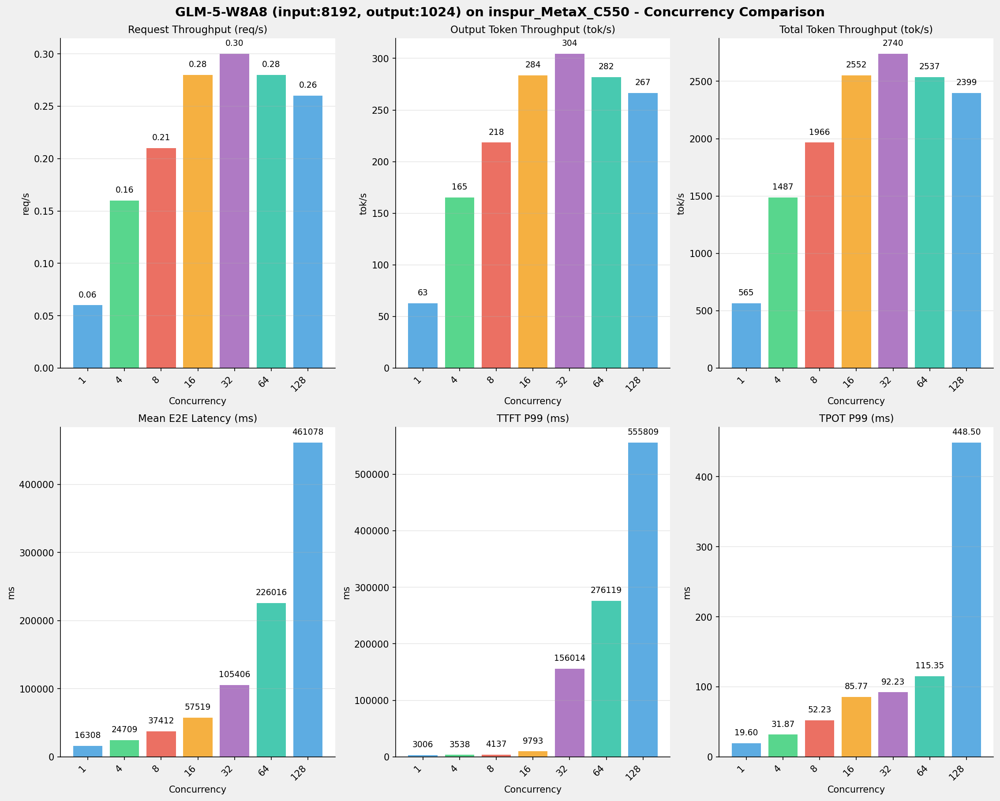

# 浪潮MetaX-C550 - 两节点GLM-5模型整体测试报告

<div align="center">
*测试日期： 2026-05-07 ~ 2026-05-11 <br>
*测试人员：九章云极

</div>

---

## 1. 模型配置信息

| 芯片名称                        | **MetaX-C550**      | 备注        |
|-----------------------------|---------------------|-----------|
| **model_name**              | GLM-5-W8A8          |           |
| **quantization_config**     | int-8               |           |
| **model_size**              | 712G                |           |
| **max_position_embeddings** | 202752              |           |
| **temperature**             | N/A                 |           |
| **top_p**                   | N/A                 |           |
| **top_k**                   | N/A                 |           |
| **transformers_version**    | 5.1.0               | 实际使用5.3.0 |
| **sglang_version**          | 0.5.9+maca3.5.3.204 |           |
| **python_version**          | 3.10.12             |           |


## 2 推理框架主要启动参数

| 参数名称                         | **MetaX-C550** |
|------------------------------|----------------|
| context-length               | 202752         |
| max-running-requests         | 64             |
| chunked-prefill-size         | 8192           |
| cuda-graph-max-bs            | 64             |
| mem-fraction-static          | 0.89           |
| dtype                        | auto           |
| dp                           | 4              |
| tp                           | 16             |
| nnodes                       | 2              |
| tool-call-parser             | glm47          |
| reasoning-parser             | glm45          |
| disable-radix-cache          | true           |
| disable-chunked-prefix-cache | true           |

>MetaX-C550平台，GLM-5模型详细部署完整脚本见本报告 **《附录一》**

## 3. 测试场景及概况

### 3.1 测试场景列表
| 序号  | 测试场景                 |
|-----|----------------------|
| 场景一 | sglang benchmark基准测试 |
| 场景二 | 单、多并发超长上下文请求         |
| 场景三 | 多并发长上下文极限验证          |
| 场景四 | 多I/O测试               |
| 场景五 | 模型精度测试               | 
| 场景六 | 模型推理功能               |


### 3.2 模型部署问题汇总

N/A

### 3.3 模型推理测试问题汇总

- GLM-5-W8A8模型两节点部署，模型服务启动的context-length参数值为**202752**，但实际只能支持到 **45626 tokens**，超过则返回错误信息：API request failed with status 400: {"object":"error","message":"Input length (47839 tokens) exceeds the maximum allowed length (45626 tokens). Use a shorter input or enable --allow-auto-truncate.","type":"BadRequestError","param":null,"code":400}
- 思考模式开关不生效，同minimax模型
---

---
以下是每个测试场景的详细结果报告
---

---

## 测试场景一：sglang benchmark基准测试
**测试目标**：在相同请求数、基础长度上下文参数下，使用sglang bench serve工具对并发数逐级增加场景的性能基准验证.

**主要采集指标**：

| 指标          | 单位         | 含义                                 |
|-------------|------------|------------------------------------|
| E2E Latency | ms         | End-to-End Latency，端到端延迟           |
| TTFT        | ms         | Time To First Token，首 token 延迟     |
| TPOT        | ms/token   | Time Per Output Token，每 token 生成时间 |
| ITL         | ms         | Inter-Token Latency，token间延迟       |
| Throughput  | tokens/s   | 系统总吞吐                              |
| QPS         | requests/s | 请求吞吐                               |

### 📊 测试概览

| 项目            | 配置     | 备注  |
|---------------|--------|-----|
| **数据集**       | random |     |
| **并发数**       | 1, 2, 4, 8, 10, 16, 32, 64, 80, 128 |     |
| **总请求数**      | 320    |     |
| **请求输入上下文长度** | 10240（10k） |     |
| **请求输出上下文长度** | 256（0.25k） |     |
| **被测芯片**      | MetaX_C550 |     |
| **被测模型**      | GLM-5-W8A8 |     |


### 📋 测试结果汇总

| 并发数 | 请求吞吐量 (req/s) | 输出Token吞吐量 (tok/s) | 总Token吞吐量 (tok/s) | TTFT P99 (ms) | TPOT P99 (ms) | E2E延迟均值 (ms) |
|-----|---------------|--------------------|-------------------|---------------|---------------|--------------|
| 1   | 0.14          | 36.52              | 1497.52           | 3929.91       | 20.28         | 7008.40      |
| 2   | 0.19          | 49.22              | 2018.03           | 4589.56       | 49.91         | 10393.40     |
| 4   | 0.25          | 64.11              | 2628.53           | 5364.65       | 89.88         | 15948.98     |
| 8   | 0.29          | 74.32              | 3047.29           | 9668.44       | 162.53        | 27497.14     |
| 10  | 0.32          | 82.17              | 3369.03           | 10721.27      | 205.64        | 31097.31     |
| 16  | 0.43          | 109.90             | 4506.02           | 20743.80      | 213.05        | 37169.95     |
| 32  | 0.31          | 79.41              | 3255.88           | 93120.34      | 308.55        | 101185.36    |
| 64  | 0.32          | 80.83              | 3314.18           | 201384.39     | 333.18        | 188645.87    |
| 80  | 0.32          | 81.40              | 3337.56           | 268841.72     | 316.71        | 226558.37    |
| 128 | 0.34          | 87.19              | 3574.74           | 385037.85     | 256.62        | 304153.90    |


---

### 📊 各并发级别性能柱状图




### 📈 性能趋势分析



---

#### 🎯 服务基准结果详情

| 指标                       | 1 并发    | 2 并发    | 4 并发    | 8 并发    | 10 并发   | 16 并发   | 32 并发   | 64 并发   | 80 并发   | 128 并发  |
|--------------------------|---------|---------|---------|---------|---------|---------|---------|---------|---------|---------|
| 成功请求数                    | 320     | 320     | 320     | 320     | 320     | 320     | 320     | 320     | 320     | 320     |
| 测试持续时间 (s)               | 2242.86 | 1664.36 | 1277.79 | 1102.20 | 996.94  | 745.38  | 1031.58 | 1013.44 | 1006.34 | 939.57  |
| 总输入 tokens               | 3276800 | 3276800 | 3276800 | 3276800 | 3276800 | 3276800 | 3276800 | 3276800 | 3276800 | 3276800 |
| 总生成 tokens               | 81920   | 81920   | 81920   | 81920   | 81920   | 81920   | 81920   | 81920   | 81920   | 81920   |
| **请求吞吐量 (req/s)**        | 0.14    | 0.19    | 0.25    | 0.29    | 0.32    | 0.43    | 0.31    | 0.32    | 0.32    | 0.34    |
| **输出 token 吞吐量 (tok/s)** | 36.52   | 49.22   | 64.11   | 74.32   | 82.17   | 109.90  | 79.41   | 80.83   | 81.40   | 87.19   |
| 峰值输出 token 吞吐量 (tok/s)   | 79.00   | 154.00  | 304.00  | 512.00  | 579.00  | 856.00  | 858.00  | 858.00  | 857.00  | 858.00  |
| 峰值并发请求数                  | 2       | 4       | 7       | 14      | 19      | 27      | 44      | 76      | 92      | 138     |
| **总 token 吞吐量 (tok/s)**  | 1497.52 | 2018.03 | 2628.53 | 3047.29 | 3369.03 | 4506.02 | 3255.88 | 3314.18 | 3337.56 | 3574.74 |


#### ⏱️ 端到端延迟 (E2E Latency)

| 指标              | 1 并发    | 2 并发     | 4 并发     | 8 并发     | 10 并发    | 16 并发    | 32 并发     | 64 并发     | 80 并发     | 128 并发    |
|-----------------|---------|----------|----------|----------|----------|----------|-----------|-----------|-----------|-----------|
| 平均 E2E 延迟 (ms)  | 7008.40 | 10393.40 | 15948.98 | 27497.14 | 31097.31 | 37169.95 | 101185.36 | 188645.87 | 226558.37 | 304153.90 |
| 中位 E2E 延迟 (ms)  | 6926.36 | 10536.89 | 15193.08 | 27210.99 | 31105.24 | 36593.75 | 106428.80 | 207505.30 | 243196.58 | 367519.69 |
| P90 E2E 延迟 (ms) | 7072.51 | 10801.95 | 17969.51 | 30236.75 | 36980.31 | 45041.12 | 130915.84 | 237037.20 | 302403.79 | 415240.42 |
| P99 E2E 延迟 (ms) | 9562.98 | 16322.43 | 26868.07 | 45219.70 | 56469.11 | 63320.77 | 155388.38 | 263429.41 | 328009.41 | 434512.31 |


#### ⏱️ 首Token延迟 (TTFT)

| 指标            | 1 并发    | 2 并发    | 4 并发    | 8 并发    | 10 并发    | 16 并发    | 32 并发    | 64 并发     | 80 并发     | 128 并发    |
|---------------|---------|---------|---------|---------|----------|----------|----------|-----------|-----------|-----------|
| 平均 TTFT (ms)  | 3606.89 | 3679.49 | 3860.75 | 4101.49 | 4476.11  | 6795.86  | 57259.92 | 145239.71 | 182957.70 | 264586.02 |
| 中位 TTFT (ms)  | 3602.74 | 3616.86 | 3630.53 | 3651.05 | 4096.36  | 4863.36  | 59284.08 | 161034.99 | 198816.67 | 328292.33 |
| P99 TTFT (ms) | 3929.91 | 4589.56 | 5364.65 | 9668.44 | 10721.27 | 20743.80 | 93120.34 | 201384.39 | 268841.72 | 385037.85 |


### ⚡ 每Token生成时间 (TPOT)

| 指标            | 1 并发  | 2 并发  | 4 并发  | 8 并发   | 10 并发  | 16 并发  | 32 并发  | 64 并发  | 80 并发  | 128 并发 |
|---------------|-------|-------|-------|--------|--------|--------|--------|--------|--------|--------|
| 平均 TPOT (ms)  | 13.34 | 26.33 | 47.40 | 91.75  | 104.40 | 119.11 | 172.26 | 170.22 | 170.98 | 155.17 |
| 中位 TPOT (ms)  | 13.03 | 27.18 | 45.10 | 92.20  | 105.28 | 120.53 | 186.66 | 177.38 | 169.97 | 157.99 |
| P99 TPOT (ms) | 20.28 | 49.91 | 89.88 | 162.53 | 205.64 | 213.05 | 308.55 | 333.18 | 316.71 | 256.62 |


#### 🔄 Token间延迟 (ITL)

| 指标           | 1 并发  | 2 并发   | 4 并发   | 8 并发    | 10 并发   | 16 并发   | 32 并发   | 64 并发   | 80 并发   | 128 并发  |
|--------------|-------|--------|--------|---------|---------|---------|---------|---------|---------|---------|
| 平均 ITL (ms)  | 13.34 | 26.33  | 47.41  | 91.75   | 104.40  | 119.12  | 172.27  | 170.23  | 170.99  | 155.18  |
| 中位 ITL (ms)  | 12.93 | 13.16  | 13.37  | 15.98   | 17.64   | 18.91   | 18.94   | 18.96   | 18.95   | 18.94   |
| P95 ITL (ms) | 13.33 | 17.19  | 19.34  | 906.35  | 911.33  | 1035.01 | 920.94  | 919.57  | 920.39  | 926.95  |
| P99 ITL (ms) | 25.50 | 896.21 | 910.14 | 1148.91 | 1156.99 | 1331.45 | 2633.70 | 2103.50 | 1915.10 | 2106.33 |


---

---

## 测试场景二：超长上下文请求测试
**测试目标**：对超长上下文的请求，使用sglang bench serve工具对并发数逐级增加场景的性能基准验证.

### 📊 测试概览

| 项目            | 配置             | 备注  |
|---------------|----------------|-----|
| **数据集**       | random         |     |
| **并发数**       | 1, 2, 4, 8, 10 |     |
| **总请求数**      | 100            |     |
| **请求输入上下文长度** | 194560（190k）   |     |
| **请求输出上下文长度** | 1024（1k）       |     |
| **被测芯片**      | MetaX_C550     |     |
| **被测模型**      | GLM-5-W8A8     |     |


### 📋 测试结果汇总

| 并发数 | 请求吞吐量 (req/s) | 输出Token吞吐量 (tok/s) | 总Token吞吐量 (tok/s) | TTFT P99 (ms) | TPOT P99 (ms) | E2E延迟均值 (ms) |
|-----|---------------|--------------------|-------------------|---------------|---------------|--------------|
| 1   | 1.45          | 46.00              | 282442.27         | 787.19        | 0.42          | 688.40       |
| 2   | 2.74          | 86.75              | 532683.60         | 1097.86       | 0.38          | 726.67       |
| 4   | 2.81          | 89.15              | 547393.69         | 2076.30       | 0.95          | 1406.97      |
| 8   | 2.81          | 88.96              | 546265.77         | 4283.84       | 0.98          | 2821.97      |
| 10  | 2.83          | 89.62              | 550313.50         | 5711.66       | 1.03          | 3499.53      |

---

### 📊 各并发级别性能柱状图




### 📈 性能趋势分析



---

#### 🎯 服务基准结果详情

| 指标                       | 1 并发      | 2 并发      | 4 并发      | 8 并发      | 10 并发     |
|--------------------------|-----------|-----------|-----------|-----------|-----------|
| 成功请求数                    | 100       | 100       | 100       | 100       | 100       |
| 测试持续时间 (s)               | 68.90     | 36.53     | 35.55     | 35.62     | 35.36     |
| 总输入 tokens               | 19456000  | 19456000  | 19456000  | 19456000  | 19456000  |
| 总生成 tokens               | 3169      | 3169      | 3169      | 3169      | 3169      |
| **请求吞吐量 (req/s)**        | 1.45      | 2.74      | 2.81      | 2.81      | 2.83      |
| **输出 token 吞吐量 (tok/s)** | 46.00     | 86.75     | 89.15     | 88.96     | 89.62     |
| 峰值输出 token 吞吐量 (tok/s)   | 3.00      | 4.00      | 4.00      | 7.00      | 9.00      |
| 峰值并发请求数                  | 3         | 6         | 8         | 12        | 14        |
| **总 token 吞吐量 (tok/s)**  | 282442.27 | 532683.60 | 547393.69 | 546265.77 | 550313.50 |


#### ⏱️ 端到端延迟 (E2E Latency)

| 指标              | 1 并发   | 2 并发    | 4 并发    | 8 并发    | 10 并发   |
|-----------------|--------|---------|---------|---------|---------|
| 平均 E2E 延迟 (ms)  | 688.40 | 726.67  | 1406.97 | 2821.97 | 3499.53 |
| 中位 E2E 延迟 (ms)  | 697.19 | 719.91  | 1406.93 | 2848.50 | 3492.02 |
| P90 E2E 延迟 (ms) | 753.32 | 802.03  | 1733.43 | 3177.04 | 4114.64 |
| P99 E2E 延迟 (ms) | 787.19 | 1097.87 | 2076.31 | 4283.85 | 5711.68 |


#### ⏱️ 首Token延迟 (TTFT)

| 指标            | 1 并发   | 2 并发    | 4 并发    | 8 并发    | 10 并发   |
|---------------|--------|---------|---------|---------|---------|
| 平均 TTFT (ms)  | 677.01 | 715.72  | 1383.44 | 2798.16 | 3472.63 |
| 中位 TTFT (ms)  | 697.18 | 719.90  | 1406.92 | 2848.49 | 3492.02 |
| P99 TTFT (ms) | 787.19 | 1097.86 | 2076.30 | 4283.84 | 5711.66 |


#### ⚡ 每Token生成时间 (TPOT)

| 指标            | 1 并发 | 2 并发 | 4 并发 | 8 并发 | 10 并发 |
|---------------|------|------|------|------|-------|
| 平均 TPOT (ms)  | 0.37 | 0.36 | 0.77 | 0.78 | 0.88  |
| 中位 TPOT (ms)  | 0.37 | 0.37 | 0.68 | 0.67 | 0.94  |
| P99 TPOT (ms) | 0.42 | 0.38 | 0.95 | 0.98 | 1.03  |


#### 🔄 Token间延迟 (ITL)

| 指标           | 1 并发 | 2 并发 | 4 并发 | 8 并发 | 10 并发 |
|--------------|------|------|------|------|-------|
| 平均 ITL (ms)  | 0.00 | 0.00 | 0.00 | 0.00 | 0.00  |
| 中位 ITL (ms)  | 0.00 | 0.00 | 0.00 | 0.00 | 0.00  |
| P95 ITL (ms) | 0.00 | 0.00 | 0.00 | 0.00 | 0.00  |
| P99 ITL (ms) | 0.00 | 0.00 | 0.00 | 0.00 | 0.00  |

---

---


## 测试场景三：长上下文高并发极限验证

**测试目标**：多并发长上下文的情况下，验证芯片平台同时能处理的最大请求数。

### 📊 测试概览

| 项目            | 配置     | 备注  |
|---------------|--------|-----|
| **数据集**       | random |     |
| **并发数**       | 32, 64 |     |
| **总请求数**      | 1000   |     |
| **请求输入上下文长度** | 90000（约90k） |     |
| **请求输出上下文长度** | 2000（约2k） |     |
| **被测芯片**      | MetaX_C550 |     |
| **被测模型**      | GLM-5  |     |


### 监控处理请求极限

**Master节点： Prefill阶段同时处理请求数：3, Decode阶段同时处理请求数：4**



**Slave节点: （日志文件在服务端，暂未获取）**

### 📋 测试结果汇总

| 并发数 | 请求吞吐量 (req/s) | 输出Token吞吐量 (tok/s) | 总Token吞吐量 (tok/s) | TTFT P99 (ms) | TPOT P99 (ms) | E2E延迟均值 (ms) |
|-----|---------------|--------------------|-------------------|---------------|---------------|--------------|
| 32  | 6.27          | 6.27               | 563888.21         | 8234.15       | 0.00          | 5088.28      |
| 64  | 6.23          | 6.23               | 560604.28         | 18597.83      | 0.00          | 10243.30     |


---

---

## 测试场景四：多I/O测试

### 测试目标
测试不同输入输出长度和并发级别下的性能表现，分析同一芯片同一模型在不同输入输出长度和并发级别下的性能指标变化趋势。

### 📊 测试概览

| 项目           | 配置                                                                            | 备注  |
|--------------|-------------------------------------------------------------------------------|-----|
| **数据集**      | random                                                                        |     |
| **并发数**      | 1, 4, 8, 16, 32, 64, 128                                                      |     |
| **总请求数**     | 1000                                                                          |     |
| **输入输出长度**   | (128, 128), (512, 256), (1024, 512), (2048, 1024), (4096, 2048), (8192, 1024) |     |
| **模型**       | GLM-5-W8A8                                                                    |     |
| **被测芯片**     | inspur_MetaX_C550                                                             |     |
| **SGLang版本** | 0.5.9                                                                         |     |

### 📋 各I/O测试汇总（随并发变化）
> **由于本测试场景数据较多，本报告仅列出一组随并发数变化的性能趋势**

#### input: 8192, output: 1024

| 并发数 | 请求吞吐量 (req/s) | 输出Token吞吐量 (tok/s) | 总Token吞吐量 (tok/s) | TTFT P99 (ms) | TPOT P99 (ms) | E2E延迟均值 (ms) |
| --------------- | --------------- | --------------- | --------------- | --------------- | --------------- | --------------- |
| 1 | 0.06 | 62.79 | 565.11 | 3005.83 | 19.60 | 16307.94 |
| 4 | 0.16 | 165.17 | 1486.56 | 3538.13 | 31.87 | 24709.21 |
| 8 | 0.21 | 218.45 | 1966.08 | 4137.29 | 52.23 | 37411.73 |
| 16 | 0.28 | 283.53 | 2551.75 | 9793.00 | 85.77 | 57519.49 |
| 32 | 0.30 | 304.40 | 2739.64 | 156013.57 | 92.23 | 105405.58 |
| 64 | 0.28 | 281.86 | 2536.75 | 276119.17 | 115.35 | 226015.89 |
| 128 | 0.26 | 266.56 | 2399.02 | 555809.23 | 448.50 | 461077.93 |



### 📊 I/O对比（固定并发数）
> **由于本测试场景数据较多，本报告仅列出一组单并发下随上下文长度变化的性能趋势**

#### 并发数 = 1

| 指标 | i128_o128 | i512_o256 | i1024_o512 | i2048_o1024 | i4096_o2048 | i8192_o1024 |
| --- | --- | --- | --- | --- | --- | --- |
| 请求吞吐量 (req/s) | 0.43 | 0.26 | 0.14 | 0.07 | 0.04 | 0.06 |
| 输出Token吞吐量 (tok/s) | 55.55 | 66.38 | 72.15 | 72.77 | 72.77 | 62.79 |
| 总Token吞吐量 (tok/s) | 111.10 | 199.14 | 216.44 | 218.31 | 218.31 | 565.11 |
| TTFT P99 (ms) | 364.84 | 367.82 | 599.30 | 903.22 | 1488.63 | 3005.83 |
| TPOT P99 (ms) | 22.97 | 21.32 | 19.57 | 19.35 | 18.84 | 19.60 |
| E2E延迟均值 (ms) | 2303.79 | 3856.13 | 7096.32 | 14071.42 | 28142.54 | 16307.94 |


---

---


## 测试场景五：模型精度测试

### 测试目标
模型精度测试目标主要是通过标准指标（如准确率、精确率、召回率、F1值、mAP、AUC）衡量模型在测试集上的输出与真实标签的一致性，评估其基本判别能力。

### GLM-5模型 - 精度测试结果

| Task                        | nvidia_h100(FP8) | metax_c550(W8A8) | 差值      | 百分比     |
|-----------------------------|------------------|------------------|---------|---------|
| IFBench (Strict)            | 0.6667           | 0.6467           | -0.0200 | - 3.00% |
| IFBench (Loose)             | 0.7133           | 0.6967           | -0.0167 | - 2.34% |
| lm-eval:gsm_plus (Flexible) | 0.7638           | 0.7651           | 0.0013  | + 0.17% |
| lm-eval:gsm_plus (Strict)   | 0.7642           | 0.7656           | 0.0014  | + 0.18% |
| lm-eval:mmlu_pro            | 0.7858           | 0.7893           | 0.0035  | + 0.45% |
| lm-eval:ruler               | N/A              | N/A              | N/A     | N/A     |


#### mmlu_pro任务子数据集详细比对

| Item             | nvidia_h100(FP8) | metax_c550(W8A8) | 差值      | 百分比     |
|------------------|------------------|------------------|---------|---------|
| biology          | 0.8968           | 0.8898           | -0.0070 | - 0.78% |
| business         | 0.8390           | 0.8137           | -0.0253 | - 3.02% |
| chemistry        | 0.8030           | 0.8101           | 0.0071  | + 0.88% |
| computer_science | 0.8122           | 0.8390           | 0.0268  | + 3.30% |
| economics        | 0.8519           | 0.8578           | 0.0059  | + 0.69% |
| engineering      | 0.6213           | 0.6316           | 0.0103  | + 1.66% |
| health           | 0.7885           | 0.7922           | 0.0037  | + 0.47% |
| history          | 0.7297           | 0.7349           | 0.0052  | + 0.71% |
| law              | 0.6013           | 0.5985           | -0.0028 | - 0.47% |
| math             | 0.8779           | 0.8934           | 0.0155  | + 1.77% |
| other            | 0.7684           | 0.7619           | -0.0065 | - 0.85% |
| philosophy       | 0.7735           | 0.7776           | 0.0041  | + 0.53% |
| physics          | 0.8122           | 0.8245           | 0.0123  | + 1.51% |
| psychology       | 0.8333           | 0.8308           | -0.0025 | - 0.30% |

---

---

## 测试场景六：基础推理能力验证

### 测试目标：
验证模型在芯片环境上的基础推理和兼容性的支持能力情况，可作为快速选型的一个基础指标。

### 测试说明
> 本报告只列出在MetaX-C550芯片平台上GLM-5-W8A8模型的测试结果

> 状态说明：✅ 已通过，⏳ 未测试，❌ 未通过，⚠️ 部分通过

### A. 基础推理能力

| #   | 测试点            | 测试内容                      | 状态  |
|-----|----------------|---------------------------|-----|
| A1  | 单轮对话           | 发送单条prompt，验证正常生成         | ✅   |
| A2  | 多轮对话           | 5轮对话，验证上下文保持和连贯性          | ✅   |
| A3  | System Prompt  | 设置系统角色，验证模型遵循程度           | ✅   |
| A4  | 流式输出           | stream=true，验证SSE逐token返回 | ✅   |
| A5  | 非流式输出          | stream=false，验证完整返回       | ✅   |
| A6  | Temperature 控制 | temp=0 vs temp=1.0，验证输出差异 | ✅   |
| A7  | Top-p/Top-k采样  | 不同top_p/top_k值，验证多样性控制    | ✅   |
| A8  | Max Tokens限制   | 设置max_tokens，验证输出不超限      | ✅   |
| A9  | Stop Sequences | 设置stop token，验证截断         | ✅   |
| A10 | Seed 可复现性      | 相同seed+temp=0，验证输出一致      | ✅   |
| A11 | 多语言能力          | 中/英/日/韩/法等多语言输入输出         | ✅   |
| A12 | 特殊Token处理      | 含emoji、代码块、数学符号、HTML标签    | ✅   |


### B. 高级生成功能

| #   | 测试点             | 测试内容                       | 状态  | 备注                  |
|-----|-----------------|----------------------------|-----|---------------------|
| B1  | 思考模式（Thinking）  | 开启thinking mode，验证返回思考链... | ✅   |                     |
| B2  | 非思考模式（Instant）  | 关闭thinking，验证无hidden th... | ❌   | 使用默认temperature 0.7 |
| B3  | 思考模式切换          | 同一会话内thinking↔non-think... | ❌   | 使用默认temperature 0.7 |
| B4  | 工具调用-单工具        | 定义单个function，验证模型正确调用并传参   | ✅   |                     |
| B5  | 工具调用-多工具        | 定义多个function，验证模型选择正确的工具   | ✅   |                     |
| B6  | 工具调用-并行调用       | 单次回复中并行调用多个工具              | ✅   |                     |
| B7  | 工具调用-多步链式       | 工具结果作为下一步输入，验证3+步链式执行      | ✅   | 有时候工具调用不完整          |
| B8  | JSON Mode       | response_format=json_ob... | ✅   |                     |
| B9  | 结构化输出           | JSON Schema约束输出格式，验证字段完整性  | ✅   |                     |
| B10 | Prefix/Suffix约束 | 指定输出前缀或格式模板，验证遵循度          | ❌   |                     |


### C. 多模态能力

| #   | 测试点     | 测试内容          | 状态 | 备注                                       |
|-----|---------|---------------|----|------------------------------------------|
| C1  | 单图理解    | 图片+文本提问       | ❌ | 只通过了代码生成的图片识别且识别结果错误,<br/>真实图片测试未查看到执行结果 |
| C2  | 多图对比    | 跨图比较          | ❌  |                                          |
| C3  | 高分辨率图片  | 4K分辨率         | ⚠️ | 只通过了代码生成的图片识别,<br/>真实图片测试未查看到执行结果        |
| C4  | 图表/OCR  | 表格截图          | ⚠️ | 只通过了代码生成的图片识别,<br/>真实图片测试未查看到执行结果        |
| C5  | 视频理解    | 视频文件          | ❌  |                                          |
| C6  | 代码截图→代码 | UI截图          | ⏳   |                                          |
| C7  | 多模态工具调用 | 图片触发工具        | ❌  |                                          |
| C8  | 图片格式兼容性 | PNG/JPEG/WebP | ❌  |                                          |

### D. 长上下文处理

| #   | 测试点       | 测试内容                        | 状态 |
|-----|------------|-----------------------------|-----|
| D1  | 短上下文基线     | 1K tokens                  | ✅ |
| D2  | 中等上下文      | 8K-16K tokens              | ✅ |
| D3  | 长上下文       | 32K-64K tokens             | ✅ |
| D4  | 超长上下文      | 128K+ tokens               | ✅ |
| D5  | 大海捞针       | NIAH                       | ✅ |
| D6  | 上下文边界行为    | max_model_len              | ❌ |
| D7  | 超出上下文截断    | 截断/拒绝                      | ✅ |
| D8  | 长输出生成      | 4K-8K tokens               | ✅ |


### F. 稳定性与边界

| #   | 测试点    | 测试内容                                        | 状态 |
|-----|--------|---------------------------------------------|----|
| F1  | 空输入    | 空prompt                                     | ✅  |
| F2  | 超大输入   | 超max_model_len                              | ❌   |
| F3  | 非法参数   | temperature=-1, max_tokens=0,非法温度值：超过范围（>2） | ✅  |
| F4  | 特殊字符注入 | SQL/Prompt注入                                | ✅  |
| F5  | 并发稳定性  | 200+并发（实际测试50并发）                            | ✅  |
| F6  | OOM恢复  | 显存耗尽                                        | ❌  |
| F7  | 长时间运行  | 24小时                                        | ⏳  |
| F8  | 请求超时处理 | 超时断开                                        | ⏳  |

- **F2、F6失败信息**：Oversized input rejected: API request failed with status 400: {"object":"error","message":"Input length (180005 tokens) exceeds the maximum allowed length (45626 tokens). Use a shorter input or enable --allow-auto-truncate.","type":"BadRequestError","param":null,"code":400}


### G. API兼容性

| #   | 测试点       | 测试内容                        | 状态 |
|-----|------------|-----------------------------|------|
| G1  | OpenAI Chat Completions | /v1/chat/completions 接口兼容  | ✅ |
| G2  | OpenAI Completions | /v1/completions 接口兼容       | ✅ |
| G3  | 模型列表       | /v1/models 返回可用模型          | ✅ |
| G4  | Usage 统计   | usage 字段准确                 | ✅ |
| G5  | 错误码规范      | 400/401/404/429/500 错误码    | ⏳ |
| G6  | 客户端 SDK 兼容 | Python openai / JS @ope... | ⏳ |
| G7  | 响应格式变体     | 不同response_format          | ✅ |
| G8  | Stream参数   | stream参数测试                 | ✅ |

### H. 质量评估

| #   | 测试点   | 测试内容  | 状态  |
|-----|-------|-------|-----|
| H1  | 生成质量  | 质量对比  | ✅   |
| H2  | 生成一致性 | 多次生成  | ✅   |
| H3  | 幻觉率   | 事实错误  | ✅   |
| H4  | 指令遵循度 | 格式/角色 | ✅   |
| H5  | 响应相关性 | 问答相关性 | ✅   |


### I. 超长上下文验证

| #   | 测试点       | 测试内容                        | 状态 |
|-----|------------|-----------------------------|------|
| I1  | 超长上下文（非流式） | 验证超长上下文请求的非流式输出            | ❌ |
| I2  | 超长上下文（流式）  | 验证超长上下文请求的流式输出             | ✅ |
| I3  | 超长上下文（边界验证） | 使用二分法逼近模型最大上下文长度           | ❌ |
| I4  | 超长上下文（思考模式） | 验证超长上下文下reasoning_conte... | ❌ |


---

---

## 附录一：MetaX-C550平台GLM-5模型部署脚本

### master节点

```shell
#!/bin/bash
# 10.130.70.1
# pip install --upgrade transformers==5.3.0
#mx-smi -r -i all

# 单机16卡 MCCL 环境变量
#export MCCL_RING_16P1H=1
#export FORCE_ACTIVE_WAIT=1
#export MCCL_P2P_LEVEL=SYS


export GLOO_SOCKET_IFNAME=ens12f0
export MCCL_SOCKET_IFNAM=ens12f0
export MCCL_IB_HCA=mlx5_0,mlx5_1,mlx5_2,mlx5_3,mlx5_4,mlx5_5,mlx5_6,mlx5_7

export TRITON_ENABLE_MACAP_OPT_MOVE_DOT_OPERANDS_OUT_LOOP=1
export TRITON_ENABLE_MACAP_CHAIN_DOT_OPT=1

# 通用环境变量
export MACA_SMALL_PAGESIZE_ENABLE=1
export TRITON_ENABLE_MACA_OPT_MOVE_DOT_OPERANDS_OUT_LOOP=1
export TRITON_ENABLE_MACA_CHAIN_DOT_OPT=1

# BF16、W8A8-TP2DP8/TP4DP4
export PYTORCH_ENABLE_PG_HIGH_PRIORITY_STREAM=1
export MACA_QUEUE_SCHEDULE_POLICY=1
export MACA_DIRECT_DISPATCH=1

# W8A8-TP16
#export MACA_DIRECT_DISPATCH=1
#export MCDBG_GRAPH_LAUNCH_QUEUE_POLICY=3
#export MACA_GRAPH_LAUNCH_QUEUE_POLICY=3

# W4A16
#export MACA_QUEUE_SCHEDULE_POLICY=1
#export MACA_DIRECT_DISPATCH=1

#export SGLANG_FUSE_MOE_CACHE_ENABLE=0

# 启用Flash_mla的优化（必须按照4.2.1操作更新flashmla）
export MX_ENABLE_FLASH_MLA_OPT=1

# add form 0.5.9
export TORCH_CUDA_ARCH_LIST="8.0 8.6+PTX"

service ssh restart


model_name=GLM-5-W8A8
model_path="/var_docker/data_shared/${model_name}"
log_file=./log-sglang-server-master-${model_name}.log


python3 -m sglang.launch_server \
    --model-path $model_path \
    --trust-remote-code \
    --quantization w8a8_int8 \
    --served-model-name glm-5 \
    --attention-backend flashinfer \
    --speculative-algorithm NEXTN \
    --speculative-num-steps 3 \
    --speculative-eagle-topk 1 \
    --speculative-num-draft-tokens 4 \
    --tp-size 16 \
    --dp 4 \
    --dist-init-addr 10.130.70.1:36555 \
    --host 0.0.0.0 \
    --port 8000 \
    --nnodes 2 \
    --node-rank 0   \
    --chunked-prefill-size 8192 \
    --dtype auto \
    --max-running-requests 64 \
    --context-length 202752 \
    --kv-cache-dtype auto \
    --disable-radix-cache \
    --cuda-graph-max-bs 64 \
    --tool-call-parser glm47 \
    --reasoning-parser glm45 \
    --disable-chunked-prefix-cache \
    --enable-dp-attention \
    --enable-dp-lm-head \
    --mem-fraction-static 0.89 2>&1  | tee -a  ${log_file}

```

### slave节点

```shell
#!/bin/bash
# 10.130.70.2
# pip install --upgrade transformers==5.3.0
#mx-smi -r -i all

# 单机16卡 MCCL 环境变量
#export MCCL_RING_16P1H=1
#export FORCE_ACTIVE_WAIT=1
#export MCCL_P2P_LEVEL=SYS


export GLOO_SOCKET_IFNAME=ens12f0
export MCCL_SOCKET_IFNAM=ens12f0
export MCCL_IB_HCA=mlx5_0,mlx5_1,mlx5_2,mlx5_3,mlx5_4,mlx5_5,mlx5_6,mlx5_7

export TRITON_ENABLE_MACAP_OPT_MOVE_DOT_OPERANDS_OUT_LOOP=1
export TRITON_ENABLE_MACAP_CHAIN_DOT_OPT=1

# 通用环境变量
export MACA_SMALL_PAGESIZE_ENABLE=1
export TRITON_ENABLE_MACA_OPT_MOVE_DOT_OPERANDS_OUT_LOOP=1
export TRITON_ENABLE_MACA_CHAIN_DOT_OPT=1

# BF16、W8A8-TP2DP8/TP4DP4
export PYTORCH_ENABLE_PG_HIGH_PRIORITY_STREAM=1
export MACA_QUEUE_SCHEDULE_POLICY=1
export MACA_DIRECT_DISPATCH=1

# W8A8-TP16
#export MACA_DIRECT_DISPATCH=1
#export MCDBG_GRAPH_LAUNCH_QUEUE_POLICY=3
#export MACA_GRAPH_LAUNCH_QUEUE_POLICY=3

# W4A16
#export MACA_QUEUE_SCHEDULE_POLICY=1
#export MACA_DIRECT_DISPATCH=1

#export SGLANG_FUSE_MOE_CACHE_ENABLE=0

# 启用Flash_mla的优化（必须按照4.2.1操作更新flashmla）
export MX_ENABLE_FLASH_MLA_OPT=1

# add form 0.5.9
export TORCH_CUDA_ARCH_LIST="8.0 8.6+PTX"


service ssh restart


model_name=GLM-5-W8A8
model_path="/data1/data_shared/${model_name}"
log_file=./log-sglang-server-master-${model_name}.log


python3 -m sglang.launch_server \
    --model-path $model_path \
    --trust-remote-code \
    --quantization w8a8_int8 \
    --served-model-name glm-5 \
    --attention-backend flashinfer \
    --speculative-algorithm NEXTN \
    --speculative-num-steps 3 \
    --speculative-eagle-topk 1 \
    --speculative-num-draft-tokens 4 \
    --tp-size 16 \
    --dp 4 \
    --dist-init-addr 10.130.70.1:36555 \
    --nnodes 2 \
    --node-rank 1   \
    --chunked-prefill-size 8192 \
    --dtype auto \
    --max-running-requests 64 \
    --context-length 202752 \
    --kv-cache-dtype auto \
    --disable-radix-cache \
    --cuda-graph-max-bs 64 \
    --tool-call-parser glm47 \
    --reasoning-parser glm45 \
    --disable-chunked-prefix-cache \
    --enable-dp-attention \
    --enable-dp-lm-head \
    --mem-fraction-static 0.89 2>&1  | tee -a  ${log_file}

```


