# 浪潮MetaX-C550、英伟达H100 - 单节点MiniMax-M2.5模型整体测试比对报告

<div align="center">
*测试日期：2026-04-22 ~ 2026-04-26 <br>
*测试人员：九章云极

</div>

---

## 1. 测试背景
公司需要在多个候选开源大模型中选型，部署基于vLLM或SGLang的推理服务。并需要在满足各项模型服务指标的情况下，选定芯片集采厂商。

## 2. 测试目标
本测试主要评估不同芯片在单机环境下运行大模型推理的能力，为后续集群采购和生产部署提供决策依据。
1. **硬件摸底**：确认各芯片型号实际规格（算力、显存、带宽）与标称值的一致性
2. **功能验证**：各模型在各芯片环境上的推理正确性和算子兼容性
3. **性能基准**：吞吐量、延迟、显存效率等关键指标
4. **单机极限**：8 卡 Tensor Parallel 的性能上限和资源利用率
5. **稳定性验证**：长时间运行下的可靠性
6. **K8S 容器化验证**：单节点 K8S 环境下GPU/DCU/XPU 调度、资源管理和服务编排能力


## 3. 测试环境

### 3.1 硬件规格

| 组件 \ 规格            | 浪潮                                     | 英伟达                                        | 状态     |
|--------------------|----------------------------------------|--------------------------------------------|--------|
| **节点数量**           | 1 台                                    | 1 台                                        | 确认     |
| **芯片型号**           | MetaX-C550                             | H100                                       | 确认     |
| **芯片数量**           | 8 张                                    | 8 张                                        | 确认     |
| **单卡算力 FP16/BF16** | 待确认                                    | 1979 TFLOPS （官方理论值）                        | ⚠️ 待确认 |
| **单卡算力 FP32**      | 待确认                                    | 67 TFLOPS （官方理论值）                          | ⚠️ 待确认 |
| **单卡算力 FP64**      | 待确认                                    | 34 TFLOPS （官方理论值）                          | ⚠️ 待确认 |
| **单卡显存**           | 64GB                                   | 80GB                                       | 确认     |
| **显存类型**           | HBM2e                                  | HBM3                                       | 确认     |
| **显存带宽**           | 待确认                                    | 3.35 TB/s                                  | ⚠️ 待确认 |
| **单卡功耗**           | 450 W                                  | 700 W                                      | 确认     |
| **卡间互联**           | MetaXLink                              | NVLink 4.0                                 | 确认     |
| **CPU**            | Intel(R) Xeon(R) Platinum 8480+ (224核) | Intel(R) Xeon(R) Platinum 8468 (192核)      | 确认     |
| **系统内存**           | 1.8 TiB                                | 2.0 TiB                                    | 确认     |
| **本地存储**           | 446.6GB + NVMe 4 x 7T                  | 894GB 系统盘 + 7TB*4 缓存盘 + 7TB 容器盘 + 25TB 扩展盘 | 确认     |


### 3.2 软件栈

| 组件\版本             | 浪潮                                 | 英伟达                   | 说明                |
|-------------------|------------------------------------|-----------------------|-------------------|
| **操作系统**          | Ubuntu 20.04.1                     | Ubuntu 22.04.5 LTS    | 芯片所在物理机系统         |
| **显卡驱动**          | Kernel Mode Driver Version: 3.6.11 | 570.133.20/580.126.09 | 驱动信息              |
| **Toolkit**       | MACA Version: 3.5.3.23             | release 12.9          | CUDA Toolkit版本    |
| **Docker**        | 28.1.1                             | -                     | 容器运行时             |
| **containerd**    | -                                  | 2.2.0                 | K8S 容器运行时（CRI）    |
| **Kubernetes**    | -                                  | 1.34.2                | 单节点 All-in-One 部署 |
| **Device Plugin** | -                                  | 0.14.5                | K8S GPU 资源管理      |
| **多卡通信库**         | MCCLl                              | NCCL                  | 多卡通信库             |


### 3.3 模型配置信息

| 芯片名称                        | **MetaX-C550**      | **NVIDIA-H100** |
|-----------------------------|---------------------|-----------------|
| **model_name**              | MiniMax-M2.5-W8A8   | MiniMax-M2.5    |
| **quantization_config**     | int-8               | FP8             |
| **model_size**              | 215G                | 215G            |
| **max_position_embeddings** | 196608              | 196608          |
| **temperature**             | N/A                 | 1.0             |
| **top_p**                   | 0.95                | 0.95            |
| **top_k**                   | 40                  | 40              |
| **transformers_version**    | 4.57.6              | 4.46.1          |
| **vllm_version**            | -                   | 0.20.0          |
| **sglang_version**          | 0.5.9+maca3.5.3.204 | -               |
| **python_version**          | 3.10.12             | 3.12.3          |


### 3.4 推理框架主要启动参数

| 参数名称（sglang）                        | **MetaX-C550** | **NVIDIA-H100** |
|-------------------------------------|----------------|-----------------|
| max-model-len (context-length)      | 196608         | 196608          |
| max-num-seqs (max-running-requests) | 64             | 64              |
| max-num-batched-tokens              | -              | 8192            |
| gpu-memory-utilization              | -              | 0.85            |
| mem-fraction-static                 | 0.9            | -               |
| dp                                  | 1              | 1               |
| tp                                  | 8              | 8               |
| pp                                  | 1              | 1               |
| enable-export-parallel              | -              | true            |
| enable-auto-tool-choice             | true           | true            |
| tool-call-parser                    | minimax-m2     | minimax_m2      |
| reasoning-parser                    | minimax        | minimax_m2      |
| disable-radix-cache                 | true           | -               |
| disable-chunked-prefix-cache        | true           | -               |

>MetaX-C550平台，Minimax-M2.5模型详细部署完整脚本见本报告 **《附录一》**

## 4. 测试场景及概况

### 4.1 测试场景列表
| 序号  | 测试场景                 |
|-----|----------------------|
| 场景一 | sglang benchmark基准测试 |
| 场景二 | 单、多并发超长上下文请求         |
| 场景三 | 多并发长上下文极限验证          |
| 场景四 | 多I/O测试               |
| 场景五 | 模型精度测试               |
| 场景六 | 模型推理功能测试             |


### 4.2 模型部署问题汇总

N/A

### 4.3 模型推理测试问题汇总

- **关闭思考模式不生效**，关闭思考模式后，请求响应输出依然有思考模型下的content: 如果parser是minimax-append-think, 思考的内容会在content里以<think>...</think>标签对包裹。如果parser是minimax，思考的内容会直接显示在reasoning_content里

---

---
以下是每个测试场景的详细结果报告
---

---

>MetaX-C550平台，Minimax-M2.5模型benchmark测试脚本见本报告 **《附录二》**

## 测试场景一：sglang/vllm benchmark基准测试
**测试目标**：在相同请求数、基础长度上下文参数下，使用sglang/vllm bench serve工具对并发数逐级增加场景的性能基准验证.

**主要采集指标**：

| 指标                  | 单位         | 含义                                 |
|---------------------|------------|------------------------------------|
| TTFT                | ms         | Time To First Token，首 token 延迟     |
| TPOT                | ms/token   | Time Per Output Token，每 token 生成时间 |
| Throughput          | tokens/s   | 系统总吞吐                              |
| QPS                 | requests/s | 请求吞吐                               |
| P50/P95/P99 Latency | ms         | 延迟分位数                              |


### 📊 测试概览

| 项目            | 配置                                                                | 备注  |
|---------------|-------------------------------------------------------------------|-----|
| **数据集**       | random                                                            |     |
| **并发数**       | 1, 2, 4, 8, 10, 16, 32, 64, 80, 128                               |     |
| **总请求数**      | 320                                                               |     |
| **请求输入上下文长度** | 10240（10k）                                                        |     |
| **请求输出上下文长度** | 256（0.25k）                                                        |     |
| **被测芯片**      | inspur_MetaX_C550, nvidia_h100                                    |     |
| **被测模型**      | inspur_MetaX_C550 (MiniMax-M2.5-W8A8), nvidia_h100 (MiniMax-M2.5) |     |


### 📊 芯片性能对比柱状图

**1并发**

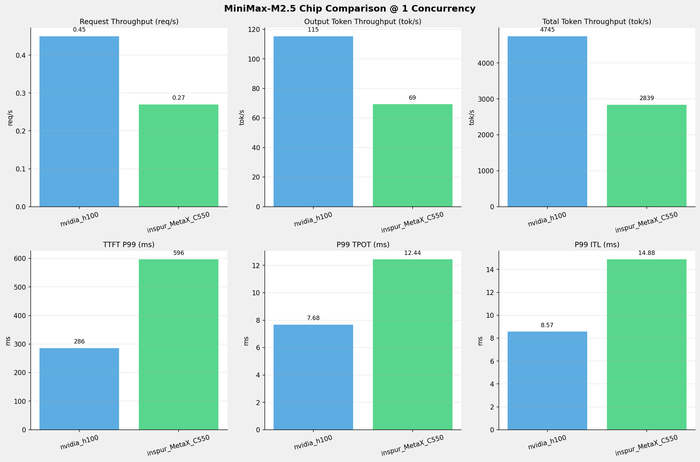

**2并发**


**4并发**


**8并发**

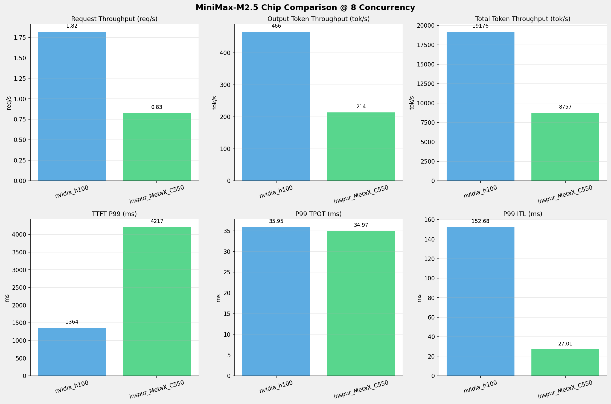

**10并发**


**16并发**

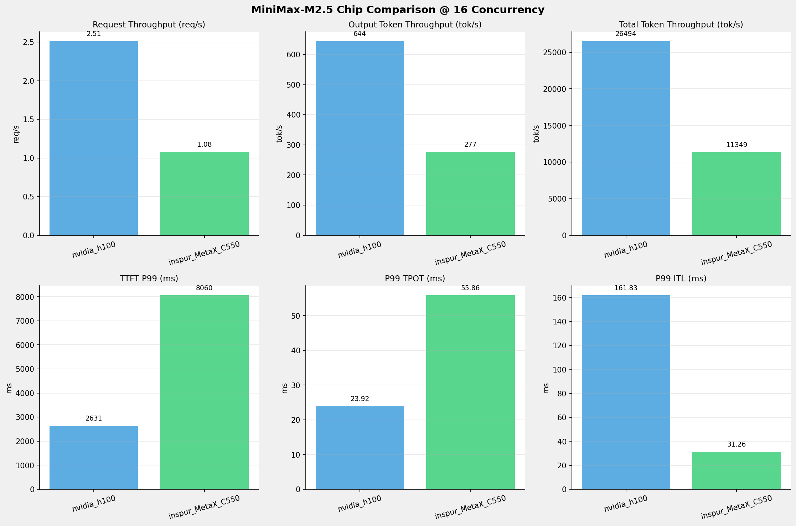

**32并发**


**64并发**


**80并发**

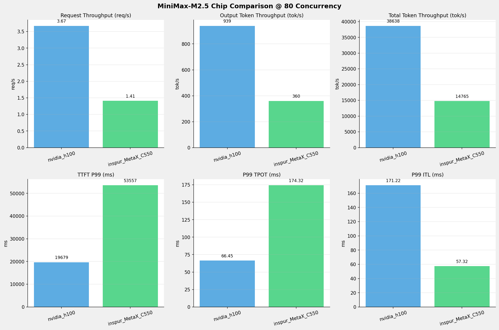

**128并发**


### 📈 性能趋势对比图 (所有芯片)

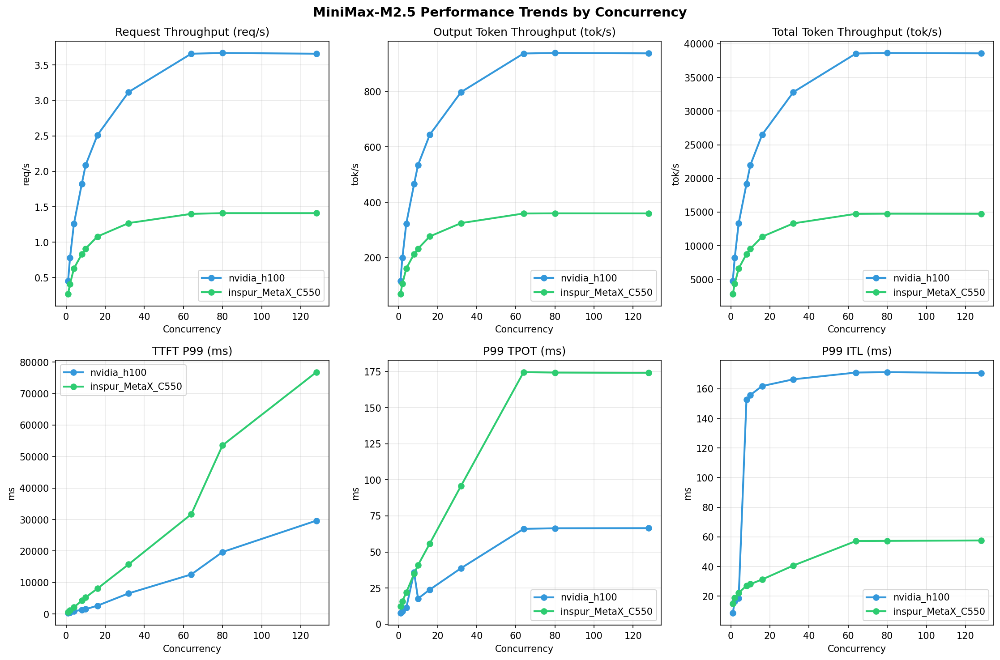

---

### 📈 各指标随并发级别性能对比详情

#### 请求吞吐量（Request throughput (req/s)）

| 并发数 | nvidia_h100 | inspur_MetaX_C550 | 差值 | 百分比 |
|-----|----------- | ----------- | ----------- | -----------|
| 1   | **0.45** ⭐ | 0.27 | -0.18 | -40.0% |
| 2   | **0.78** ⭐ | 0.41 | -0.37 | -47.4% |
| 4   | **1.26** ⭐ | 0.63 | -0.63 | -50.0% |
| 8   | **1.82** ⭐ | 0.83 | -0.99 | -54.4% |
| 10   | **2.09** ⭐ | 0.91 | -1.18 | -56.5% |
| 16   | **2.51** ⭐ | 1.08 | -1.43 | -57.0% |
| 32   | **3.12** ⭐ | 1.27 | -1.85 | -59.3% |
| 64   | **3.66** ⭐ | 1.40 | -2.26 | -61.7% |
| 80   | **3.67** ⭐ | 1.41 | -2.26 | -61.6% |
| 128   | **3.66** ⭐ | 1.41 | -2.25 | -61.5% |


#### 输出token吞吐量（Output token throughput (tok/s)）

| 并发数 | nvidia_h100 | inspur_MetaX_C550 | 差值 | 百分比 |
|-----|----------- | ----------- | ----------- | -----------|
| 1   | **115.31** ⭐ | 69.26 | -46.05 | -39.9% |
| 2   | **199.70** ⭐ | 105.76 | -93.94 | -47.0% |
| 4   | **323.45** ⭐ | 161.40 | -162.05 | -50.1% |
| 8   | **465.99** ⭐ | 213.59 | -252.40 | -54.2% |
| 10   | **534.52** ⭐ | 232.70 | -301.82 | -56.5% |
| 16   | **643.80** ⭐ | 276.80 | -367.00 | -57.0% |
| 32   | **797.81** ⭐ | 324.93 | -472.88 | -59.3% |
| 64   | **937.16** ⭐ | 359.62 | -577.54 | -61.6% |
| 80   | **938.91** ⭐ | 360.13 | -578.78 | -61.6% |
| 128   | **937.61** ⭐ | 359.90 | -577.71 | -61.6% |


#### 总token吞吐量（Total token throughput (tok/s)）

| 并发数 | nvidia_h100 | inspur_MetaX_C550 | 差值 | 百分比 |
|-----|----------- | ----------- | ----------- | -----------|
| 1   | **4745.14** ⭐ | 2839.48 | -1905.66 | -40.2% |
| 2   | **8217.92** ⭐ | 4336.07 | -3881.85 | -47.2% |
| 4   | **13310.92** ⭐ | 6617.46 | -6693.46 | -50.3% |
| 8   | **19176.39** ⭐ | 8757.21 | -10419.18 | -54.3% |
| 10   | **21996.95** ⭐ | 9540.82 | -12456.13 | -56.6% |
| 16   | **26494.03** ⭐ | 11348.92 | -15145.11 | -57.2% |
| 32   | **32831.81** ⭐ | 13322.11 | -19509.70 | -59.4% |
| 64   | **38566.45** ⭐ | 14744.38 | -23822.07 | -61.8% |
| 80   | **38638.21** ⭐ | 14765.49 | -23872.72 | -61.8% |
| 128   | **38585.00** ⭐ | 14756.01 | -23828.99 | -61.8% |


#### 首token延迟（P99 TTFT (ms)）

| 并发数 | nvidia_h100 | inspur_MetaX_C550 | 差值 | 百分比 |
|-----|----------- | ----------- | ----------- | -----------|
| 1   | 286.01 | 596.38 | +310.37 | +108.5% |
| 2   | 466.40 | 1097.81 | +631.41 | +135.4% |
| 4   | 826.89 | 2137.97 | +1311.08 | +158.6% |
| 8   | 1364.44 | 4216.68 | +2852.24 | +209.0% |
| 10   | 1534.23 | 5277.45 | +3743.22 | +244.0% |
| 16   | 2630.84 | 8059.86 | +5429.02 | +206.4% |
| 32   | 6556.86 | 15782.91 | +9226.05 | +140.7% |
| 64   | 12557.76 | 31672.66 | +19114.90 | +152.2% |
| 80   | 19679.20 | 53556.78 | +33877.58 | +172.1% |
| 128   | 29645.32 | 76792.15 | +47146.83 | +159.0% |


#### 每token生成时间（P99 TPOT (ms)）

| 并发数 | nvidia_h100 | inspur_MetaX_C550 | 差值 | 百分比 |
|-----|----------- | ----------- | ----------- | -----------|
| 1   | 7.68 | 12.44 | +4.76 | +62.0% |
| 2   | 9.05 | 15.89 | +6.84 | +75.6% |
| 4   | 11.41 | 21.99 | +10.58 | +92.7% |
| 8   | 35.95 | 34.97 | -0.98 | -2.7% |
| 10   | 17.75 | 40.89 | +23.14 | +130.4% |
| 16   | 23.92 | 55.86 | +31.94 | +133.5% |
| 32   | 38.79 | 95.85 | +57.06 | +147.1% |
| 64   | 66.03 | 174.61 | +108.58 | +164.4% |
| 80   | 66.45 | 174.32 | +107.87 | +162.3% |
| 128   | 66.52 | 174.13 | +107.61 | +161.8% |


#### token间延迟（P99 ITL (ms)）

| 并发数 | nvidia_h100 | inspur_MetaX_C550 | 差值 | 百分比 |
|-----|----------- | ----------- | ----------- | -----------|
| 1   | 8.57 | 14.88 | +6.31 | +73.6% |
| 2   | 16.54 | 19.00 | +2.46 | +14.9% |
| 4   | 18.61 | 22.33 | +3.72 | +20.0% |
| 8   | 152.68 | 27.01 | -125.67 | -82.3% |
| 10   | 155.84 | 28.12 | -127.72 | -82.0% |
| 16   | 161.83 | 31.26 | -130.57 | -80.7% |
| 32   | 166.38 | 40.69 | -125.69 | -75.5% |
| 64   | 170.95 | 57.22 | -113.73 | -66.5% |
| 80   | 171.22 | 57.32 | -113.90 | -66.5% |
| 128   | 170.62 | 57.60 | -113.02 | -66.2% |


---

---

## 测试场景二：超长上下文请求测试
**测试目标**：对超长上下文的请求，使用sglang/vllm bench serve工具对并发数逐级增加场景的性能基准验证.

### 📊 测试概览

| 项目            | 配置                                                                | 备注  |
|---------------|-------------------------------------------------------------------|-----|
| **数据集**       | random                                                            |     |
| **并发数**       | 1, 2, 4, 8, 10                                                    |     |
| **总请求数**      | 100                                                               |     |
| **请求输入上下文长度** | 194560（190k）                                                      |     |
| **请求输出上下文长度** | 1024（1k）                                                          |     |
| **被测芯片**      | inspur_MetaX_C550, nvidia_h100                                    |     |
| **被测模型**      | inspur_MetaX_C550 (MiniMax-M2.5-W8A8), nvidia_h100 (MiniMax-M2.5) |     |


### 📊 芯片性能对比柱状图

**1并发**


**2并发**

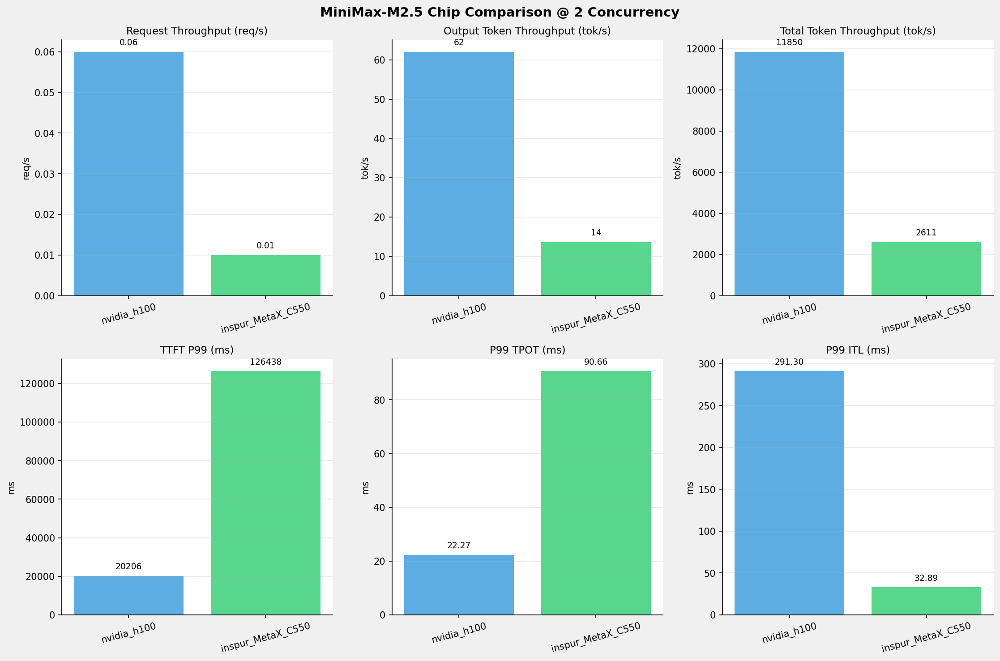

**4并发**


**8并发**


**10并发**

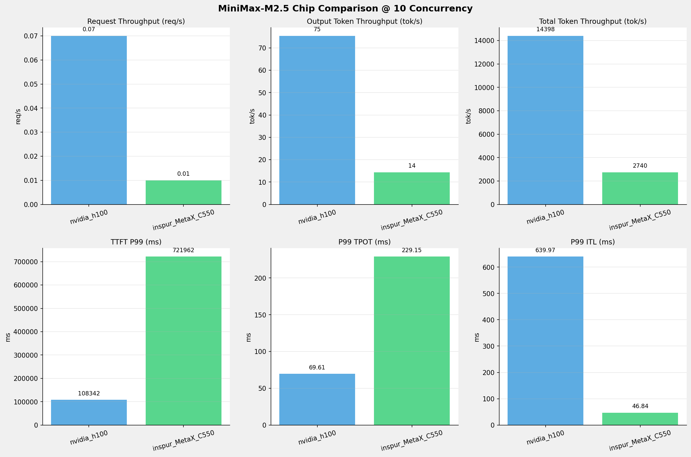


### 📈 性能趋势对比图 (所有芯片)


---

### 📈 各指标随并发级别性能对比详情


#### 请求吞吐量（Request throughput (req/s)）

| 并发数 | nvidia_h100 | inspur_MetaX_C550 | 差值 | 百分比 |
|-----|----------- | ----------- | ----------- | -----------|
| 1   | **0.05** ⭐ | 0.01 | -0.04 | -80.0% |
| 2   | **0.06** ⭐ | 0.01 | -0.05 | -83.3% |
| 4   | **0.07** ⭐ | 0.01 | -0.06 | -85.7% |
| 8   | **0.07** ⭐ | 0.01 | -0.06 | -85.7% |
| 10   | **0.07** ⭐ | 0.01 | -0.06 | -85.7% |


#### 输出token吞吐量（Output token throughput (tok/s)）

| 并发数 | nvidia_h100 | inspur_MetaX_C550 | 差值 | 百分比 |
|-----|----------- | ----------- | ----------- | -----------|
| 1   | **46.70** ⭐ | 12.69 | -34.01 | -72.8% |
| 2   | **62.03** ⭐ | 13.67 | -48.36 | -78.0% |
| 4   | **71.85** ⭐ | 14.34 | -57.51 | -80.0% |
| 8   | **75.61** ⭐ | 14.35 | -61.26 | -81.0% |
| 10   | **75.37** ⭐ | 14.34 | -61.03 | -81.0% |


#### 总token吞吐量（Total token throughput (tok/s)）

| 并发数 | nvidia_h100 | inspur_MetaX_C550 | 差值 | 百分比 |
|-----|----------- | ----------- | ----------- | -----------|
| 1   | **8921.40** ⭐ | 2424.14 | -6497.26 | -72.8% |
| 2   | **11850.06** ⭐ | 2610.79 | -9239.27 | -78.0% |
| 4   | **13726.45** ⭐ | 2739.69 | -10986.76 | -80.0% |
| 8   | **14443.68** ⭐ | 2741.37 | -11702.31 | -81.0% |
| 10   | **14398.41** ⭐ | 2739.59 | -11658.82 | -81.0% |


#### 首token延迟（P99 TTFT (ms)）

| 并发数 | nvidia_h100 | inspur_MetaX_C550 | 差值 | 百分比 |
|-----|----------- | ----------- | ----------- | -----------|
| 1   | 10539.10 | 63374.54 | +52835.44 | +501.3% |
| 2   | 20205.87 | 126438.40 | +106232.53 | +525.8% |
| 4   | 37530.99 | 252746.14 | +215215.15 | +573.4% |
| 8   | 81506.35 | 550123.80 | +468617.45 | +574.9% |
| 10   | 108342.29 | 721962.01 | +613619.72 | +566.4% |


#### 每token生成时间（P99 TPOT (ms)）

| 并发数 | nvidia_h100 | inspur_MetaX_C550 | 差值 | 百分比 |
|-----|----------- | ----------- | ----------- | -----------|
| 1   | 11.39 | 20.33 | +8.94 | +78.5% |
| 2   | 22.27 | 90.66 | +68.39 | +307.1% |
| 4   | 45.32 | 228.93 | +183.61 | +405.1% |
| 8   | 70.19 | 229.02 | +158.83 | +226.3% |
| 10   | 69.61 | 229.15 | +159.54 | +229.2% |


#### token间延迟（P99 ITL (ms)）

| 并发数 | nvidia_h100 | inspur_MetaX_C550 | 差值 | 百分比 |
|-----|----------- | ----------- | ----------- | -----------|
| 1   | 22.97 | 24.42 | +1.45 | +6.3% |
| 2   | 291.30 | 32.89 | -258.41 | -88.7% |
| 4   | 518.54 | 46.66 | -471.88 | -91.0% |
| 8   | 642.87 | 46.82 | -596.05 | -92.7% |
| 10   | 639.97 | 46.84 | -593.13 | -92.7% |

---

---


## 测试场景三：长上下文高并发极限验证

**测试目标**：多并发长上下文的情况下，验证各芯片单节点同时能处理的最大请求数。

### 📊 测试概览

| 项目            | 配置                                                                | 备注  |
|---------------|-------------------------------------------------------------------|-----|
| **数据集**       | random                                                            |     |
| **并发数**       | 32, 64                                                            |     |
| **总请求数**      | 1000                                                              |     |
| **请求输入上下文长度** | 90000（约90k）                                                       |     |
| **请求输出上下文长度** | 2000（约2k）                                                         |     |
| **被测芯片**      | inspur_MetaX_C550, nvidia_h100                                    |     |
| **被测模型**      | inspur_MetaX_C550 (MiniMax-M2.5-W8A8), nvidia_h100 (MiniMax-M2.5) |     |


### 监控处理请求极限

#### MetaX_C550芯片
**Prefill阶段同时处理请求数：从0开始逐步增加到最高9**
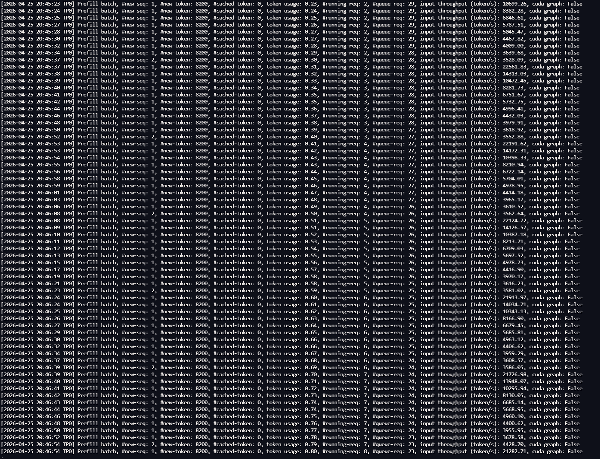

**Decode阶段同时处理请求数：每批固定10个**
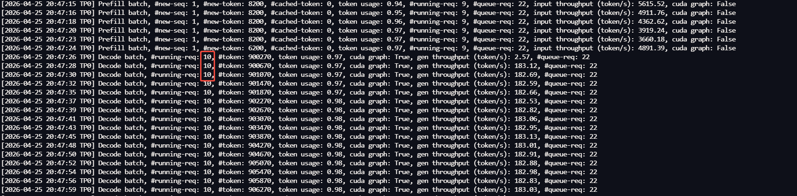

#### nvidia_h100芯片
**可同时处理请求数：13**
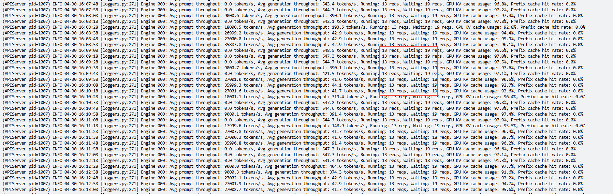


### 📊 芯片性能对比柱状图

**32并发**

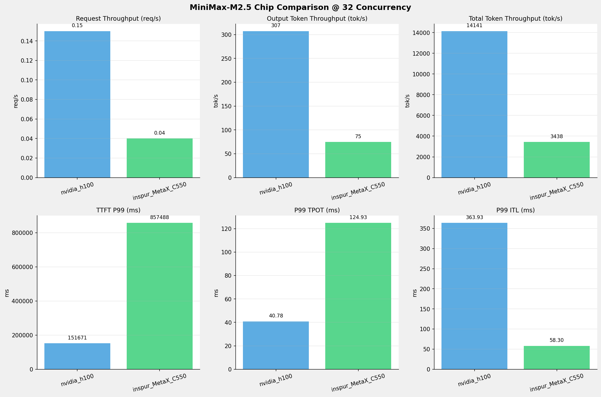

**64并发**

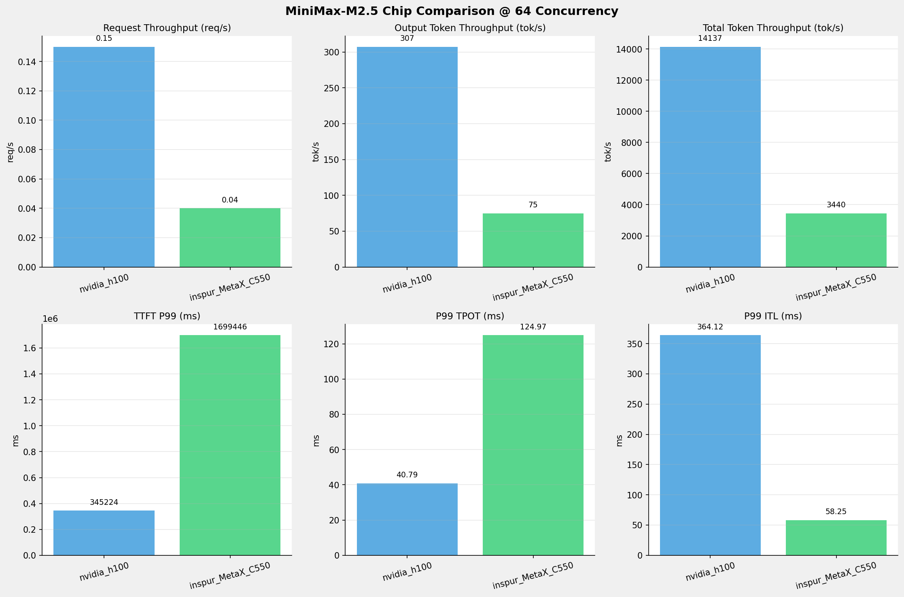


### 📈 各并发级别性能对比详情


#### 32 并发

| 指标 | nvidia_h100 | inspur_MetaX_C550 |
|------|----------- | -----------|
| 请求吞吐量（Request throughput (req/s)） | **0.15** ⭐ | 0.04 |
| 输出token吞吐量（Output token throughput (tok/s)） | **307.27** ⭐ | 74.75 |
| 总token吞吐量（Total token throughput (tok/s)） | **14140.63** ⭐ | 3438.38 |
| 首token延迟（P99 TTFT (ms)） | **151671.11** ⭐ | 857488.09 |
| 每token生成时间（P99 TPOT (ms)） | **40.78** ⭐ | 124.93 |
| token间延迟（P99 ITL (ms)） | 363.93 | **58.30** ⭐ |


#### 64 并发

| 指标 | nvidia_h100 | inspur_MetaX_C550 |
|------|----------- | -----------|
| 请求吞吐量（Request throughput (req/s)） | **0.15** ⭐ | 0.04 |
| 输出token吞吐量（Output token throughput (tok/s)） | **307.19** ⭐ | 74.77 |
| 总token吞吐量（Total token throughput (tok/s)） | **14136.71** ⭐ | 3439.56 |
| 首token延迟（P99 TTFT (ms)） | **345223.92** ⭐ | 1699446.48 |
| 每token生成时间（P99 TPOT (ms)） | **40.79** ⭐ | 124.97 |
| token间延迟（P99 ITL (ms)） | 364.12 | **58.25** ⭐ |

---

---

## 测试场景四：多I/O测试

### 测试目标
**测试不同输入输出长度和并发级别下的性能表现，分析同一芯片同一模型在不同输入输出长度和并发级别下的性能指标变化趋势。**

### 📊 测试概览

| 项目            | 配置                                     | 备注  |
|---------------|----------------------------------------|-----|
| **数据集**       | random                                 |     |
| **并发数**       | 1, 4, 8, 16, 32, 64, 128    |     |
| **总请求数**      | 1000                                    |     |
| **输入输出长度** | (128, 128), (512, 256), (1024, 512), (2048, 1024), (4096, 2048), (8192, 1024) |     |
| **模型**        | MiniMax-M2.5-W8A8                           |     |
| **被测芯片**      | inspur_MetaX_C550 |     |
| **SGLang版本**   | 0.5.9                           |     |

### 📋 各I/O测试汇总（随并发变化）
> **报告说明: 由于本测试场景比较多，此报告仅列出一组测试结果作为示例，且仅列出MetaX-C550测试结果**

#### input: 8192, output: 1024

| 并发数 | 请求吞吐量 (req/s) | 输出Token吞吐量 (tok/s) | 总Token吞吐量 (tok/s) | TTFT P99 (ms) | TPOT P99 (ms) | E2E延迟均值 (ms) |
| --------------- | --------------- | --------------- | --------------- | --------------- | --------------- | --------------- |
| 1 | 0.08 | 78.29 | 704.57 | 520.17 | 12.47 | 13079.88 |
| 4 | 0.21 | 219.44 | 1975.00 | 1674.84 | 18.01 | 18663.66 |
| 8 | 0.32 | 322.67 | 2904.05 | 3159.86 | 24.60 | 25384.99 |
| 16 | 0.48 | 494.64 | 4451.74 | 6149.73 | 32.34 | 32912.17 |
| 32 | 0.66 | 673.65 | 6062.88 | 12147.10 | 46.88 | 48015.24 |
| 64 | 0.84 | 856.52 | 7708.66 | 23889.08 | 73.84 | 75139.87 |
| 128 | 0.84 | 857.26 | 7715.33 | 99741.36 | 73.69 | 146090.88 |

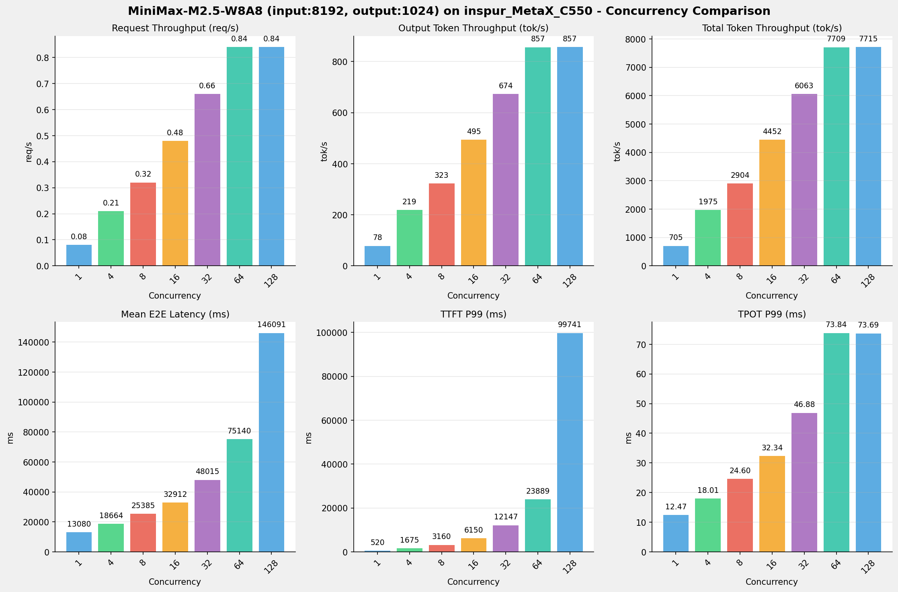

### 📊 I/O对比（固定并发数, 随请求上下文长度变化）

#### 并发数 = 1

| 指标                 | i128_o128 | i512_o256 | i1024_o512 | i2048_o1024 | i4096_o2048 | i8192_o1024 |
|--------------------|-----------|-----------|------------|-------------|-------------|-------------|
| 请求吞吐量 (req/s)      | 0.60      | 0.31      | 0.16       | 0.08        | 0.04        | 0.08        |
| 输出Token吞吐量 (tok/s) | 77.40     | 80.35     | 81.65      | 82.15       | 81.37       | 78.29       |
| 总Token吞吐量 (tok/s)  | 154.81    | 241.04    | 244.96     | 246.46      | 244.12      | 704.57      |
| TTFT P99 (ms)      | 153.05    | 156.87    | 158.39     | 159.25      | 217.04      | 520.17      |
| TPOT P99 (ms)      | 11.97     | 11.99     | 12.03      | 12.08       | 12.22       | 12.47       |
| E2E延迟均值 (ms)       | 1653.19   | 3185.64   | 6269.82    | 12463.90    | 25167.30    | 13079.88    |

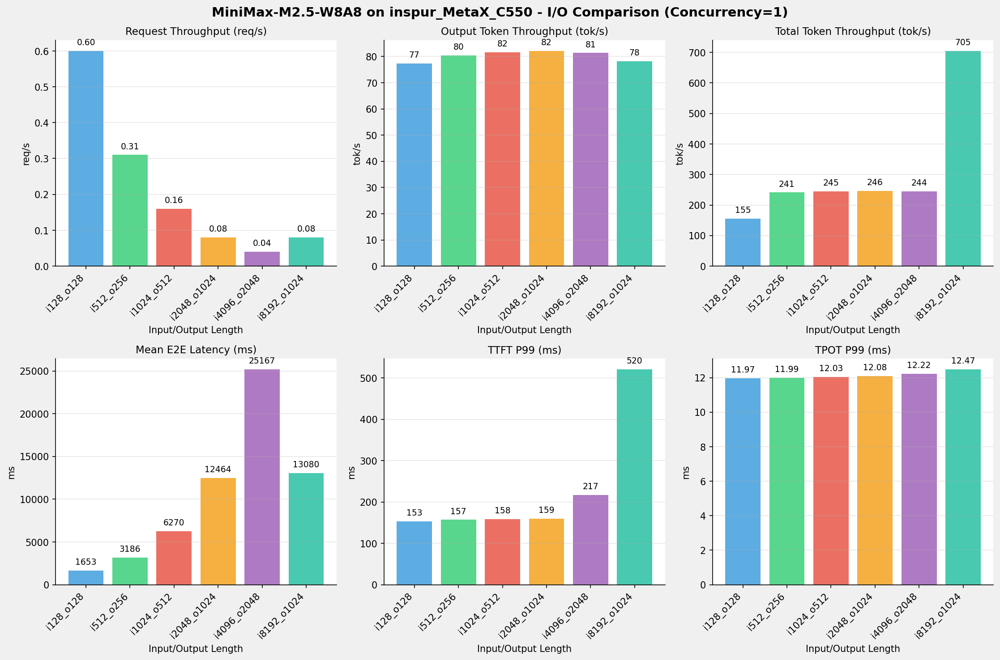

---

---


## 测试场景五：模型精度测试

### 测试目标
模型精度测试目标主要是通过标准指标（如准确率、精确率、召回率、F1值、mAP、AUC）衡量模型在测试集上的输出与真实标签的一致性，评估其基本判别能力。

### MiniMax-M2.5模型 - 各测试任务整体比对

| Task                        | nvidia_h100(FP8) | metax_c550(W8A8) | 差值      | 百分比      |
|-----------------------------|------------------|------------------|---------|----------|
| IFBench (Strict)            | 0.6067           | 0.5700           | -0.0367 | - 6.04%  |
| IFBench (Loose)             | 0.6433           | 0.5967           | -0.0467 | - 7.25%  |
| lm-eval:gsm_plus (Flexible) | 0.6863           | 0.7486           | 0.0623  | + 9.08%  |
| lm-eval:gsm_plus (Strict)   | 0.7307           | 0.7334           | 0.0027  | + 0.37%  |
| lm-eval:mmlu_pro            | 0.7378           | 0.6686           | -0.0692 | - 9.38%  |
| lm-eval:ruler               | 0.5461           | 0.8972           | 0.3511  | + 64.30% |


#### mmlu_pro任务子数据集详细比对

| Item             | nvidia_h100(FP8) | metax_c550(W8A8) | 差值      | 百分比      |
|------------------|------------------|------------------|---------|----------|
| biology          | 0.8703           | 0.8173           | -0.0530 | - 6.09%  |
| business         | 0.8238           | 0.7997           | -0.0241 | - 2.93%  |
| chemistry        | 0.7836           | 0.5857           | -0.1979 | - 25.26% |
| computer_science | 0.8049           | 0.7341           | -0.0708 | - 8.80%  |
| economics        | 0.7974           | 0.7701           | -0.0273 | - 3.42%  |
| engineering      | 0.5851           | 0.5686           | -0.0165 | - 2.82%  |
| health           | 0.7702           | 0.6675           | -0.1027 | - 13.33% |
| history          | 0.6115           | 0.5591           | -0.0524 | - 8.57%  |
| law              | 0.4759           | 0.4759           | 0.0000  | + 0.00%  |
| math             | 0.8312           | 0.6758           | -0.1554 | - 18.70% |
| other            | 0.7240           | 0.7045           | -0.0195 | - 2.69%  |
| philosophy       | 0.6814           | 0.5671           | -0.1143 | - 16.77% |
| physics          | 0.7691           | 0.7375           | -0.0316 | - 4.11%  |
| psychology       | 0.7870           | 0.7206           | -0.0664 | - 8.44%  |

#### ruler任务子数据集详细比对

| Item            | nvidia_h100(FP8) | metax_c550(W8A8) | 差值      | 百分比       |
|-----------------|------------------|------------------|---------|-----------|
| niah_multikey_1 | 0.3125           | 0.9688           | 0.6563  | + 210.02% |
| niah_multikey_2 | 0.7812           | 1.0000           | 0.2188  | + 28.01%  |
| niah_multikey_3 | 0.5312           | 1.0000           | 0.4688  | + 88.25%  |
| niah_multiquery | 0.2969           | 0.9844           | 0.6875  | + 231.56% |
| niah_multivalue | 0.1484           | 0.9531           | 0.8047  | + 542.25% |
| niah_single_1   | 0.3438           | 1.0000           | 0.6562  | + 190.87% |
| niah_single_2   | 0.2812           | 1.0000           | 0.7188  | + 255.62% |
| niah_single_3   | 0.4375           | 1.0000           | 0.5625  | + 128.57% |
| ruler_cwe       | 0.6281           | 0.5312           | -0.0969 | - 15.43%  |
| ruler_fwe       | 0.8958           | 0.9479           | 0.0521  | + 5.82%   |
| ruler_qa_hotpot | 0.7500           | 0.6562           | -0.0938 | - 12.51%  |
| ruler_qa_squad  | 0.6927           | 0.6224           | -0.0703 | - 10.15%  |
| ruler_vt        | 1.0000           | 1.0000           | 0.0000  | + 0.00%   |


>- IFBench模型精度测试脚本参见《附录三》
>- lm-eval模型精度测试脚本参见《附录四》
---

## 测试场景六：基础推理能力验证

### 测试目标：
验证模型在芯片环境上的基础推理和兼容性的支持能力情况，可作为快速选型的一个基础指标。

### 测试说明
> 比对说明：本章节只列出在MetaX-C550芯片平台上的测试结果

> 状态说明：✅ 已通过，⏳ 未测试，❌ 未通过，⚠️ 部分通过

### A. 基础推理能力

| #   | 测试点            | 测试内容                      | 状态  |
|-----|----------------|---------------------------|-----|
| A1  | 单轮对话           | 发送单条prompt，验证正常生成         | ✅   |
| A2  | 多轮对话           | 5轮对话，验证上下文保持和连贯性          | ✅   |
| A3  | System Prompt  | 设置系统角色，验证模型遵循程度           | ✅   |
| A4  | 流式输出           | stream=true，验证SSE逐token返回 | ✅   |
| A5  | 非流式输出          | stream=false，验证完整返回       | ✅   |
| A6  | Temperature 控制 | temp=0 vs temp=1.0，验证输出差异 | ✅   |
| A7  | Top-p/Top-k采样  | 不同top_p/top_k值，验证多样性控制    | ✅   |
| A8  | Max Tokens限制   | 设置max_tokens，验证输出不超限      | ✅   |
| A9  | Stop Sequences | 设置stop token，验证截断         | ✅   |
| A10 | Seed 可复现性      | 相同seed+temp=0，验证输出一致      | ✅   |
| A11 | 多语言能力          | 中/英/日/韩/法等多语言输入输出         | ✅   |
| A12 | 特殊Token处理      | 含emoji、代码块、数学符号、HTML标签    | ✅   |


### B. 高级生成功能

| #   | 测试点             | 测试内容                       | 状态  | 备注                  |
|-----|-----------------|----------------------------|-----|---------------------|
| B1  | 思考模式（Thinking）  | 开启thinking mode，验证返回思考链... | ✅   |                     |
| B2  | 非思考模式（Instant）  | 关闭thinking，验证无hidden th... | ❌   | 使用默认temperature 0.7 |
| B3  | 思考模式切换          | 同一会话内thinking↔non-think... | ❌   | 使用默认temperature 0.7 |
| B4  | 工具调用-单工具        | 定义单个function，验证模型正确调用并传参   | ✅   |                     |
| B5  | 工具调用-多工具        | 定义多个function，验证模型选择正确的工具   | ✅   |                     |
| B6  | 工具调用-并行调用       | 单次回复中并行调用多个工具              | ✅   |                     |
| B7  | 工具调用-多步链式       | 工具结果作为下一步输入，验证3+步链式执行      | ✅   | 个别时候会失败             |
| B8  | JSON Mode       | response_format=json_ob... | ✅   |                     |
| B9  | 结构化输出           | JSON Schema约束输出格式，验证字段完整性  | ✅   |                     |
| B10 | Prefix/Suffix约束 | 指定输出前缀或格式模板，验证遵循度          | ❌   |                     |


### C. 多模态能力 （MiniMax-M2.5模型为文本模型，此测试组请跳过）


| #   | 测试点     | 测试内容          | 状态  |
|-----|---------|---------------|-----|
| C1  | 单图理解    | 图片+文本提问       | ❌   |
| C2  | 多图对比    | 跨图比较          | ❌   |
| C3  | 高分辨率图片  | 4K分辨率         | ❌   |
| C4  | 图表/OCR  | 表格截图          | ❌   |
| C5  | 视频理解    | 视频文件          | ❌   |
| C6  | 代码截图→代码 | UI截图          | ❌   |
| C7  | 多模态工具调用 | 图片触发工具        | ❌   |
| C8  | 图片格式兼容性 | PNG/JPEG/WebP | ❌   |

### D. 长上下文处理

| #   | 测试点       | 测试内容                        | 状态 |
|-----|------------|-----------------------------|------|
| D1  | 短上下文基线     | 1K tokens                  | ✅ |
| D2  | 中等上下文      | 8K-16K tokens              | ✅ |
| D3  | 长上下文       | 32K-64K tokens             | ✅ |
| D4  | 超长上下文      | 128K+ tokens               | ✅ |
| D5  | 大海捞针       | NIAH                       | ✅ |
| D6  | 上下文边界行为    | max_model_len              | ✅ |
| D7  | 超出上下文截断    | 截断/拒绝                      | ✅ |
| D8  | 长输出生成      | 4K-8K tokens               | ✅ |


### F. 稳定性与边界

| #   | 测试点    | 测试内容                                        | 状态  |
|-----|--------|---------------------------------------------|-----|
| F1  | 空输入    | 空prompt                                     | ✅   |
| F2  | 超大输入   | 超max_model_len                              | ✅   |
| F3  | 非法参数   | temperature=-1, max_tokens=0,非法温度值：超过范围（>2） | ✅   |
| F4  | 特殊字符注入 | SQL/Prompt注入                                | ✅   |
| F5  | 并发稳定性  | 200+并发（实际测试50并发）                            | ✅   |
| F6  | OOM恢复  | 显存耗尽                                        | ⏳   |
| F7  | 长时间运行  | 24小时                                        | ⏳   |
| F8  | 请求超时处理 | 超时断开                                        | ⏳   |


### G. API兼容性

| #   | 测试点       | 测试内容                        | 状态 |
|-----|------------|-----------------------------|------|
| G1  | OpenAI Chat Completions | /v1/chat/completions 接口兼容  | ✅ |
| G2  | OpenAI Completions | /v1/completions 接口兼容       | ✅ |
| G3  | 模型列表       | /v1/models 返回可用模型          | ✅ |
| G4  | Usage 统计   | usage 字段准确                 | ✅ |
| G5  | 错误码规范      | 400/401/404/429/500 错误码    | ⏳ |
| G6  | 客户端 SDK 兼容 | Python openai / JS @ope... | ⏳ |
| G7  | 响应格式变体     | 不同response_format          | ✅ |
| G8  | Stream参数   | stream参数测试                 | ✅ |

### H. 质量评估

| #   | 测试点   | 测试内容  | 状态  |
|-----|-------|-------|-----|
| H1  | 生成质量  | 质量对比  | ✅   |
| H2  | 生成一致性 | 多次生成  | ✅   |
| H3  | 幻觉率   | 事实错误  | ✅   |
| H4  | 指令遵循度 | 格式/角色 | ✅   |
| H5  | 响应相关性 | 问答相关性 | ✅   |


### I. 超长上下文验证


| #   | 测试点       | 测试内容                        | 状态 |
|-----|------------|-----------------------------|------|
| I1  | 超长上下文（非流式） | 验证超长上下文请求的非流式输出            | ✅ |
| I2  | 超长上下文（流式）  | 验证超长上下文请求的流式输出             | ✅ |
| I3  | 超长上下文（边界验证） | 使用二分法逼近模型最大上下文长度           | ✅ |
| I4  | 超长上下文（思考模式） | 验证超长上下文下reasoning_conte... | ✅ |

---

---

## 附录一：MetaX-C550平台Minimax-M2.5模型部署脚本

```shell
#!/bin/bash
# 10.130.70.2 
# 10.130.70.1

mx-smi -r -i all

export PYTORCH_CUDA_ALLOC_CONF=expandable_segments:True,max_split_size_mb:128


# 单机16卡 MCCL 环境变量
#export MCCL_RING_16P1H=1
#export FORCE_ACTIVE_WAIT=1
#export MCCL_P2P_LEVEL=SYS


export GLOO_SOCKET_IFNAME=ens12f0
export MCCL_SOCKET_IFNAM=ens12f0
export MCCL_IB_HCA=mlx5_0,mlx5_1,mlx5_2,mlx5_3,mlx5_4,mlx5_5,mlx5_6,mlx5_7

export TRITON_ENABLE_MACAP_OPT_MOVE_DOT_OPERANDS_OUT_LOOP=1
export TRITON_ENABLE_MACAP_CHAIN_DOT_OPT=1

# 通用环境变量
export MACA_SMALL_PAGESIZE_ENABLE=1
export TRITON_ENABLE_MACA_OPT_MOVE_DOT_OPERANDS_OUT_LOOP=1
export TRITON_ENABLE_MACA_CHAIN_DOT_OPT=1

# BF16、W8A8-TP2DP8/TP4DP4
export PYTORCH_ENABLE_PG_HIGH_PRIORITY_STREAM=1
export MACA_QUEUE_SCHEDULE_POLICY=1
export MACA_DIRECT_DISPATCH=1

# W8A8-TP16
#export MACA_DIRECT_DISPATCH=1
#export MCDBG_GRAPH_LAUNCH_QUEUE_POLICY=3
#export MACA_GRAPH_LAUNCH_QUEUE_POLICY=3

# W4A16
#export MACA_QUEUE_SCHEDULE_POLICY=1
#export MACA_DIRECT_DISPATCH=1

#export SGLANG_FUSE_MOE_CACHE_ENABLE=0

# 启用Flash_mla的优化（必须按照4.2.1操作更新flashmla）
export MX_ENABLE_FLASH_MLA_OPT=1

# add form 0.5.9
export TORCH_CUDA_ARCH_LIST="8.0 8.6+PTX"

service ssh restart


model_name=MiniMax-M2.5-W8A8
model_path="/data/data_shared/${model_name}"
log_file=./log-sglang-server-master-${model_name}.log


python3 -m sglang.launch_server \
    --model-path $model_path \
    --trust-remote-code \
    --attention-backend flashinfer \
    --quantization w8a8_int8 \
    --served-model-name minimax-m2.5 \
    --tp-size 8 \
    --context-length 196608 \
    --max-running-requests 64 \
    --dist-init-addr 10.130.70.1:36555 \
    --host 0.0.0.0 \
    --port 8000 \
    --nnodes 1 \
    --node-rank 0   \
    --disable-radix-cach \
    --disable-chunked-prefix-cache \
    --tool-call-parser minimax-m2 \
    --reasoning-parser minimax \
    --mem-fraction-static 0.9 2>&1  | tee -a  ${log_file}
    
```
>注：reasoning-parser为minimax，思考内容显示在reasoning_content字段里，如果为minimax-append-think，则思考内容会嵌入到content里，以"\<think>...<\/think>"标签对显示

---

---

## 附录二：benchmark执行脚本

**执行命令**
```shell
python run_benchmark.py --chip inspur_MetaX_C550 --model MiniMax-M2.5-W8A8 --test-suite test_01,test_02,test_03,test_04,test_05

# 如果不指定test-suite参数，默认执行run_benchmark.py里TEST_SUITES定义的测试套件列表，可以根据自己需要修改默认测试套件
```

**run_benchmark.py**
```python
import os
import yaml
import subprocess
import requests
import time
from datetime import datetime
from itertools import product
from pathlib import Path

API_KEY = os.environ.get("API_KEY", "abc123")

TEST_SUITES = ["test_01"]

RUN_ID = "01"

try:
    from gpu_monitor import GPUMonitor, generate_gpu_charts

    HAS_GPU_MONITOR = True
except ImportError:
    HAS_GPU_MONITOR = False
    print("Warning: GPU monitor module not available")


def get_model_info_from_api(base_url, api_key):
    headers = {"Authorization": f"Bearer {api_key}"}
    try:
        response = requests.get(f"{base_url}/v1/models", headers=headers, timeout=10)
        if response.status_code == 200:
            data = response.json()
            if data.get("data") and len(data["data"]) > 0:
                model_info = data["data"][0]
                model_name = model_info.get("id")
                owned_by = model_info.get("owned_by")
                model_path = model_info.get("root")
                if owned_by == "sglang" and model_path:
                    return model_name, model_path
                else:
                    return model_name, None
    except Exception as e:
        print(f"Failed to get model info from API: {e}")
    return None, None


def run_benchmark(chip_name, base_config, model_config, test_suites, run_id):
    base_url = base_config.get("base_url", "http://127.0.0.1:8000")

    model_name_yaml = model_config.get("name")
    served_model_name = model_config.get("served-model-name")
    model_path_yaml = model_config.get("model_path")

    if not model_path_yaml:
        print(f"Error: model_path is required in config for model '{model_name_yaml}'")
        return

    model_name, model_path = get_model_info_from_api(base_url, API_KEY)

    if not model_name:
        model_name = served_model_name
    model_path = model_path_yaml

    print(f"Model Name: {model_name}")
    print(f"Model Path: {model_path}")
    print(f"Running test suites: {', '.join(test_suites)}")

    temperature = base_config.get("temperature", 0.7)
    seed = base_config.get("seed", 123)
    ready_timeout = base_config.get("ready-check-timeout-sec", 30)

    M = model_name_yaml
    output_base = f"reports/benchmark/{chip_name}/{M}"

    params_config = base_config.get("params", {})

    for test_suite in test_suites:
        test_params = params_config.get(test_suite, {})
        max_concurrency = test_params.get("max-concurrency", [10])
        num_prompts = test_params.get("num-prompts", [300])
        random_input_output_len = test_params.get(
            "random-input-output-len", [[20000, 100]]
        )

        run_id_dir = os.path.join(output_base, test_suite, run_id)
        if os.path.exists(run_id_dir):
            print(
                f"Error: Run ID '{run_id}' already exists for test suite '{test_suite}' at path: {run_id_dir}"
            )
            print(f"Please either:")
            print(f"  1. Use a different RUN_ID (--run-id)")
            print(f"  2. Delete the existing directory: {run_id_dir}")
            continue

        print(f"\n=== Running test suite: {test_suite} ===")

        gpu_monitor = GPUMonitor(interval=10) if HAS_GPU_MONITOR else None

        for nc, np, io_len in product(
            max_concurrency, num_prompts, random_input_output_len
        ):
            ni = io_len[0]
            no = io_len[1]
            param_dir = f"{test_suite}/{run_id}/{nc}-{np}-i{ni}-o{no}"
            output_dir = os.path.join(output_base, param_dir)
            Path(output_dir).mkdir(parents=True, exist_ok=True)

            log_file = os.path.join(
                output_dir, f"bench-{test_suite}-{nc}-{np}-i{ni}-o{no}.log"
            )

            jsonl_file = os.path.join(
                output_dir, f"bench-{test_suite}-{nc}-{np}-i{ni}-o{no}.jsonl"
            )

            if gpu_monitor:
                gpu_monitor.start_monitoring(
                    "monitor/logs", chip_name, model_name_yaml, param_dir
                )

            cmd = [
                "python3",
                "-m",
                "sglang.bench_serving",
                "--backend",
                "sglang",
                "--dataset-name",
                test_params.get("dataset-name", "random"),
                "--random-range-ratio",
                "1.0",
                "--host",
                "0.0.0.0",
                "--port",
                str(base_config.get("port", 8000)),
                "--random-input-len",
                str(ni),
                "--random-output-len",
                str(no),
                "--max-concurrency",
                str(nc),
                "--num-prompt",
                str(np),
            ]

            if model_path_yaml:
                cmd.extend(["--model", model_path_yaml])

            cmd.extend(["--output-file", jsonl_file])

            print(f"Running: {' '.join(cmd)}")
            print(f"Log file: {log_file}")

            log_f = open(log_file, "w")
            process = subprocess.Popen(
                cmd, stdout=subprocess.PIPE, stderr=subprocess.STDOUT, text=True
            )

            for line in process.stdout:
                print(line, end="")
                log_f.write(line)

            process.wait()
            log_f.close()

            if gpu_monitor:
                gpu_log = gpu_monitor.stop_monitoring()
                if gpu_log:
                    gpu_log_dir = os.path.dirname(gpu_log)
                    generate_gpu_charts(gpu_log, gpu_log_dir)

            print(f"Completed: {log_file}")
            time.sleep(30)


def main():
    import argparse

    parser = argparse.ArgumentParser(description="Run SGLang benchmark")
    parser.add_argument(
        "--chip",
        type=str,
        required=True,
        help="Chip name to test (e.g., inspur_MetaX_C550, hygon_bw1000, kunlun_p800, nvidia_h100)",
    )
    parser.add_argument(
        "--model",
        type=str,
        default=None,
        help="Model name to test (e.g., minimax-m2.5, Qwen3.5). If not specified, uses the first model in config.",
    )
    parser.add_argument(
        "--test-suite",
        type=str,
        default=None,
        help=f"Test suite to run (default: all). Available: {', '.join(TEST_SUITES)}",
    )
    parser.add_argument(
        "--run-id",
        type=str,
        default=RUN_ID,
        help=f"Run ID to identify this test run (default: {RUN_ID})",
    )
    args = parser.parse_args()

    yaml_path = os.path.join(
        os.path.dirname(__file__), "config", "models_scenarios.yaml"
    )

    with open(yaml_path, "r", encoding="utf-8") as f:
        config = yaml.safe_load(f)

    base_config = config.get("base_config", {})
    params_config = base_config.get("params", {})
    models = config.get("models", {})

    chip_name_input = args.chip
    chip_name_lower = chip_name_input.lower()

    chip_name = None
    for key in models.keys():
        if key.lower() == chip_name_lower:
            chip_name = key
            break

    if chip_name is None:
        print(
            f"Error: Chip '{chip_name_input}' not found in config. Available chips: {', '.join(models.keys())}"
        )
        return

    available_models = models[chip_name]

    if args.model:
        model_name_input = args.model
        model_name_lower = model_name_input.lower()
        selected_model = None
        for m in available_models:
            if m.get("name", "").lower() == model_name_lower:
                selected_model = m
                break
                break
        if not selected_model:
            print(
                f"Error: Model '{args.model}' not found for chip '{chip_name}'. Available models:"
            )
            for m in available_models:
                print(f"  - {m.get('name')} (served: {m.get('served-model-name')})")
            return
        model_configs = [selected_model]
    else:
        model_configs = available_models

    test_suites_to_run = []
    if args.test_suite:
        test_suites_to_run = [s.strip() for s in args.test_suite.split(",")]
    else:
        test_suites_to_run = TEST_SUITES

    invalid_suites = [s for s in test_suites_to_run if s not in params_config]
    if invalid_suites:
        print(
            f"Error: Test suite(s) {invalid_suites} not found in config. Available: {', '.join(params_config.keys())}"
        )
        return

    run_id = args.run_id

    for model_config in model_configs:
        print(f"Processing chip: {chip_name}, model: {model_config.get('name')}")
        run_benchmark(chip_name, base_config, model_config, test_suites_to_run, run_id)
        print(f"Finished chip: {chip_name}, model: {model_config.get('name')}")


if __name__ == "__main__":
    main()

```

## 附录三：IFBench精度测试脚本

以MiniMax-M2.5-W8A8模型为例

---

**ifbench_mm25_w8a8.sh**

```shell
#!/bin/bash
ROOT_PATH=$(cd `dirname $0`; pwd)

echo $ROOT_PATH
cd ${ROOT_PATH}

CurDate=`date +'%Y%m%d'`
export NLTK_DATA=/home/workspace/poc/16-kh/llmtest/IFBench/nltk_data

cat > .env << 'EOF'
api_base=http://127.0.0.1:8000/v1
api_key=abc123
model=/data/data_shared/MiniMax-M2.5-W8A
temperature=1.0
top_p=0.95
top_k=40
max_tokens=8192
seed=42
input_file=data/IFBench_test.jsonl
output_file=data/mm25-responses.jsonl
workers=32
EOF

# 2. 生成模型响应
uv run python generate_responses.py

# 3. Thinking 模型后处理（重要！）
uv run python postprocess_thinking.py data/mm25-responses.jsonl -o data/mm25-clean.jsonl

# 4. 运行评估
uv run python -m run_eval \
	--input_data=data/IFBench_test.jsonl \
	--input_response_data=data/mm25-clean.jsonl \
	--output_dir=eval


```

## 附录四： lm-eval精度测试脚本

以MiniMax-M2.5-W8A8模型为例

---

**lm_eval_test.sh**

```shell
#!/bin/bash
ROOT_PATH=$(cd `dirname $0`; pwd)

echo $ROOT_PATH
cd ${ROOT_PATH}

CurDate=`date +'%Y%m%d'`

export HF_HUB_OFFLINE=1
export TRANSFORMERS_OFFLINE=1

#export HF_ENDPOINT=https://hf-mirror.com

ADDR=${ADDR:-127.0.0.1}
PORT=${PORT:-8000}
API_KEY=${API_KEY:-abc123}
LLM_ADDR="http://$ADDR:$PORT"

# 自动获取模型名和 tokenizer 路径
#MODEL_NAME=$(curl -s --header "Authorization: Bearer $API_KEY" $LLM_ADDR/v1/models | jq -r .data[0].id)
#MODEL_PATH=$(curl -s --header "Authorization: Bearer $API_KEY" $LLM_ADDR/v1/models | jq -r .data[0].root)
MODEL_NAME="minimax-m2.5"
LOCAL_MODEL_PATH="/data/data_shared/MiniMax-M2.5-W8A8"

# model_args 构造
MODEL_ARGS_BASE_1="{\"model\":\"$MODEL_NAME\",\"base_url\":\"$LLM_ADDR/v1/completions\",\"max_length\":131072,\"tokenizer\":\"$LOCAL_MODEL_PATH\",\"trust_remote_code\":true,\"num_concurrent\":10,\"max_retries\":3,\"timeout\":12000,\"tokenized_requests\":false,\"headers\":{\"Authorization\":\"Bearer $API_KEY\"}}"
MODEL_ARGS_BASE_2="{\"model\":\"$MODEL_NAME\",\"base_url\":\"$LLM_ADDR/v1/completions\",\"max_length\":192512,\"tokenizer\":\"$LOCAL_MODEL_PATH\",\"trust_remote_code\":true,\"num_concurrent\":10,\"max_retries\":3,\"timeout\":12000,\"tokenized_requests\":false,\"headers\":{\"Authorization\":\"Bearer $API_KEY\"}}"

# 运行单个任务的函数
run_task_1() {
	local task_name=$1
	local max_tokens=$2
	local temperature=$3
	local unsafe_code=$4
	
	local do_sample="false"
	[ "$temperature" = "1.0" ] && do_sample="true"

	GEN_KWARGS="{\"max_gen_toks\":$max_tokens,\"do_sample\":$do_sample,\"temperature\":$temperature,\"top_p\":0.95,\"top_k\":40}"

	local unsafe_flag=""
	[ "$unsafe_code" = "true" ] && unsafe_flag="--confirm_run_unsafe_code" && export HF_ALLOW_CODE_EVAL=1
	
	lm_eval \
		--model local-completions \
		--tasks $task_name \
		--output_path ./output/${task_name}/${MODEL_NAME}_${CurDate} \
		--model_args "$MODEL_ARGS_BASE_1" \
		--batch_size auto \
		--gen_kwargs "$GEN_KWARGS" \
		$unsafe_flag
}


run_task_2() {
	local task_name=$1
	local max_tokens=$2
	local temperature=$3
	local unsafe_code=$4
	
	local do_sample="false"
	[ "$temperature" = "1.0" ] && do_sample="true"

	GEN_KWARGS="{\"max_gen_toks\":$max_tokens,\"do_sample\":$do_sample,\"temperature\":$temperature,\"top_p\":0.95,\"top_k\":40}"

	local unsafe_flag=""
	[ "$unsafe_code" = "true" ] && unsafe_flag="--confirm_run_unsafe_code" && export HF_ALLOW_CODE_EVAL=1
	
	lm_eval \
		--model local-completions \
		--tasks $task_name \
		--output_path ./output/${task_name}/${MODEL_NAME}_${CurDate} \
		--model_args "$MODEL_ARGS_BASE_2" \
		--batch_size auto \
		--limit 32 \
		--gen_kwargs "$GEN_KWARGS" \ 
		$unsafe_flag
}


run_task_1 mmlu_pro 8192 0.0 false

sleep 120
run_task_1 gsm_plus 8192 0.0 false

sleep 120
run_task_2 ruler 8192 0.0 false

```

---

---
